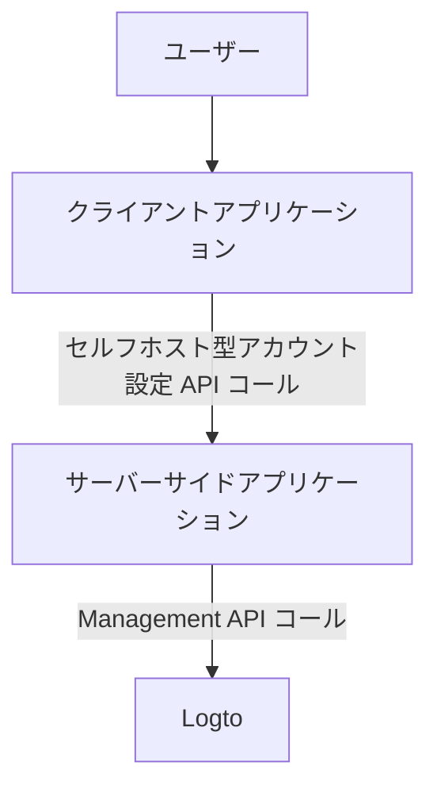
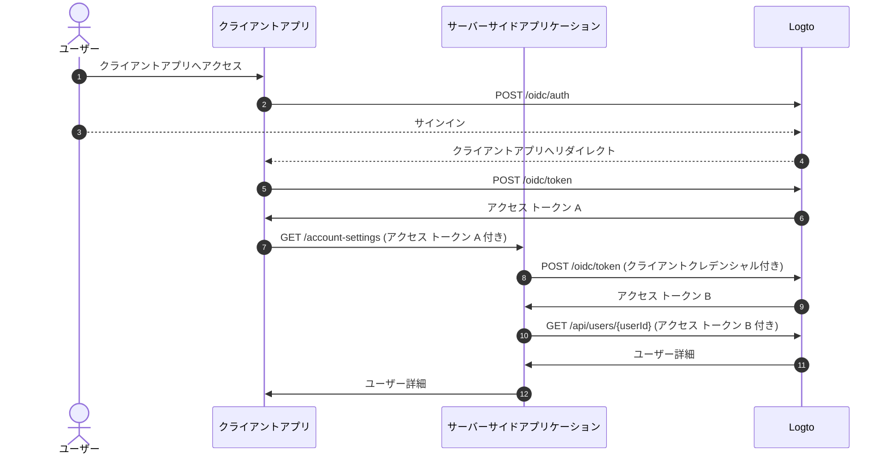
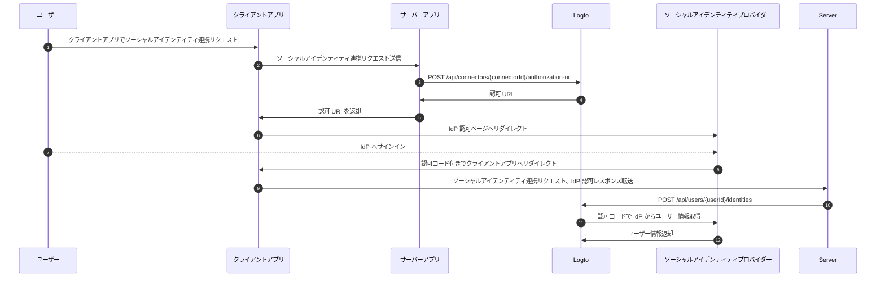

# Management API によるアカウント設定

## インテグレーション \{#integrations}

Logto は、ユーザーアカウントを管理するためのさまざまな Management API を提供しています。これらの API を利用して、エンドユーザー向けのセルフサービス型アカウント設定ページを構築できます。

### アーキテクチャ \{#architecture}

```mermaid
  graph TB
    A[ユーザー] --> B[クライアントアプリケーション]
    B -->|セルフホスト型アカウント設定 API コール|C[サーバーサイドアプリケーション]
    C -->|Management API コール| D[Logto]
```

1. **ユーザー**：アカウント設定へアクセス・管理する認証済みエンドユーザー。
2. **クライアントアプリケーション**：ユーザーにアカウント設定ページを提供するクライアントアプリケーション。
3. **サーバーサイドアプリケーション**：クライアントにアカウント設定 API を提供するサーバーサイドアプリケーション。Logto Management API と連携します。
4. **Logto**：認証 (Authentication) および認可 (Authorization) サービスとしての Logto。ユーザーアカウント管理のための Management API を提供します。

### シーケンス図 \{#sequence-diagram}

```mermaid
  sequenceDiagram
    autonumber
    actor User as ユーザー
    participant Client as クライアントアプリ
    participant Server as サーバーサイドアプリケーション
    participant Logto as Logto

    User ->> Client: クライアントアプリへアクセス
    Client ->> Logto: POST /oidc/auth
    User -->> Logto: サインイン
    Logto -->> Client: クライアントアプリへリダイレクト
    Client ->> Logto: POST /oidc/token
    Logto ->> Client: アクセス トークン A
    Client ->> Server: GET /account-settings (アクセス トークン A 付き)
    Server ->> Logto: POST /oidc/token (クライアントクレデンシャル付き)
    Logto ->> Server: アクセス トークン B
    Server ->> Logto: GET /api/users/{userId} (アクセス トークン B 付き)
    Logto ->> Server: ユーザー詳細
    Server ->> Client: ユーザー詳細
```

1. ユーザーがクライアントアプリケーションへアクセスします。
2. クライアントアプリケーションが認証リクエストを Logto へ送り、ユーザーを Logto のサインインページへリダイレクトします。
3. ユーザーが Logto へサインインします。
4. 認証済みユーザーが認可コード付きでクライアントアプリケーションへリダイレクトされます。
5. クライアントアプリケーションがセルフホスト型アカウント設定 API へのアクセスのため、Logto からアクセス トークンをリクエストします。
6. Logto がクライアントアプリケーションへアクセス トークンを発行します。
7. クライアントアプリケーションがユーザーのアクセス トークンを付与してサーバーサイドアプリケーションへアカウント設定リクエストを送信します。
8. サーバーサイドアプリケーションがユーザーのアクセス トークンからリクエスターのアイデンティティと権限を検証し、Logto から Management API アクセス トークンをリクエストします。
9. Logto がサーバーサイドアプリケーションへ Management API アクセス トークンを発行します。
10. サーバーサイドアプリケーションが Management API アクセス トークンを用いて Logto からユーザーデータを取得します。
11. Logto がサーバーのアイデンティティと Management API 権限を検証し、ユーザーデータを返します。
12. サーバーサイドアプリケーションがリクエスターの権限に基づきユーザーデータを処理し、クライアントアプリケーションへユーザーアカウント詳細を返します。

### Management API をサーバーサイドアプリケーションへ統合する \{#integrate-management-api-to-server-side-application}

サーバーサイドアプリケーションへの Management API 統合方法については、[Management API](/integrate-logto/interact-with-management-api/) セクションを参照してください。

## ユーザー管理 API \{#user-management-apis}

### ユーザーデータスキーマ \{#user-data-schema}

Logto のユーザースキーマについて詳しくは、[ユーザーデータとカスタムデータ](/user-management/user-data/) セクションを参照してください。

### ユーザープロファイルおよび識別子管理 API \{#user-profile-and-identifiers-management-apis}

ユーザープロファイルと識別子はユーザー管理に不可欠です。以下の API を利用してユーザープロファイルや識別子を管理できます。

| method | path                                                                                                     | description                          |
| ------ | -------------------------------------------------------------------------------------------------------- | ------------------------------------ |
| GET    | [/api/users/\{userId\}](https://openapi.logto.io/operation/operation-getuser)                            | ユーザー ID でユーザー詳細を取得     |
| PATCH  | [/api/users/\{userId\}](https://openapi.logto.io/operation/operation-updateuser)                         | ユーザー詳細を更新                   |
| PATCH  | [/api/users/\{userId\}/profile](https://openapi.logto.io/operation/operation-updateuserprofile)          | ユーザー ID でプロファイル項目を更新 |
| GET    | [/api/users/\{userId\}/custom-data](https://openapi.logto.io/operation/operation-listusercustomdata)     | ユーザー ID でカスタムデータを取得   |
| PATCH  | [/api/users/\{userId\}/custom-data](https://openapi.logto.io/operation/operation-updateusercustomdata)   | ユーザー ID でカスタムデータを更新   |
| PATCH  | [/api/users/\{userId\}/is-suspended](https://openapi.logto.io/operation/operation-updateuserissuspended) | ユーザー ID でサスペンド状態を更新   |

### メールアドレスと電話番号の認証 \{#email-and-phone-number-verification}

Logto システムでは、メールアドレスと電話番号の両方がユーザー識別子となるため、その認証が重要です。これをサポートするため、提供されたメールアドレスや電話番号を認証するための認証コード API を用意しています。

:::note
新しいメールアドレスや電話番号でユーザープロファイルを更新する前に、必ずメールアドレスまたは電話番号を認証してください。
:::

| method | path                                                                                                                             | description                                        |
| ------ | -------------------------------------------------------------------------------------------------------------------------------- | -------------------------------------------------- |
| POST   | [/api/verifications/verification-code](https://openapi.logto.io/operation/operation-createverificationbyverificationcode)        | メールアドレスまたは電話番号の認証コード送信       |
| POST   | [/api/verifications/verification-code/verify](https://openapi.logto.io/operation/operation-verifyverificationbyverificationcode) | 認証コードによるメールアドレスまたは電話番号の認証 |

### ユーザーパスワード管理 \{#user-password-management}

| method | path                                                                                                     | description                          |
| ------ | -------------------------------------------------------------------------------------------------------- | ------------------------------------ |
| POST   | [/api/users/\{userId\}/password/verify](https://openapi.logto.io/operation/operation-verifyuserpassword) | ユーザー ID で現在のパスワードを認証 |
| PATCH  | [/api/users/\{userId\}/password](https://openapi.logto.io/operation/operation-updateuserpassword)        | ユーザー ID でパスワードを更新       |
| GET    | [/api/users/\{userId\}/has-password](https://openapi.logto.io/operation/operation-getuserhaspassword)    | ユーザー ID でパスワード有無を確認   |

:::note
ユーザーのパスワードを更新する前に、必ず現在のパスワードを認証してください。
:::

### ユーザーソーシャルアイデンティティ管理 \{#user-social-identities-management}

| method | path                                                                                                                              | description                                                                                                       |
| ------ | --------------------------------------------------------------------------------------------------------------------------------- | ----------------------------------------------------------------------------------------------------------------- |
| GET    | [/api/users/\{userId\}](https://openapi.logto.io/operation/operation-getuser)                                                     | ユーザー ID でユーザー詳細を取得。ソーシャルアイデンティティは `identities` フィールドに含まれます。              |
| POST   | [/api/users/\{userId\}/identities](https://openapi.logto.io/operation/operation-createuseridentity)                               | 認証済みソーシャルアイデンティティをユーザー ID でリンク                                                          |
| DELETE | [/api/users/\{userId\}/identities](https://openapi.logto.io/operation/operation-deleteuseridentity)                               | ソーシャルアイデンティティをユーザー ID でアンリンク                                                              |
| PUT    | [/api/users/\{userId\}/identities](https://openapi.logto.io/operation/operation-replaceuseridentity)                              | ユーザー ID でリンクされたソーシャルアイデンティティを直接更新                                                    |
| POST   | [/api/connectors/\{connectorId\}/authorization-uri](https://openapi.logto.io/operation/operation-createconnectorauthorizationuri) | ソーシャルアイデンティティプロバイダーの認可 URI を取得。新しいソーシャルアイデンティティ接続の開始に使用します。 |

```mermaid
sequenceDiagram
    autoNumber
    participant User as ユーザー
    participant Client as クライアントアプリ
    participant App as サーバーアプリ
    participant Logto as Logto
    participant IdP as ソーシャルアイデンティティプロバイダー

    User ->> Client: クライアントアプリでソーシャルアイデンティティ連携リクエスト
    Client ->> App: ソーシャルアイデンティティ連携リクエスト送信
    App ->> Logto: POST /api/connectors/{connectorId}/authorization-uri
    Logto ->> App: 認可 URI
    App ->> Client: 認可 URI を返却
    Client ->> IdP: IdP 認可ページへリダイレクト
    User -->> IdP: IdP へサインイン
    IdP ->> Client: 認可コード付きでクライアントアプリへリダイレクト
    Client ->> Server: ソーシャルアイデンティティ連携リクエスト、IdP 認可レスポンス転送
    Server ->> Logto: POST /api/users/{userId}/identities
    Logto ->> IdP: 認可コードで IdP からユーザー情報取得
    IdP ->> Logto: ユーザー情報返却
```

1. ユーザーがクライアントアプリケーションにアクセスし、ソーシャルアイデンティティ連携をリクエストします。
2. クライアントアプリケーションがサーバーへソーシャルアイデンティティ連携リクエストを送信します。
3. サーバーが Logto へソーシャルアイデンティティプロバイダーの認可 URI を取得するリクエストを送信します。この際、独自の `state` パラメーターと `redirect_uri` をリクエストに含める必要があります。`redirect_uri` はソーシャルアイデンティティプロバイダーに事前登録してください。
4. Logto がサーバーへ認可 URI を返却します。
5. サーバーがクライアントアプリケーションへ認可 URI を返却します。
6. クライアントアプリケーションがユーザーを IdP 認可 URI へリダイレクトします。
7. ユーザーが IdP へサインインします。
8. IdP が `redirect_uri` 付きで認可コードをクライアントアプリケーションへリダイレクトします。
9. クライアントアプリケーションが `state` を検証し、IdP 認可レスポンスをサーバーへ転送します。
10. サーバーが Logto へソーシャルアイデンティティをユーザーへリンクするリクエストを送信します。
11. Logto が認可コードを用いて IdP からユーザー情報を取得します。
12. IdP がユーザー情報を Logto へ返却し、Logto がソーシャルアイデンティティをユーザーへリンクします。

:::note
ユーザーへ新しいソーシャルアイデンティティをリンクする際、いくつかの制限事項があります：

- Management API にはセッションコンテキストがないため、ソーシャル認証状態を安全に維持するためにアクティブなセッションが必要なソーシャルコネクターは Management API 経由でリンクできません。サポートされないコネクターには apple、標準 OIDC、標準 OAuth 2.0 コネクターが含まれます。
- 同じ理由で、Logto は認可レスポンスの `state` パラメーターを検証できません。クライアントアプリで `state` パラメーターを保存し、認可レスポンス受信時に必ず検証してください。
- `redirect_uri` を事前にソーシャルアイデンティティプロバイダーへ登録する必要があります。登録しない場合、ソーシャル IdP はユーザーをクライアントアプリへリダイレクトしません。ソーシャル IdP には、ユーザーサインイン用とプロフィール連携ページ用の複数のコールバック `redirect_uri` を受け入れる必要があります。

:::

### ユーザーエンタープライズアイデンティティ管理 \{#user-enterprise-identities-management}

| method | path                                                                                                    | description                                                                                                                                                                            |
| ------ | ------------------------------------------------------------------------------------------------------- | -------------------------------------------------------------------------------------------------------------------------------------------------------------------------------------- |
| GET    | [/api/users/\{userId\}?includeSsoIdentities=true](https://openapi.logto.io/operation/operation-getuser) | ユーザー ID でユーザー詳細を取得。エンタープライズアイデンティティは `ssoIdentities` フィールドに含まれます。API で `includeSsoIdentities=true` クエリパラメーターを追加してください。 |

現在、Management API ではユーザーへのエンタープライズアイデンティティのリンク・アンリンクはサポートされていません。ユーザーにリンクされたエンタープライズアイデンティティの表示のみ可能です。

### パーソナルアクセス トークン \{#personal-access-token}

| method | path                                                                                                                                 | description                                         |
| ------ | ------------------------------------------------------------------------------------------------------------------------------------ | --------------------------------------------------- |
| GET    | [/api/users/\{userId\}/personal-access-tokens](https://openapi.logto.io/operation/operation-listuserpersonalaccesstokens)            | ユーザーのすべてのパーソナルアクセス トークンを取得 |
| POST   | [/api/users/\{userId\}/personal-access-tokens](https://openapi.logto.io/operation/operation-createuserpersonalaccesstoken)           | ユーザーに新しいパーソナルアクセス トークンを追加   |
| DELETE | [/api/users/\{userId\}/personal-access-tokens/\{name\}](https://openapi.logto.io/operation/operation-deleteuserpersonalaccesstoken)  | 名前でユーザーのトークンを削除                      |
| PATCH  | [/api/users/\{userId\s}/personal-access-tokens/\{name\}](https://openapi.logto.io/operation/operation-updateuserpersonalaccesstoken) | 名前でユーザーのトークンを更新                      |

パーソナルアクセス トークンは、ユーザーが認証情報やインタラクティブなサインインを使わずに [アクセス トークン](https://auth.wiki/access-token) を安全に付与する方法を提供します。 [パーソナルアクセス トークンの利用方法](/user-management/personal-access-token) もご覧ください。

### ユーザー MFA 設定管理 \{#user-mfa-settings-management}

| method | path                                                                                                                                 | description                           |
| ------ | ------------------------------------------------------------------------------------------------------------------------------------ | ------------------------------------- |
| GET    | [/api/users/\{userId\}/mfa-verifications](https://openapi.logto.io/operation/operation-listusermfaverifications)                     | ユーザー ID で MFA 設定を取得         |
| POST   | [/api/users/\{userId\}/mfa-verifications](https://openapi.logto.io/operation/operation-createusermfaverification)                    | ユーザー ID で MFA 認証をセットアップ |
| DELETE | [/api/users/\{userId\}/mfa-verifications/\{verificationId\}](https://openapi.logto.io/operation/operation-deleteusermfaverification) | ID でユーザーの MFA 認証を削除        |

### ユーザーアカウント削除 \{#user-account-deletion}

| method | path                                                                             | description                  |
| ------ | -------------------------------------------------------------------------------- | ---------------------------- |
| DELETE | [/api/users/\{userId\}](https://openapi.logto.io/operation/operation-deleteuser) | ユーザー ID でユーザーを削除 |
