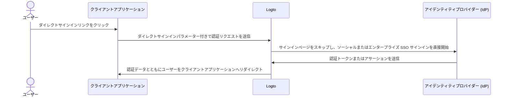

# ダイレクトサインイン

ダイレクトサインインは、Logto 独自の [認証 (Authentication) パラメーター](/end-user-flows/authentication-parameters) であり、デフォルトのユニバーサル Logto サインインページをバイパスして、ソーシャルサインインやエンタープライズシングルサインオン (SSO) を直接開始できます。

この機能は、カスタムサインインページや IdP ログインエントリーポイントをウェブサイトに埋め込んでいる場合（ユースケースを参照）に特に便利です。ダイレクトサインインを利用することで、ユーザーを IdP のログインページへ直接リダイレクトできます。



## ソーシャルサインイン \{#social-sign-in}

`direct_sign_in` パラメーターに `social:<idp-name>` の値を渡すことで、ソーシャルサインインプロセスを直接開始できます。

### コネクター IdP 名の確認方法 \{#where-to-find-the-connector-idp-name}

1. <CloudLink to="/connectors/social">コンソール > コネクター > ソーシャルコネクター</CloudLink> に移動します。
2. 使用したい [ソーシャルコネクター](/connectors/social-connectors) をクリックします。
3. コネクター設定ページの上部でアイデンティティプロバイダー名を確認します。


### 例 \{#example}

`direct_sign_in` パラメーターを使って独自の認証リクエスト URL を作成します：

```sh
curl --location \
  --request GET 'https://[tenant-id].logto.app/oidc/auth?client_id=1234567890&...&direct_sign_in=social:google'
```

対応する Logto SDK では、`signIn` メソッド呼び出し時に `directSignIn` パラメーターを設定できます：

```javascript
const authResult = await logto.signIn({
  redirectUri: 'https://your-app.com/callback',
  directSignIn: 'social:google',
});
```

## エンタープライズシングルサインオン (SSO) \{#enterprise-sso}

`direct_sign_in` パラメーターに `sso:<connector-id>` の値を渡すことで、エンタープライズシングルサインオン (SSO) サインインプロセスを直接開始できます。

### エンタープライズ SSO コネクター ID の確認方法 \{#where-to-find-the-enterprise-sso-connector-id}

1. <CloudLink to="/enterprise-sso">コンソール > エンタープライズ SSO</CloudLink> に移動します。
2. 使用したい [エンタープライズコネクター](/connectors/enterprise-connectors) をクリックします。
3. コネクター設定ページの上部でコネクター ID を確認します。


### 例 \{#example-1}

`direct_sign_in` パラメーターを使って独自の認証リクエスト URL を作成します：

```sh
curl --location \
  --request GET 'https://[tenant-id].logto.app/oidc/auth?client_id=1234567890&...&direct_sign_in=sso:1234567890'
```

対応する Logto SDK では、`signIn` メソッド呼び出し時に `directSignIn` パラメーターを設定できます：

```javascript
logtoClient.signIn({
  redirectUri: 'https://your-app.com/callback',
  directSignIn: 'sso:1234567890',
});
```

## サインインページへのフォールバック \{#fallback-to-the-sign-in-page}

ダイレクトサインインプロセスが失敗した場合（例：コネクターが見つからない、または有効化されていない場合）、ユーザーは標準のサインインページへリダイレクトされます。

:::note
`direct_sign_in` パラメーターへの対応をすべての Logto SDK へ段階的に追加しています。SDK に見当たらない場合は、Issue を作成するかお問い合わせください。
:::

## よくある質問 \{#faqs}

<details>
  <summary>

### ダイレクトサインインは API 認証 (Authentication) と同じですか？ \{#is-direct-sign-in-the-same-as-api-authentication}

</summary>

いいえ、ダイレクトサインインはデフォルトの Logto サインインページをスキップし、ユーザーをソーシャルまたはエンタープライズ SSO プロバイダーのログインページへ直接リダイレクトできるユーザーフローパラメーターです。API ベースの認証 (Authentication) とは異なり、ユーザーはまず Logto の認証 (Authentication) エンドポイントへリダイレクトされ、サインインプロセスを開始する必要があります。

</details>
