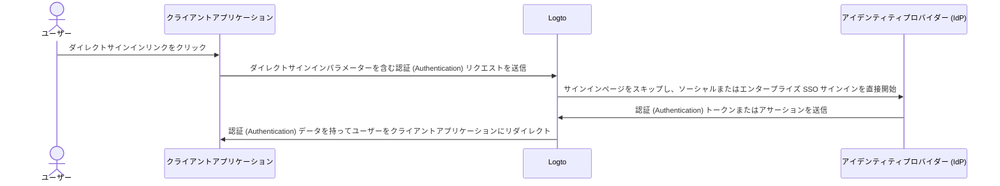

# ダイレクトサインイン

ダイレクトサインインは、Logto 固有の [認証 (Authentication) パラメーター](/end-user-flows/authentication-parameters) であり、デフォルトのユニバーサル Logto サインインページをバイパスして、ソーシャルサインインまたはエンタープライズシングルサインオン (SSO) を直接開始することができます。

この機能は、カスタムサインインページや IdP ログインエントリポイントをウェブサイトに埋め込んでいる場合に特に便利です（ユースケースを参照）。ダイレクトサインインを使用することで、ユーザーを IdP のログインページに直接リダイレクトできます。



## ソーシャルサインイン

`direct_sign_in` パラメーターに `social:<idp-name>` の値を渡して、ソーシャルサインインプロセスを直接開始します。

### コネクター IdP 名の見つけ方

1. <CloudLink to="/connectors/social">コンソール > コネクター > ソーシャルコネクター</CloudLink> に移動します。
2. 使用したい [ソーシャルコネクター](/connectors/social-connectors) をクリックします。
3. コネクター設定ページの上部にあるアイデンティティプロバイダー名を見つけます。


### 例

`direct_sign_in` パラメーターを使用して独自の認証 (Authentication) リクエスト URL を構築します：

```sh
curl --location \
  --request GET 'https://[tenant-id].logto.app/oidc/auth?client_id=1234567890&...&direct_sign_in=social:google'
```

サポートされている Logto SDK では、`signIn` メソッドを呼び出す際に `directSignIn` パラメーターを設定できます：

```javascript
const authResult = await logto.signIn({
  redirectUri: 'https://your-app.com/callback',
  directSignIn: 'social:google',
});
```

## エンタープライズ SSO

`direct_sign_in` パラメーターに `sso:<connector-id>` の値を渡して、エンタープライズ SSO サインインプロセスを直接開始します。

### エンタープライズ SSO コネクター ID の見つけ方

1. <CloudLink to="/enterprise-sso">コンソール > エンタープライズ SSO</CloudLink> に移動します。
2. 使用したい [エンタープライズコネクター](/connectors/enterprise-connectors) をクリックします。
3. コネクター設定ページの上部にあるコネクター ID を見つけます。


### 例

`direct_sign_in` パラメーターを使用して独自の認証 (Authentication) リクエスト URL を構築します：

```sh
curl --location \
  --request GET 'https://[tenant-id].logto.app/oidc/auth?client_id=1234567890&...&direct_sign_in=sso:1234567890'
```

サポートされている Logto SDK では、`signIn` メソッドを呼び出す際に `directSignIn` パラメーターを設定できます：

```javascript
logtoClient.signIn({
  redirectUri: 'https://your-app.com/callback',
  directSignIn: 'sso:1234567890',
});
```

## サインインページへのフォールバック

ダイレクトサインインプロセスが失敗した場合、例えばコネクターが見つからないまたは有効でない場合、ユーザーは標準のサインインページにリダイレクトされます。

:::note
`direct_sign_in` パラメーターのサポートをすべての Logto SDK に徐々に追加しています。お使いの SDK に表示されない場合は、問題を報告するか、私たちに連絡してください。
:::

## よくある質問

<details>
  <summary>ダイレクトサインインは API 認証 (Authentication) と同じですか？</summary>

いいえ、ダイレクトサインインは、デフォルトの Logto サインインページをスキップし、ユーザーをソーシャルまたはエンタープライズ SSO プロバイダーのログインページに直接リダイレクトすることを可能にするユーザーフローパラメーターです。API ベースの認証 (Authentication) とは異なり、ユーザーはサインインプロセスを開始するために最初に Logto 認証 (Authentication) エンドポイントにリダイレクトされる必要があります。

</details>
