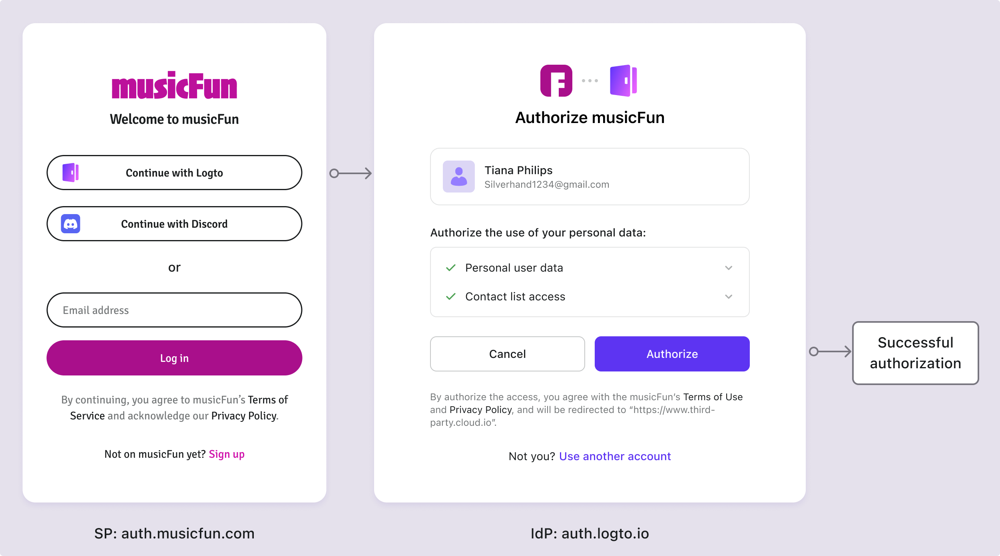

# 同意画面

## 同意画面とは？ \{#what-is-consent-screen}

Google アカウントを使用して Logto にサインアップすることを想像してください。「Google でサインイン」ボタンをクリックすると、Google のサインインページにリダイレクトされます。Google の資格情報を入力すると、Logto に Google アカウント情報へのアクセスを許可するよう求められます。これがユーザーの同意画面です。

このページは、ユーザーの **同意画面** または **同意ページ** と呼ばれます。これは、ユーザーが [サードパーティアプリケーション](/integrate-logto/third-party-applications) に代わってデータにアクセスするための権限を付与することを可能にする標準的な [OIDC / OAuth 2.0 フロー](/integrate-logto/third-party-applications/oidc-oauth-third-party-applications) です。その主な目的は、個人データの収集、処理、および使用についてユーザーに通知し、これらの活動に対する明示的な同意を求めることです。

同意画面では、通常、収集されるデータの種類、その使用方法、および第三者と共有されるかどうかについての [情報](/integrate-logto/third-party-applications/oidc-oauth-third-party-applications/consent-screen-branding#customize-the-branding-information) がユーザーに提示されます。この情報は透明性にとって重要であり、ユーザーがプライバシーとデータセキュリティについて情報に基づいた決定を下すことを可能にします。

同意ページは、欧州連合の一般データ保護規則（[GDPR](https://gdpr-info.eu/art-4-gdpr/)）や米国のカリフォルニア消費者プライバシー法（[CCPA](https://oag.ca.gov/privacy/ccpa)）などのプライバシー規制の文脈で特に重要です。これらの規制は、組織がユーザーの個人情報を処理する前に明確で肯定的な同意を得ることを要求しています。

## Logto でユーザーが同意画面を見るのはいつですか？ \{#when-does-user-see-the-consent-screen-in-logto}

前述のように、ユーザーが Google、Facebook、Apple などのサードパーティのアイデンティティプロバイダー (IdP) を使用して Logto にサインインする際に同意画面が表示されます。この設定では、Logto はサービスプロバイダー (SP) として機能し、IdP からユーザー情報へのアクセスを要求します。同意画面は通常、[SP](https://auth.wiki/service-provider) と [IdP](https://auth.wiki/identity-provider) が別の組織である場合に表示され、データ共有を容易にするためにユーザーの認可が必要です。

同様に、Logto が IdP として機能する場合、Logto と統合された [**OIDC / OAuth サードパーティアプリケーション**](/integrate-logto/third-party-applications/oidc-oauth-third-party-applications) にユーザーがサインインする際に同意画面が表示されます。この画面は、アプリケーションが要求しているデータについてユーザーに通知し、進行するための許可を求めます。ユーザーは要求された権限を確認し、アプリケーションに認可を与えるかどうかを決定できます。

## 同意画面をどのように設定しますか？ \{#how-to-configure-the-consent-screen}

Logto の同意フローでは、サードパーティアプリケーションからのログインを認可することができます。各 OIDC サードパーティアプリケーションのブランディングと権限要求をカスタマイズできます。

[サードパーティアプリケーション](/integrate-logto/third-party-applications/) の設定と Logto での [同意](/integrate-logto/third-party-applications/oidc-oauth-third-party-applications/consent-screen-branding/) 画面の設定について詳しく学びましょう。

## 関連リソース \{#related-resources}

<Url href="https://www.youtube.com/watch?v=sW-C7SRt9OM">
  あなたのサービスを同意画面を備えた安全な OIDC IdP に変える。
</Url>
<Url href="https://blog.logto.io/user-consent-screen">ユーザー同意画面の紹介。</Url>

<Url href="https://blog.logto.io/introducing-oidc-prompt">
  OIDC プロンプト 101: 開発者向けの簡単なガイド
</Url>
