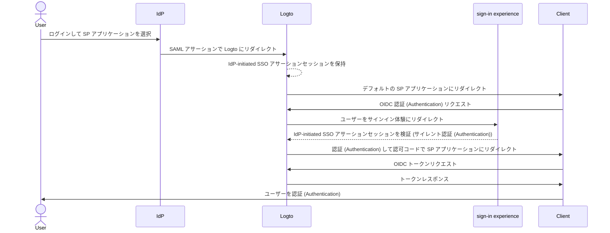
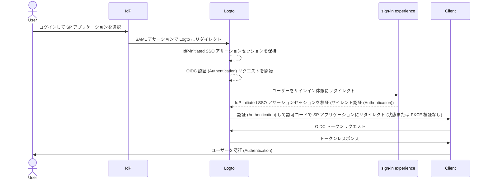

import Availability from '@components/Availability';
import idpInitiatedSsoPortalImage from '@site/docs/end-user-flows/enterprise-sso/assets/idp-initiated-sso-portal.png';
import idpInitiatedSsoRedirectImage from '@site/docs/end-user-flows/enterprise-sso/assets/idp-initiated-sso-redirect.png';
import idpInitiatedSsoSignInImage from '@site/docs/end-user-flows/enterprise-sso/assets/idp-initiated-sso-sign-in.png';

<Availability cloud="comingSoon" oss={false} />

# IdP-initiated SSO (SAML のみ)

IdP-initiated SSO は、アイデンティティプロバイダー (IdP) が主に認証 (Authentication) フローを制御するシングルサインオンプロセスです。このプロセスは、ユーザーが会社のポータルや集中アイデンティティダッシュボードなどの IdP のプラットフォームにログインすることで始まります。認証 (Authentication) が完了すると、IdP は SAML アサーションを生成し、ユーザーをサービスプロバイダー (SP) にリダイレクトしてアプリケーションやサービスにアクセスさせます。


## リスクと考慮事項 \{#risks-and-considerations}

IdP-initiated SSO は、組織が認識しておくべきいくつかのセキュリティ脆弱性を引き起こす可能性があります。認証 (Authentication) プロセスがユーザーからの直接のリクエストなしに IdP によって開始されるため、[クロスサイトリクエストフォージェリ](https://blog.logto.io/csrf) (CSRF) などのさまざまな攻撃に対して脆弱になる可能性があります。

このユーザーによって開始されない認証 (Authentication) は、適切な保護策がない場合、不正アクセスにつながる可能性があります。さらに、単一の認証 (Authentication) ポイントに依存することは、IdP が侵害されるとすべての接続されたアプリケーションが危険にさらされるため、セキュリティ侵害のリスクを高めます。

したがって、ユーザーがサービスへのアクセスを明示的に要求することを保証する、より安全で制御された認証 (Authentication) フローを提供する SP-initiated SSO を使用することを強くお勧めします。

## Logto OIDC アプリケーションと IdP-initiated SSO を接続する \{#connect-idp-initiated-sso-with-logto-oidc-applications}

Logto は OpenID Connect (OIDC) プロバイダーとして IdP-initiated SSO をサポートしていません。ただし、Logto を SP として構成し、SAML を使用してエンタープライズ IdP と IdP-initiated SSO をサポートすることができます。この設定により、IdP の認証 (Authentication) フローの制御を維持しながら、Logto の認証 (Authentication) 機能を活用できます。

:::note
デフォルトでは、この機能は Logto で有効になっていません。テナントに対して IdP-initiated SSO を有効にする必要がある場合は、[サポートチーム](https://logto.io/contact?src=docs.sso) にお問い合わせください。
:::

### 前提条件 \{#prerequisites}

IdP-initiated SSO を構成する前に、まず SAML コネクターを作成する必要があります。<CloudLink to="/enterprise-sso">Console > Enterprise SSO</CloudLink> に移動し、IdP と [SAML](/integrations/saml-sso/) コネクターを設定するためのステップバイステップガイドに従ってください。

SAML コネクターが設定されたら、<CloudLink to="/sign-in-experience">Sign-in experience</CloudLink> セクションで SSO サインイン方法を有効にし、SP-initiated SSO フローをテストして設定が正しいことを確認します。IdP-initiated SSO に進む前に、SP-initiated SSO が期待どおりに動作していることを確認してください。

### IdP-initiated SSO を有効にする \{#enable-idp-initiated-sso}

テナントに対して IdP-initiated SSO 機能が有効になると、SAML コネクターの設定ページに **IdP-initiated SSO** という追加のタブが表示されます。コネクターの機能を有効にするには、**IdP-initiated SSO** トグルを有効にします。

### SP アプリケーションを選択する \{#select-the-sp-application}

SP-initiated SSO とは異なり、認証 (Authentication) フローが SP から始まるのではなく、IdP-initiated SSO では認証 (Authentication) プロセス後にユーザーをリダイレクトするクライアント側の SP アプリケーションが必要です。**Default application** ドロップダウンから登録済みアプリケーションのリストから SP アプリケーションを選択できます。

IdP-initiated SSO では、**Traditional Web App** と **Single Page App** アプリケーションのみがサポートされています。使用ケースに基づいて適切なアプリケーションタイプを選択してください。

:::note
IdP 側では、IdP-initiated SSO フローが正しく動作するために `RelayState` パラメーターを **EMPTY** にしておいてください。Logto は選択されたデフォルトの SP アプリケーションに基づいてリダイレクトを処理します。
:::

## IdP-initiated 認証 (Authentication) フローを構成する \{#configure-idp-initiated-authentication-flow}

IdP-initiated SAML SSO を OIDC と接続するために、Logto は認証 (Authentication) リクエストを処理するための 2 つの構成オプションを提供します。

### オプション A: デフォルトの SP アプリケーションにリダイレクトする (推奨) \{#option-a-redirect-to-the-default-sp-application-recommended}

IdP が SSO フローを開始し、SAML アサーションを Logto に送信すると、IdP-initiated SSO アサーションセッションが作成されます。Logto はユーザーをデフォルトの SP アプリケーションにリダイレクトし、クライアント側で標準の OIDC 認証 (Authentication) リクエストを開始します。



このオプションを設定するには、SAML コネクター設定の **IdP-initiated SSO** タブで **Redirect to client for SP-initiated authentication** カードを選択します。


1. IdP-initiated SSO フローの後にユーザーをデフォルトの SP アプリケーションにリダイレクトするための **Client redirect URL** を提供します。Logto はこの URL に `?ssoConnectorId={connectorId}` クエリパラメーターを追加してユーザーをリダイレクトします。クライアントアプリケーションはリダイレクトを処理し、OIDC 認証 (Authentication) リクエストを開始する必要があります。（クライアントアプリケーションで IdP-initiated SSO 認証 (Authentication) リクエストを処理するための専用ルートまたはページを使用することをお勧めします。）

2. クライアント側で `ssoConnectorId` クエリパラメーターを使用して、IdP-initiated SSO 認証 (Authentication) フローを開始した SAML コネクターを識別し、OIDC 認証 (Authentication) リクエストを処理します。

3. SSO 認証 (Authentication) フローを完了するために、サインインリクエストで [direct sign-in](/end-user-flows/authentication-parameters/direct-sign-in/) 認証 (Authentication) パラメーターを Logto に渡します。

```typescript
// React の例
import { Prompt, useLogto } from '@logto/react';
import { useEffect } from 'react';
import { useNavigate, useSearchParams } from 'react-router-dom';

const SsoDirectSignIn = () => {
  const { signIn } = useLogto();
  const [searchParams] = useSearchParams();

  useEffect(() => {
    const ssoConnectorId = searchParams.get('ssoConnectorId');
    if (ssoConnectorId) {
      void signIn({
        redirectUri,
        prompt: Prompt.Login,
        directSignIn: {
          method: 'sso',
          target: ssoConnectorId,
        },
      });
    }
  }, [searchParams, signIn]);
};
```

- `redirectUri`: OIDC 認証 (Authentication) フローが完了した後にユーザーをリダイレクトする `redirect_uri`。
- `prompt=login`: IdP-initiated SSO アイデンティティを使用してユーザーにログインを強制します。
- `directSignIn=sso:{connectorId}`: 直接サインイン方法を `sso` として指定し、ターゲット SAML コネクター ID を指定します。このパラメーターは、ログインページを表示せずに SSO 認証 (Authentication) フローを直接トリガーします。コネクター ID が一致し、セッションが有効であれば、保存された IdP-initiated SSO アサーションセッションを使用してユーザーが自動的に認証 (Authentication) されます。

この方法は、認証 (Authentication) フローが安全で標準の OIDC プロトコルに従いながら、IdP の認証 (Authentication) プロセスの制御を維持することを保証します。クライアントアプリは、追加のログインステップなしでユーザーを認証 (Authentication) するために IdP-initiated SSO アサーションセッションを利用しつつ、認証 (Authentication) フローを安全かつ制御された状態に保つことができます。クライアントアプリは、認証 (Authentication) リクエストが安全であることを確認するために `state` および `PKCE` パラメーターを検証することもできます。

:::note
この方法は、**Traditional Web App** と **Single Page App** アプリケーションの両方で利用可能です。すべての使用ケースに推奨されます。
:::

### オプション B: IdP-initiated SSO でユーザーを直接認証 (Authentication) する \{#option-b-directly-authenticate-the-user-with-idp-initiated-sso}

特定の状況では、SP が IdP-initiated SSO コールバックを処理し、OIDC 認証 (Authentication) リクエストを開始できない場合があります。この場合、Logto は IdP-initiated SSO アサーションセッションを使用してユーザーを直接認証 (Authentication) するための代替オプションを提供します。

このオプションは、セキュリティが低く、推奨されません。認証 (Authentication) フローは標準の OIDC プロトコルをバイパスします。認証 (Authentication) リクエストが IdP によって開始されるため、クライアントアプリは認証 (Authentication) リクエストを安全に検証できない可能性があります。例えば、クライアントアプリは認証 (Authentication) リクエストが安全であることを確認するために `state` および `PKCE` パラメーターを検証できません。

:::warning
この方法は、**Single Page App** アプリケーションでは利用できません。クライアントアプリが `PKCE` パラメーターを使用して認証 (Authentication) リクエストを安全に処理する必要があるためです。SPA アプリケーションで IdP-initiated SSO を実装する必要がある場合は、上記のオプションを使用してください。
:::



このオプションを構成するには、SAML コネクター設定の **IdP-initiated SSO** タブで **Directly sign-in using IdP-initiated SSO** オプションを選択します。


1. 認証 (Authentication) が成功した後にユーザーをクライアントアプリケーションにリダイレクトするための **Post sign-in redirect URI** を選択します。この URL は OIDC 認証 (Authentication) リクエストの `redirect_uri` として使用されます。URI はクライアントアプリケーションに登録された許可されたリダイレクト URI のいずれかでなければなりません。

   :::note
   IdP-initiated SSO には専用の **redirect URI** を使用することを強くお勧めします。認証 (Authentication) リクエストが未承諾であるため、クライアントアプリケーションは標準の SP-initiated 認証 (Authentication) フローとは別にレスポンスを独立して管理する必要があります。
   :::

2. 必要に応じて、**Additional authentication parameters** JSON エディターを使用して認可リクエストパラメーターをカスタマイズします（タイプ `Map<string,string>` に従います）。

   例：デフォルトでは Logto は `openid` と `profile` スコープのみを要求します。認証 (Authentication) リクエストに追加のスコープやパラメーターを追加できます。

   ```json
   {
     "scope": "email offline_access"
   }
   ```

   - ユーザーのメールアドレスを要求するために追加の `email` スコープを追加します。
   - リフレッシュ トークンを要求するために `offline_access` スコープを追加します。

   また、認証 (Authentication) レスポンスを安全に検証するためにカスタム `state` パラメーターを提供することをお勧めします。

   ```json
   {
     "state": "custom-state-value"
   }
   ```

   クライアントアプリは、認証 (Authentication) リクエストが有効であることを確認するために、認可コードレスポンスで `state` パラメーターを検証する必要があります。
