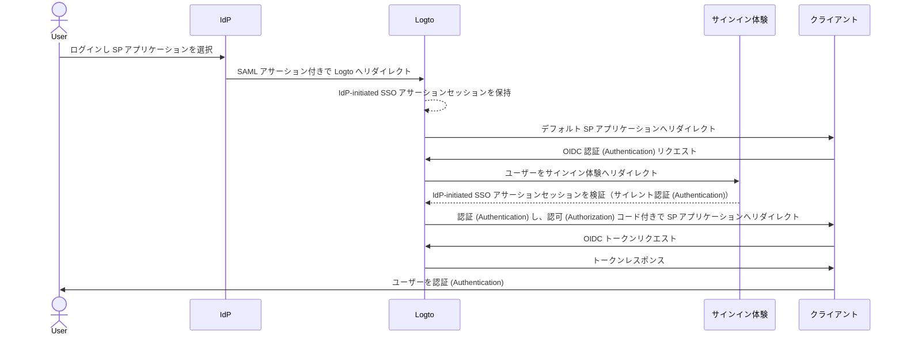
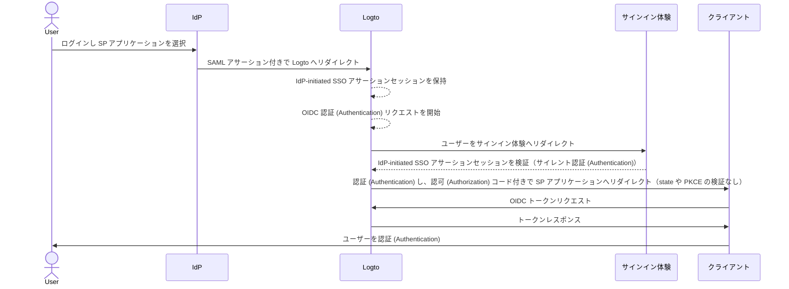

import Availability from '@components/Availability';

<Availability cloud="comingSoon" oss={false} />

# IdP-initiated SSO（SAML のみ）

IdP-initiated SSO は、アイデンティティプロバイダー (IdP) が主に認証 (Authentication) フローを制御するシングルサインオン (SSO) プロセスです。このプロセスは、ユーザーが会社のポータルや集中型アイデンティティダッシュボードなど、IdP のプラットフォームにログインすることから始まります。認証 (Authentication) が完了すると、IdP は SAML アサーションを生成し、ユーザーをサービスプロバイダー (SP) にリダイレクトしてアプリケーションやサービスへアクセスさせます。


## リスクと考慮事項 \{#risks-and-considerations}

IdP-initiated SSO には、組織が注意すべきいくつかのセキュリティ脆弱性が存在します。認証 (Authentication) プロセスがユーザーからの直接的なリクエストなしに IdP によって開始されるため、[クロスサイトリクエストフォージェリ (CSRF)](https://blog.logto.io/csrf) など、さまざまな攻撃に対して脆弱になる可能性があります。

ユーザー主導でない認証 (Authentication) により、適切なセーフガードがない場合、不正アクセスが発生する可能性があります。さらに、単一の認証 (Authentication) ポイントに依存することで、IdP が侵害された場合、すべての接続されたアプリケーションが危険にさらされるリスクが高まります。

そのため、より安全で制御された認証 (Authentication) フローを提供する SP-initiated SSO の利用が強く推奨されます。これにより、ユーザーが明示的にサービスへのアクセスをリクエストすることが保証されます。

## IdP-initiated SSO を Logto OIDC アプリケーションと連携する \{#connect-idp-initiated-sso-with-logto-oidc-applications}

Logto は OpenID Connect (OIDC) プロバイダーとして、IdP-initiated SSO をサポートしていません。ただし、Logto を SP として設定し、エンタープライズ IdP と SAML を使って IdP-initiated SSO をサポートすることができます。このセットアップにより、IdP 側で認証 (Authentication) フローを制御しつつ、Logto の認証 (Authentication) 機能を活用できます。

:::note
この機能はデフォルトでは Logto で有効になっていません。テナントで IdP-initiated SSO を有効にする必要がある場合は、[サポートチーム](https://logto.io/contact?src=docs.sso) までご連絡ください。
:::

### 前提条件 \{#prerequisites}

IdP-initiated SSO を設定する前に、まず SAML コネクターを作成する必要があります。<CloudLink to="/enterprise-sso">コンソール > エンタープライズ SSO</CloudLink>
に移動し、[SAML](/integrations/saml-sso/) コネクターを IdP と連携するためのステップバイステップガイドに従ってください。

SAML コネクターのセットアップが完了したら、<CloudLink to="/sign-in-experience/sign-up-and-sign-in">サインイン & アカウント > サインアップとサインイン</CloudLink>
セクションで SSO サインイン方法を有効にし、SP-initiated SSO フローをテストして設定が正しいことを確認してください。IdP-initiated SSO を進める前に、SP-initiated SSO が期待通りに動作していることを必ず確認してください。

### IdP-initiated SSO を有効にする \{#enable-idp-initiated-sso}

テナントで IdP-initiated SSO 機能が有効になると、SAML コネクターの設定ページに **IdP-initiated SSO** という追加タブが表示されます。**IdP-initiated SSO** トグルを有効にして、この機能をコネクターで利用できるようにします。

### SP アプリケーションの選択 \{#select-the-sp-application}

SP-initiated SSO とは異なり、認証 (Authentication) フローが SP から始まるのではなく、IdP-initiated SSO では認証 (Authentication) プロセス後にユーザーをリダイレクトするクライアント側の SP アプリケーションが必要です。**Default application** ドロップダウンから登録済みアプリケーションの中から SP アプリケーションを選択できます。

IdP-initiated SSO では **Traditional Web App** および **Single Page App** アプリケーションのみがサポートされています。ユースケースに応じて適切なアプリケーションタイプを選択してください。

:::note
IdP 側では、IdP-initiated SSO フローが正しく動作するように `RelayState` パラメーターを **空** にしてください。Logto は選択されたデフォルト SP アプリケーションに基づいてリダイレクトを処理します。
:::

## IdP-initiated 認証 (Authentication) フローの設定 \{#configure-idp-initiated-authentication-flow}

IdP-initiated SAML SSO を OIDC と連携するために、Logto では認証 (Authentication) リクエストを処理するための 2 つの設定オプションを提供しています。

### オプション A: デフォルト SP アプリケーションへリダイレクト（推奨） \{#option-a-redirect-to-the-default-sp-application-recommended}

IdP が SSO フローを開始し、SAML アサーションを Logto に送信すると、IdP-initiated SSO アサーションセッションが作成されます。Logto はユーザーをデフォルト SP アプリケーションにリダイレクトし、クライアント側で標準の OIDC 認証 (Authentication) リクエストを開始します。


```mermaid
sequenceDiagram
    actor User
    participant IdP as IdP
    participant Logto as Logto
    participant Experience as サインイン体験
    participant SP as クライアント

    User->>IdP: ログインし SP アプリケーションを選択
    IdP->>Logto: SAML アサーション付きで Logto へリダイレクト
    Logto-->>Logto: IdP-initiated SSO アサーションセッションを保持
    Logto->>SP: デフォルト SP アプリケーションへリダイレクト
    SP->>Logto: OIDC 認証 (Authentication) リクエスト
    Logto->>Experience: ユーザーをサインイン体験へリダイレクト
    Experience-->>Logto: IdP-initiated SSO アサーションセッションを検証（サイレント認証 (Authentication)）
    Logto->>SP: 認証 (Authentication) し、認可 (Authorization) コード付きで SP アプリケーションへリダイレクト
    SP->>Logto: OIDC トークンリクエスト
    Logto->>SP: トークンレスポンス
    SP->>User: ユーザーを認証 (Authentication)
```

このオプションを設定するには、SAML コネクター設定の **IdP-initiated SSO** タブで **SP-initiated 認証 (Authentication) のためにクライアントへリダイレクト** カードを選択します。


1. **クライアントリダイレクト URL** を指定し、IdP-initiated SSO フロー後にユーザーをデフォルト SP アプリケーションへリダイレクトします。Logto はこの URL に `?ssoConnectorId={connectorId}` クエリパラメーターを付与してリダイレクトします。クライアントアプリケーション側でこのリダイレクトを処理し、OIDC 認証 (Authentication) リクエストを開始してください。（IdP-initiated SSO 認証 (Authentication) リクエストを処理する専用のルートやページをクライアントアプリケーションに用意することを推奨します。）

2. クライアント側で `ssoConnectorId` クエリパラメーターを利用し、IdP-initiated SSO 認証 (Authentication) フローを開始した SAML コネクターを特定して OIDC 認証 (Authentication) リクエストを処理します。

3. サインインリクエストで [ダイレクトサインイン](/end-user-flows/authentication-parameters/direct-sign-in/) 認証 (Authentication) パラメーターを Logto に渡し、SSO 認証 (Authentication) フローを完了します。

```typescript
// React の例
import { Prompt, useLogto } from '@logto/react';
import { useEffect } from 'react';
import { useNavigate, useSearchParams } from 'react-router-dom';

const SsoDirectSignIn = () => {
  const { signIn } = useLogto();
  const [searchParams] = useSearchParams();

  useEffect(() => {
    const ssoConnectorId = searchParams.get('ssoConnectorId');
    if (ssoConnectorId) {
      void signIn({
        redirectUri,
        prompt: Prompt.Login,
        directSignIn: {
          method: 'sso',
          target: ssoConnectorId,
        },
      });
    }
  }, [searchParams, signIn]);
};
```

- `redirectUri`：OIDC 認証 (Authentication) フロー完了後にユーザーをリダイレクトする `redirect_uri`。
- `prompt=login`：IdP-initiated SSO アイデンティティでのログインを強制します。
- `directSignIn=sso:{connectorId}`：ダイレクトサインイン方式として `sso` と対象 SAML コネクター ID を指定します。このパラメーターにより、ログインページを表示せずに SSO 認証 (Authentication) フローが直接トリガーされます。コネクター ID が一致し、セッションが有効な場合、保存された IdP-initiated SSO アサーションセッションを使って自動的に認証 (Authentication) されます。

この方法により、認証 (Authentication) フローが安全かつ標準の OIDC プロトコルに従いながら、IdP 側で認証 (Authentication) プロセスを制御できます。クライアントアプリは追加のログインステップなしで IdP-initiated SSO アサーションセッションを利用してユーザーを認証 (Authentication) でき、認証 (Authentication) フローの安全性と制御性を維持できます。クライアントアプリは `state` や `PKCE` パラメーターの検証も引き続き行えます。

:::note
この方法は **Traditional Web App** および **Single Page App** アプリケーションの両方で利用可能です。すべてのユースケースで推奨されます。
:::

### オプション B: IdP-initiated SSO で直接ユーザーを認証 (Authentication) する \{#option-b-directly-authenticate-the-user-with-idp-initiated-sso}

特定の状況では、SP が IdP-initiated SSO コールバックを処理し OIDC 認証 (Authentication) リクエストを開始できない場合があります。この場合、Logto は IdP-initiated SSO アサーションセッションを使ってユーザーを直接認証 (Authentication) する代替オプションを提供します。

このオプションは安全性が低く、推奨されません。認証 (Authentication) フローが標準の OIDC プロトコルをバイパスします。認証 (Authentication) リクエストが IdP によって開始されるため、クライアントアプリは認証 (Authentication) リクエストを安全に検証できない場合があります。例えば、`state` や `PKCE` パラメーターの検証ができません。

:::warning
この方法は **Single Page App** アプリケーションでは利用できません。`PKCE` パラメーターを使って認証 (Authentication) リクエストを安全に処理する必要があるためです。SPA アプリケーションで IdP-initiated SSO を実装する場合は、上記のオプションを利用してください。
:::


```mermaid
  sequenceDiagram

  actor User
  participant IdP as IdP
  participant Logto as Logto
  participant Experience as サインイン体験
  participant SP as クライアント

  User->>IdP: ログインし SP アプリケーションを選択
  IdP->>Logto: SAML アサーション付きで Logto へリダイレクト
  Logto-->>Logto: IdP-initiated SSO アサーションセッションを保持
  Logto-->>Logto: OIDC 認証 (Authentication) リクエストを開始
  Logto->>Experience: ユーザーをサインイン体験へリダイレクト
  Experience-->>Logto: IdP-initiated SSO アサーションセッションを検証（サイレント認証 (Authentication)）
  Logto->>SP: 認証 (Authentication) し、認可 (Authorization) コード付きで SP アプリケーションへリダイレクト（state や PKCE の検証なし）
  SP->>Logto: OIDC トークンリクエスト
  Logto->>SP: トークンレスポンス
  SP->>User: ユーザーを認証 (Authentication)
```

このオプションを設定するには、SAML コネクター設定の **IdP-initiated SSO** タブで **IdP-initiated SSO で直接サインイン** オプションを選択します。


1. **サインイン後リダイレクト URI** を選択し、認証 (Authentication) 成功後にユーザーをクライアントアプリケーションへリダイレクトします。この URL は OIDC 認証 (Authentication) リクエストの `redirect_uri` として使用されます。URI はクライアントアプリケーションに登録されている許可済みリダイレクト URI のいずれかでなければなりません。

   :::note
   IdP-initiated SSO 用に専用の **リダイレクト URI** を使用することを強く推奨します。認証 (Authentication) リクエストが予期しないものであるため、クライアントアプリケーションは標準の SP-initiated 認証 (Authentication) フローとは独立してレスポンスを管理する必要があります。
   :::

2. 必要に応じて **追加認証 (Authentication) パラメーター** json エディター（型 `Map<string,string>` に従う）を使って認可 (Authorization) リクエストパラメーターをカスタマイズできます。

   例：デフォルトでは Logto は `openid` と `profile` スコープのみをリクエストします。追加のスコープやパラメーターを認証 (Authentication) リクエストに追加できます。

   ```json
   {
     "scope": "email offline_access"
   }
   ```

   - 追加の `email` スコープでユーザーのメールアドレスをリクエストします。
   - `offline_access` スコープでリフレッシュ トークンをリクエストします。

   また、認証 (Authentication) レスポンスを安全に検証するためにカスタムの `state` パラメーターを指定することも推奨します。

   ```json
   {
     "state": "custom-state-value"
   }
   ```

   クライアントアプリは認可 (Authorization) コードレスポンスで `state` パラメーターを検証し、認証 (Authentication) リクエストが有効であることを確認してください。
