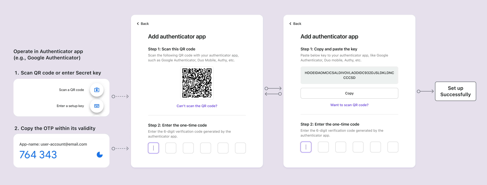

# 認証アプリ OTP

## 概念 {#concepts}

認証アプリ、またはソフトウェアトークンとも呼ばれるものは、最も広く採用されている [MFA](https://auth.wiki/mfa) 方法の一つです。これは、一時的な [ワンタイムパスワード (OTP)](https://auth.wiki/otp) を生成して、オンラインサービスの認証 (Authentication) のセキュリティを強化します。物理的なハードウェアトークンとは異なり、ソフトウェアトークンは通常、ユーザーがスマートフォンやコンピュータブラウザにインストールするアプリケーションやプラグインです。ソフトウェアトークンは、単一のデバイスでローカルに動作するか、認証アプリの機能と個々のユーザー設定に応じてさまざまなデバイス間で同期することができます。

ソフトウェアトークンの一般的な例には、Google Authenticator、Microsoft Authenticator、Duo、1Password、Authy などがあります。

## 認証 (Authentication) フロー {#authentication-flows}

### 認証アプリ OTP 設定フロー {#authentication-app-otp-setup-flows}

1. **QR コードまたは秘密キー**: ユーザーはサービスから QR コードまたは秘密キーを受け取ります。
2. **アカウント追加**: 認証アプリを使用して、ユーザーは QR コードをスキャンするか、秘密キーを手動で入力してアカウントを追加します。
3. **動的ワンタイムパスワード**: 認証アプリは、追加されたアカウントのために 1～2 分ごとに更新される 6 桁のコードを表示します。
4. **MFA 設定完了**: ユーザーは、このコードを有効期限内に MFA 設定ページに入力し、認証アプリ OTP の MFA 設定を完了します。

### 認証アプリ OTP 検証フロー {#authentication-app-otp-verification-flows}

1. **ログイン試行**: ログイン時に、ユーザーは MFA を求められます。
2. **OTP の取得**: 認証アプリを開いて、該当するアカウントの OTP を取得します。
3. **OTP の入力**: ユーザーは、アプリに表示された OTP を有効期限内に 2 段階認証ページに入力します。
4. **認証 (Authentication)**: システムは OTP を検証し、成功した場合にアクセスを許可します。

