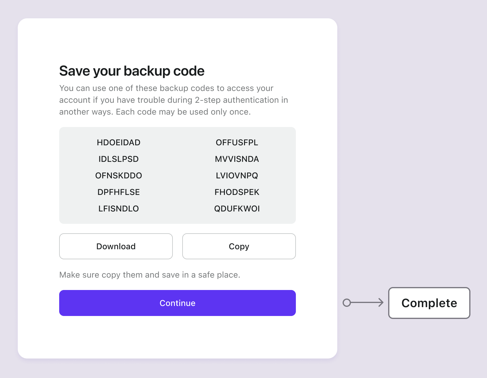

# バックアップコード

## 概念 {#concepts}

バックアップコード（リカバリーコードとも呼ばれる）は、MFA のための一度限りの使用コードであり、ユーザーの主要な認証 (Authentication) 要素（例：認証 (Authentication) アプリやハードウェアトークン）が利用できない場合のバックアップとして機能します。

これを失うと、アカウントの回復が困難になる可能性があります。そのため、バックアップコードを有効にする前に、追加の主要な要素を設定し、それに優先順位を与えることをお勧めします。

Logto は、ユーザーが追加の要素を設定すると、自動的に 10 個のバックアップコードを生成します。各コードは一度限りの使用です。ユーザーは、既存のコードをすべて使い切る前に、ユーザーアカウント設定（[Management API](/integrate-logto/interact-with-management-api/) を通じてアクセス可能）で新しいコードセットを再生成することをお勧めします。

## 認証 (Authentication) フロー {#authentication-flows}

- **バックアップコード設定フロー**

- **バックアップコード検証フロー**

