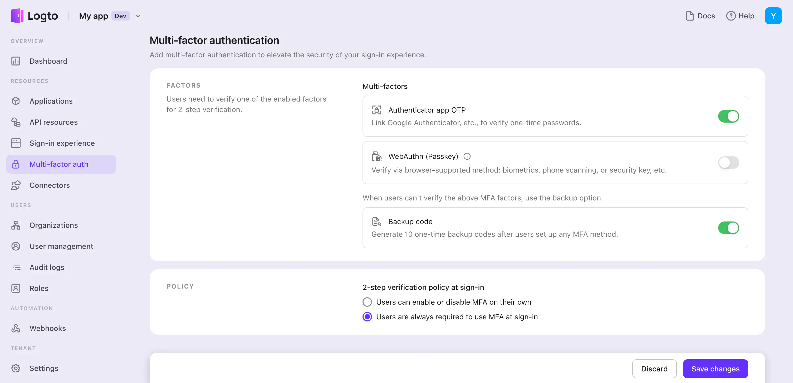

# MFA を設定する

## Logto で MFA 設定を構成する

ユーザーの Logto サインインフローで MFA を有効にするには、次の手順に従います：

1. 移動先：<CloudLink to="/mfa">Console > Multi-factor auth</CloudLink>。
2. ユーザーに対してサポートされている検証要素を有効にします。
   1. 主な要素：
      - [Authenticator App OTP](/end-user-flows/mfa/authenticator-app-otp)：最も一般的で広く受け入れられている方法です。Google Authenticator や Authy などの認証アプリによって生成される時間ベースのワンタイムパスワード (TOTP) を使用します。
      - [Passkeys (WebAuthn)](/end-user-flows/mfa/webauthn)：デバイスの生体認証やセキュリティキーなどをサポートする Web 製品に適した高セキュリティオプションで、強力な保護を保証します。
   2. バックアップ要素：
      - [バックアップコード](/end-user-flows/mfa/backup-codes)：これは、上記の主な要素を検証できない場合のバックアップオプションとして機能します。このオプションを有効にすると、ユーザーのアクセスが成功するための摩擦が軽減されます。
3. ユーザーの MFA ポリシー設定を選択します：
   - **ユーザー制御の MFA**：ユーザーはサインアップフロー中に MFA 設定プロセスをスキップできます。後でセルフサービスのアカウント設定ページまたは Logto ホストのアカウント設定ページ（近日公開予定）を通じて MFA を設定することを選択できます。ユーザーアカウント設定ページの実装について [詳細を学ぶ](/end-user-flows/account-settings/)。
   - **管理者による MFA の強制**：すべてのユーザーに対して MFA を強制できます。ユーザーはサインインプロセス中に MFA を設定するよう求められ、スキップすることはできません。ユーザーが MFA の設定に失敗したり、MFA 設定を削除した場合、再度 MFA を設定するまでアカウントにアクセスできなくなります。

## MFA ユーザーフロー

### MFA 設定フロー

MFA が有効になると、ユーザーはサインインおよびサインアッププロセス中に MFA を設定するよう求められます。「ユーザー制御の MFA」ポリシーが有効な場合に限り、ユーザーはこの設定プロセスをスキップできます。

1. **サインインまたはサインアップページにアクセス**：ユーザーはサインインまたはサインアップページに移動します。
2. **サインインまたはサインアップを完了**：ユーザーはサインインまたはサインアップフロー内でアイデンティティ検証プロセスを完了します。
3. **MFA 主な要素を設定**：ユーザーは主な MFA 要素（Authenticator アプリ OTP または WebAuthn のいずれか）を設定するよう求められます。複数の主な要素が有効になっている場合、ユーザーは好みのオプションを選択できます。「ユーザー制御の MFA」ポリシーが有効な場合、「スキップ」ボタンを選択してこのステップをスキップすることもできます。
4. **MFA バックアップ要素を設定**：**バックアップコード**が有効になっている場合、ユーザーは主な認証要素を正常に設定した後にバックアップコードを設定するよう求められます。自動生成されたバックアップコードがユーザーに表示され、ダウンロードして安全に保管できます。ユーザーはバックアップコードを手動で確認して MFA 設定プロセスを完了する必要があります。

### MFA 検証フロー

MFA を設定したユーザーは、サインイン時に設定された MFA 要素を使用してアイデンティティを検証するよう求められます。検証要素は、Logto の MFA 設定とユーザー設定に依存します。

- ユーザーが 1 つの要素のみを設定している場合、それを直接検証します。
- ユーザーが複数の要素を 2FA として設定している場合、1 つを選択して検証する必要があります。
- 有効な主な要素がすべてユーザーに利用できない場合、バックアップコードが有効であれば、ワンタイムバックアップコードを使用してアイデンティティを検証できます。

