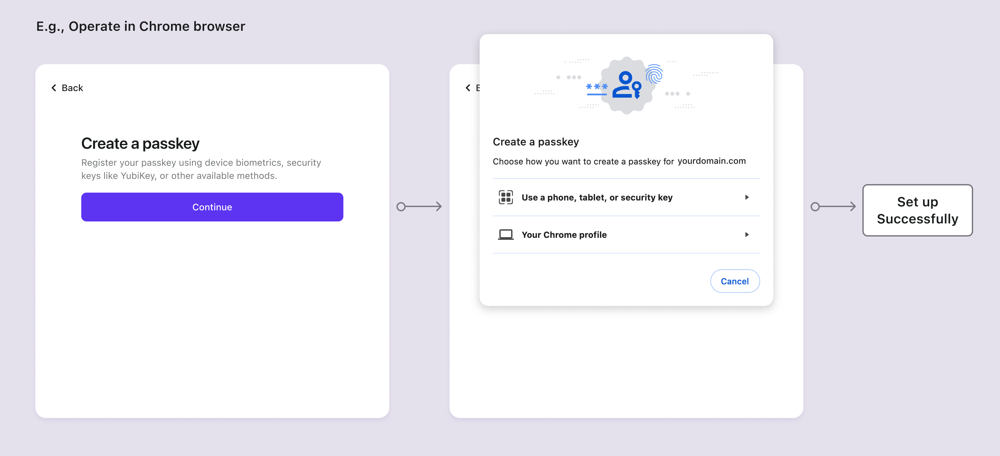
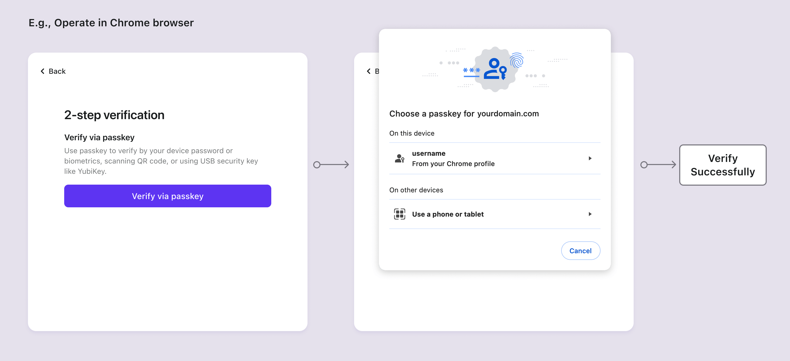

# Passkeys (WebAuthn)

[Passkey](https://auth.wiki/passkey) は、従来のパスワードに代わるより安全でユーザーフレンドリーなオプションを提供します。公開鍵暗号を使用することで、ユーザーのデバイス、サービスドメイン、およびユーザー ID をリンクし、フィッシングやパスワード攻撃に効果的に対抗します。さまざまなデバイスやブラウザと互換性があり、ユーザーはバイオメトリクスやハードウェアセキュリティ機能を使用して便利に認証できます。[WebAuthn](https://auth.wiki/webauthn) は、Web サイトがパスキーを実装するための API を提供します。

Logto は現在、多要素認証 (MFA) のために passkey (Webauthn) をサポートしています。パスキーサインイン機能は近日公開予定です。更新情報をお待ちください。

## 概念

顧客は常に WebAuthn よりも Passkeys を知っていますが、それらの関係は何であり、どのように使用するのでしょうか？これらの概念を探ってみましょう：

- **Passkeys**: パスキーは、パスワードに代わる FIDO ベースのフィッシング耐性のある資格情報です。非対称公開鍵暗号を利用してセキュリティを強化します。USB や Bluetooth デバイスなどのハードウェアトークンやセキュリティキーである場合があります。「Passkeys」はユーザーに表示される認証 (Authentication) 方法であるため、製品クライアント内で使用する必要があります。
- **WebAuthn**: これは W3C と FIDO Alliance によって開発された JavaScript API で、FIDO2 標準を使用して Web アプリケーションの認証 (Authentication) を強化します。Passkeys は WebAuthn がサポートする認証 (Authentication) 方法の一つです。Logto コンソールでは、この統合を専門的に「WebAuthn」と呼んでいます。

WebAuthn は、ユーザーが選択できる多様な認証 (Authentication) デバイスを提供し、ローカルおよびクラウドで使用可能な 2 種類があります：

- **プラットフォーム認証 (Internal authenticator)**: 特定のデバイス OS に結びついており、ユーザーがサインインするコンピュータ、ラップトップ、電話、またはタブレットなどです。バイオメトリクスやデバイスのパスコードなどの方法を使用して、デバイス上でのみ認証 (Authentication) を行うため、迅速に認証 (Authentication) できます。例：macOS または iOS での Touch ID、Face ID、またはデバイスパスコードによる iCloud キーチェーンの確認；顔認識、指紋、またはフレンドリーピンによる Windows Hello の確認。
- **ローミング認証 (External authenticator, Cross-platform authenticator)**: 別のポータブルデバイスまたはソフトウェアアプリケーションで、ハードウェアセキュリティキーやスマートフォンなどです。USB を使用してデバイスをリンクするか、NFC または Bluetooth をオンにしておく必要があります。ローミング認証 (Authentication) は単一のデバイスやブラウザに限定されず、より大きな柔軟性を提供します。

WebAuthn の原理とプロセスについて詳しく知るには、ブログ記事 [WebAuthn and Passkeys 101](https://blog.logto.io/web-authn-and-passkey-101/) と [Things you should know before integrating WebAuthn](https://blog.logto.io/webauthn-base-knowledge/) を参照してください。

## 制限に注意

WebAuthn を実装する際には、いくつかの制限に注意することが重要です：

1. **プラットフォームとブラウザの制限**: Logto は現在、ネイティブアプリケーションに対して WebAuthn サポートを提供していないことに注意してください。さらに、WebAuthn 認証 (Authentication) デバイスの利用可能性は、ブラウザとデバイスの機能に依存します（[リストを確認](https://caniuse.com/?search=webauthn)）。したがって、WebAuthn は常に多要素認証 (MFA) を実装する唯一のオプションではなく、製品にアクセスできるブラウザとデバイスを制御できます。
2. **ドメインの制限**: ドメインを変更すると、既存の WebAuthn アカウントを通じたユーザーの確認が妨げられる可能性があります。Passkeys は現在の Web ページの特定のドメインに結びついており、異なるドメイン間で使用することはできません。
3. **デバイスの制限**: デバイスを紛失すると、特に「このデバイス」プラットフォーム認証 (Authentication) に依存している場合、アカウントへのアクセスが失われる可能性があります。認証 (Authentication) アクセスを強化するために、ユーザーに複数の認証 (Authentication) 要素を提供することをお勧めします。

## 認証 (Authentication) フロー

Passkeys の仕様では、ユーザーが現在のページでボタンをアクティブにクリックして認証 (Authentication) コンポーネントを開始する必要があります。これは、セットアップと検証の両方のフローで、ユーザーが WebAuthn を開始するためにランディングページにリダイレクトされる必要があることを意味します。

- **パスキーセットアップフロー**

- **パスキー検証フロー**

## 関連リソース

<Url href="https://blog.logto.io/webauthn-base-knowledge">
  WebAuthn を統合する前に知っておくべきこと
</Url>

<Url href="https://blog.logto.io/web-authn-and-passkey-101">
  WebAuthn と Passkey 101
</Url>
