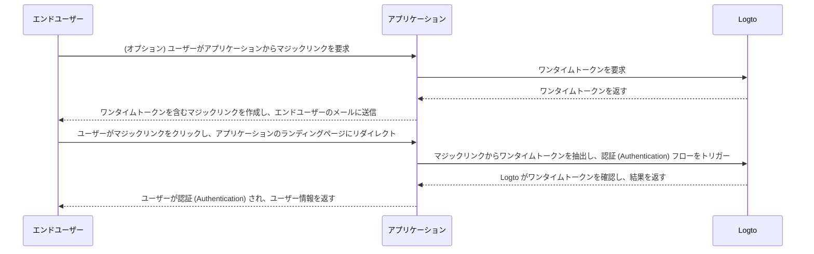

# マジックリンク (ワンタイムトークン)

import Availability from '@components/Availability';

<Availability cloud oss="comingSoon" />

ワンタイムパスワード (OTP) に似て、ワンタイムトークンはユーザーのアイデンティティを確認するために使用できる別のパスワードレス認証 (Authentication) 方法です。
トークンは限られた期間のみ有効で、エンドユーザーのメールアドレスに関連付けられています。

時には、新しいユーザーをアプリケーション / 組織に招待する際に、最初にアカウントを作成する必要がないようにしたい場合があります。
または、パスワードを忘れてしまい、メールを介して迅速にアイデンティティを確認してサインイン / パスワードをリセットしたい場合もあります。
そのような場合、アプリケーションは「マジックリンク」をメールに送信できます。そして、リンクをクリックするとすぐに認証 (Authentication) されます。

アプリケーション開発者は、ワンタイムトークンを使用してマジックリンクを作成し、エンドユーザーのメールアドレスに送信できます。

## ワンタイムトークンフロー \{#one-time-token-flow}

ワンタイムトークンを使用した認証 (Authentication) フローのシーケンス図は次のとおりです：



## 実装ガイド \{#implementation-guide}

Logto は、マジックリンクの実装を容易にするために、Management API と Experience API のセットを提供しています。

始める前に、Logto インスタンスが準備されていることを確認し、アプリケーションサーバーと Logto エンドポイント間のマシン間通信接続を確立してください（Management API に必要です）。 [Logto Management API](/integrate-logto/interact-with-management-api) について詳しく学びましょう。

### ステップ 1: ワンタイムトークンを要求する \{#step-1-request-one-time-token}

Logto Management API を使用してワンタイムトークンを作成します。

```bash
POST /api/one-time-tokens
```

リクエストボディのサンプルペイロード：

```json
{
  "email": "user@example.com",
  // オプション。デフォルトは 600 (10 分)。
  "expiresIn": 3600,
  // オプション。成功した確認後に指定された組織にユーザーがプロビジョニングされます。
  "context": {
    "jitOrganizationIds": ["abcdefgh1234"]
  }
}
```

### ステップ 2: マジックリンクを作成する \{#step-2-compose-your-magic-link}

ワンタイムトークンを取得した後、マジックリンクを作成し、エンドユーザーのメールアドレスに送信できます。
マジックリンクには少なくともトークンとユーザーのメールをパラメータとして含め、アプリケーション内のランディングページに移動する必要があります。
例： `https://yourapp.com/landing-page`。

マジックリンクの簡単な例は次のようになります：

```
https://yourapp.com/landing-page?token=YHwbXSXxQfL02IoxFqr1hGvkB13uTqcd&email=user@example.com
```

:::note

マジックリンク内のパラメータ名は完全にカスタマイズ可能です。
アプリケーションの要件に基づいてマジックリンクに追加情報を追加したり、すべての URL パラメータをエンコードしたりできます。

:::

### ステップ 3: Logto SDK を介して認証 (Authentication) フローをトリガーする \{#step-3-trigger-the-authentication-flow-via-logto-sdk}

エンドユーザーがマジックリンクをクリックしてアプリケーションに移動した後、URL から `token` と `email` パラメータを抽出し、Logto SDK の `signIn()` 関数を呼び出して認証 (Authentication) フローをトリガーします。

```typescript title="TokenLandingPage.tsx"
// React の例
import { useLogto } from '@logto/react';
import { useEffect } from 'react';
import { useSearchParams } from 'react-router-dom';

const TokenLandingPage = () => {
  const { signIn } = useLogto();
  const [searchParams] = useSearchParams();

  useEffect(() => {
    // マジックリンクからトークンとメールを抽出
    const oneTimeToken = searchParams.get('token');
    const email = searchParams.get('email');

    // これがサインインリダイレクト URI であると仮定
    const redirectUri = 'https://yourapp.com/callback';

    if (oneTimeToken && email) {
      signIn({
        redirectUri,
        clearTokens: false, // オプション。以下の警告メッセージを参照
        extraParams: {
          'one_time_token': oneTimeToken,
          'login_hint': email,
        },
      });
    }
  }, [searchParams, signIn]);

  return <>お待ちください...</>;
};
```

:::warning

ユーザーがすでにサインインしている場合、SDK の `signIn()` 関数を呼び出すと、クライアントストレージからすべてのキャッシュされたトークン (ID トークン、アクセス トークン、リフレッシュ トークン) が自動的にクリアされ、現在のユーザーの認証 (Authentication) 状態が失われます。

したがって、既存のトークンをクリアしないようにするために、追加のサインインパラメータ `clearTokens: false` を指定する必要があります。
これを指定した場合、サインインコールバックページでトークンを手動でクリアする必要もあります。

マジックリンクが認証済みユーザー用に設計されていない場合は、これを無視してください。

:::

### ステップ 4: (オプション) サインインコールバックページでキャッシュされたトークンをクリアする \{#step-4-clear-cached-tokens-in-sign-in-callback-page}

サインイン関数で `clearTokens: false` を指定した場合、サインインコールバックページでトークンを手動でクリアする必要があります。

```typescript title="Callback.tsx"
// React の例
import { useHandleSignInCallback, useLogto } from '@logto/react';
import { useEffect } from 'react';

const Callback = () => {
  const { clearAllTokens } = useLogto();

  useEffect(() => {
    void clearAllTokens();
  }, [clearAllTokens]);

  useHandleSignInCallback(() => {
    // ホームページに移動
  });

  return <>お待ちください...</>;
};
```

## よくある質問 \{#faqs}

<details>

<summary>

### マジックリンクを使用して新しいユーザーを組織に招待できますか？ \{#can-i-use-the-magic-link-to-invite-new-users-to-my-organizations}

</summary>

はい、マジックリンクを使用してアプリケーションや組織に新しいユーザーを招待できます。
組織に新しいユーザーを招待したい場合は、リクエストボディで `jitOrganizationIds` を指定するだけです。

ユーザーは確認が成功すると自動的に組織に参加し、デフォルトの組織ロールが割り当てられます。
組織の詳細ページで「ジャストインタイムプロビジョニング」セクションを確認し、組織のデフォルトロールを設定してください。

</details>

<details>

<summary>

### ワンタイムトークンは期限切れになりますか？ \{#does-the-one-time-token-expire}

</summary>

はい、ワンタイムトークンは指定された `expiresIn` 時間（秒単位）後に期限切れになります。デフォルトの有効期限は 10 分です。

</details>

<details>

<summary>

### 「サインイン体験」でユーザー登録を無効にした場合でも、マジックリンクを使用してユーザーを招待できますか？ \{#if-i-disable-user-registration-in-sign-in-experience-can-i-still-use-magic-link-to-invite-users}

</summary>

はい、「サインイン体験」でユーザー登録を無効にしても、マジックリンクを使用してユーザーを招待できます。

</details>

<details>

<summary>

### ユーザーがすでにサインインしている場合、別のマジックリンクをクリックするとどうなりますか？ \{#what-will-happen-if-a-user-already-signed-in-and-then-click-another-magic-link}

</summary>

いくつかのシナリオが考えられます：

1. ユーザーがすでにサインインしており、現在のユーザーアカウントに関連付けられたマジックリンクをクリックした場合。この場合、Logto はワンタイムトークンを確認し、必要に応じてユーザーを指定された組織にプロビジョニングします。
2. ユーザーがすでにサインインしており、別のアカウントに関連付けられたマジックリンクをクリックした場合。この場合、Logto はユーザーに新しいアカウントとして続行するか、現在のアカウントでアプリケーションに戻るかを促します。
   1. ユーザーが新しいアカウントとして続行することを選択した場合、トークンの確認が成功した後に Logto は新しいアカウントに切り替わります。
   2. ユーザーが現在のアカウントに留まることを選択した場合、Logto はトークンを確認せず、現在のアカウントでアプリケーションに戻ります。
3. サインインプロンプトが「login」に設定されているか、「login」を含んでいる場合、Logto はアカウントの切り替えを促さずにワンタイムトークンに関連付けられたアカウントに自動的にサインインします。

</details>
