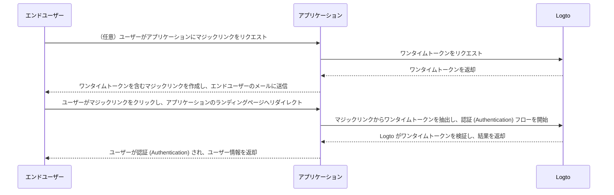

# マジックリンク（ワンタイムトークン）

ワンタイムパスワード（OTP）と同様に、ワンタイムトークンはユーザーのアイデンティティを検証するために使用できる、もう一つのパスワードレス認証 (Authentication) 方法です。
このトークンは一定期間のみ有効で、エンドユーザーのメールアドレスに紐付けられます。

新しいユーザーをアプリケーション / 組織に招待したいが、事前にアカウント作成を求めたくない場合があります。
または、パスワードを忘れてしまい、メールで素早く本人確認をしてサインイン / パスワードリセットをしたい場合もあるでしょう。
このような場合、アプリケーションは「マジックリンク」をメールで送信できます。リンクをクリックすると、即座に認証 (Authentication) されます。

アプリケーション開発者はワンタイムトークンを使ってマジックリンクを作成し、エンドユーザーのメールアドレスに送信できます。

## ユースケース \{#use-cases}

Logto はマジックリンクで次のシナリオをサポートしています：

- **招待制登録**：社内ツールやテスト段階の AI プロダクトなどで、公開登録を無効にし、特定のユーザーだけをマジックリンクで招待できます。
- **組織メンバー招待**：SaaS プロダクトで、新しいメンバーを組織に招待し、オンボーディングプロセスを効率化できます。
- **サインイン / サインアップ**：メール経由でパスワードレスのサインインやサインアップ用のマジックリンクを送信できます。

例えば、公開登録を無効にしている場合、ワンタイムトークン付きのマジックリンク（例： `https://yourapp.com/landing-page?token=YHwbXSXxQfL02IoxFqr1hGvkB13uTqcd&email=user@example.com` ）をユーザーのメールに送信し、アカウント作成を完了するよう招待できます。メールテンプレートは独自のメール配信サービスでカスタマイズ可能です。例：


現在サポートされていないもの：

- マジックリンクによるパスワードリセット
- 電話番号やユーザー名を識別子として使用すること

## ワンタイムトークンのフロー \{#one-time-token-flow}

ワンタイムトークンを使った認証 (Authentication) フローのシーケンス図は以下の通りです：



## 実装ガイド \{#implementation-guide}

Logto はマジックリンクの実装を簡単にするため、Management API および Experience API のセットを提供しています。

始める前に、Logto インスタンスが用意されていること、アプリケーションサーバーと Logto エンドポイント間でマシン間通信 (M2M) 接続が確立されていることを確認してください（Management API に必要です）。詳しくは [Logto Management API](/integrate-logto/interact-with-management-api) をご覧ください。

### ステップ 1: ワンタイムトークンのリクエスト \{#step-1-request-one-time-token}

Logto Management API を使ってワンタイムトークンを作成します。

```bash
POST /api/one-time-tokens
```

リクエストボディの例：

```json
{
  "email": "user@example.com",
  // 任意。デフォルトは 600（10 分）。
  "expiresIn": 3600,
  // 任意。検証に成功した場合、指定した組織にユーザーがプロビジョニングされます。
  "context": {
    "jitOrganizationIds": ["abcdefgh1234"]
  }
}
```

### ステップ 2: マジックリンクの作成 \{#step-2-compose-your-magic-link}

ワンタイムトークンを取得したら、マジックリンクを作成し、エンドユーザーのメールアドレスに送信します。
マジックリンクには少なくともトークンとユーザーのメールアドレスをパラメータとして含め、自身のアプリケーションのランディングページに遷移させる必要があります。
例： `https://yourapp.com/landing-page`

マジックリンクの例：

```
https://yourapp.com/landing-page?token=YHwbXSXxQfL02IoxFqr1hGvkB13uTqcd&email=user@example.com
```

:::note

マジックリンク内のパラメータ名は完全にカスタマイズ可能です。
アプリケーションの要件に応じて追加情報をマジックリンクに含めたり、URL パラメータをすべてエンコードしたりできます。

:::

### ステップ 3: Logto SDK で認証 (Authentication) フローを開始 \{#step-3-trigger-the-authentication-flow-via-logto-sdk}

エンドユーザーがマジックリンクをクリックしてアプリケーションに遷移したら、URL から `token` と `email` パラメータを抽出し、Logto SDK の `signIn()` 関数を呼び出して認証 (Authentication) フローを開始します。

```typescript title="TokenLandingPage.tsx"
// React の例
import { useLogto } from '@logto/react';
import { useEffect } from 'react';
import { useSearchParams } from 'react-router-dom';

const TokenLandingPage = () => {
  const { signIn } = useLogto();
  const [searchParams] = useSearchParams();

  useEffect(() => {
    // マジックリンクからトークンとメールアドレスを抽出
    const oneTimeToken = searchParams.get('token');
    const email = searchParams.get('email');

    // これはサインインリダイレクト URI の例
    const redirectUri = 'https://yourapp.com/callback';

    if (oneTimeToken && email) {
      signIn({
        redirectUri,
        clearTokens: false, // 任意。下記の警告メッセージ参照
        extraParams: {
          'one_time_token': oneTimeToken,
          'login_hint': email,
        },
      });
    }
  }, [searchParams, signIn]);

  return <>お待ちください...</>;
};
```

:::warning

ユーザーがすでにサインインしている場合、SDK の `signIn()` 関数を呼び出すと、クライアントストレージからすべてのキャッシュ済みトークン（ID トークン、アクセス トークン、リフレッシュ トークン）が自動的にクリアされ、
現在のユーザーの認証 (Authentication) 状態が失われます。

そのため、既存のトークンをクリアしないように追加のサインインパラメータ `clearTokens: false` を指定してください。
これを指定した場合、サインインコールバックページで手動でトークンをクリアする必要があります。

マジックリンクが認証 (Authentication) 済みユーザー向けでない場合は、この注意事項を無視してください。

:::

### ステップ 4: （任意）サインインコールバックページでキャッシュ済みトークンをクリア \{#step-4-clear-cached-tokens-in-sign-in-callback-page}

サインイン関数で `clearTokens: false` を指定した場合、サインインコールバックページで手動でトークンをクリアする必要があります。

```typescript title="Callback.tsx"
// React の例
import { useHandleSignInCallback, useLogto } from '@logto/react';
import { useEffect } from 'react';

const Callback = () => {
  const { clearAllTokens } = useLogto();

  useEffect(() => {
    void clearAllTokens();
  }, [clearAllTokens]);

  useHandleSignInCallback(() => {
    // ホームページへ遷移
  });

  return <>お待ちください...</>;
};
```

## よくある質問 \{#faqs}

<details>

<summary>

### マジックリンクで新しいユーザーを組織に招待できますか？ \{#can-i-use-the-magic-link-to-invite-new-users-to-my-organizations}

</summary>

はい、マジックリンクを使ってアプリケーションや組織に新しいユーザーを招待できます。
組織に新しいユーザーを招待したい場合は、リクエストボディで `jitOrganizationIds` を指定してください。

ユーザーは検証に成功すると自動的に組織に参加し、デフォルトの組織ロールが割り当てられます。
組織詳細ページの「ジャストインタイムプロビジョニング」セクションで、組織のデフォルトロールを設定できます。

</details>

<details>

<summary>

### マジックリンクでユーザーに特定のロールを割り当てられますか？ \{#can-i-assign-users-to-specific-roles-using-the-magic-link}

</summary>

マジックリンク認証 (Authentication) フローでは、ユーザーへのロール割り当てはサポートされていません。ただし、[Webhook](/developers/webhooks) や [Management API](/user-management/manage-users#manage-roles-of-users) を使って、ユーザー登録後にロールを更新できます。

</details>

<details>

<summary>

### ワンタイムトークンは有効期限がありますか？ \{#does-the-one-time-token-expire}

</summary>

はい、ワンタイムトークンは指定した `expiresIn` 時間（秒）後に失効します。デフォルトの有効期限は 10 分です。

</details>

<details>

<summary>

### 「サインイン体験」でユーザー登録を無効にしても、マジックリンクでユーザーを招待できますか？ \{#if-i-disable-user-registration-in-sign-in-experience-can-i-still-use-magic-link-to-invite-users}

</summary>

はい、「サインイン体験」でユーザー登録を無効にしても、マジックリンクでユーザーを招待できます。

</details>

<details>

<summary>

### すでにサインインしているユーザーが、別のマジックリンクをクリックした場合どうなりますか？ \{#what-will-happen-if-a-user-already-signed-in-and-then-click-another-magic-link}

</summary>

いくつかのシナリオが考えられます：

1. ユーザーがすでにサインインしており、現在のアカウントに関連付けられたマジックリンクをクリックした場合。この場合、Logto はワンタイムトークンを検証し、必要に応じて組織へのプロビジョニングを行います。
2. ユーザーがすでにサインインしており、別のアカウントに関連付けられたマジックリンクをクリックした場合。この場合、Logto は新しいアカウントで続行するか、現在のアカウントでアプリケーションに戻るかをユーザーに促します。
   1. ユーザーが新しいアカウントで続行を選択した場合、トークン検証が成功すると Logto は新しいアカウントに切り替えます。
   2. ユーザーが現在のアカウントを維持する場合、Logto はトークンを検証せず、現在のアカウントでアプリケーションに戻ります。
3. サインインプロンプトが "login" または "login" を含む場合、Logto は切り替えを促さず、ワンタイムトークンに関連付けられたアカウントで自動的にサインインします。これは "login" プロンプトが明示的な認証 (Authentication) 意図を示し、現在のセッションより優先されるためです。

</details>
