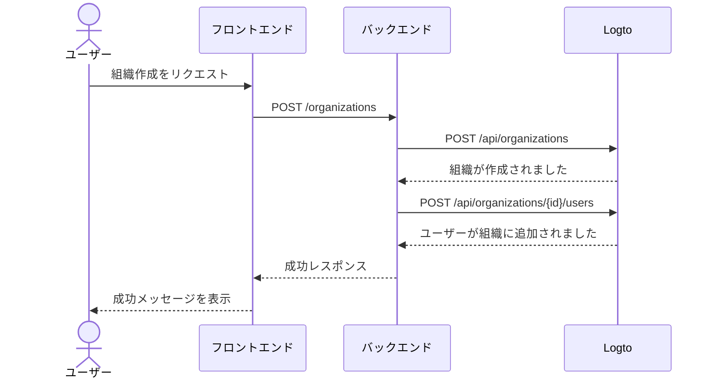

import GearIcon from '@site/src/assets/gear.svg';
import OrganizationIcon from '@site/src/assets/organization.svg';

# 組織体験 (Organization experience)

[組織 (Organization)](/organizations) 体験とは、ビジネス顧客やその従業員が利用する一連の UI やフローのことです。特に [マルチテナントアプリケーション](https://auth.wiki/multi-tenancy) で重要です。このガイドでは、Logto Management API を使ってアプリに組織体験を統合する方法を紹介します。

このセクションでは、エンドユーザー向けの **組織体験 (Organization experience)** を設計するのに役立つ情報を提供します。例えば：

1. 管理者が自分の組織を作成できる。
2. 管理者が組織メンバーを管理できる。
3. 管理者がメンバーを組織に招待できる。
4. その他多数。

  

## 認証フローを理解する \{#understand-the-authentication-flow}

Logto Management API と連携するには、まず基本的な認証フローを理解しましょう。主な要件は 2 つあります：

### バックエンド API を保護する \{#protect-your-backend-api}

- フロントエンドからバックエンド API への呼び出しには認証が必要です。
- ユーザーの Logto アクセス トークンを検証して API エンドポイントを保護します。
- 認証済みユーザーのみがサービスにアクセスできるようにします。

### Logto Management API へアクセスする \{#access-the-logto-management-api}

- バックエンドサービスが Logto Management API へ安全にアクセスします。
- セットアップ方法は [Management API との連携](/integrate-logto/interact-with-management-api) ガイドを参照してください。
- マシン間通信認証 (Machine-to-machine authentication) を利用してアクセス認証情報を取得します。

次の章では、Logto Management API のセットアップ方法や、組織体験を構築するための一般的なユースケースについて説明します。

## 組織体験の機能 \{#features-for-organization-experience}

<DocCardList
  items={[
    {
      type: 'link',
      label: '組織の作成',
      href: '/end-user-flows/organization-experience/create-organization',
      description:
        'Logto Management API を利用して、エンドユーザーが自分で組織を作成できるようにします。',
      customProps: {
        icon: <OrganizationIcon />,
      },
    },
    {
      type: 'link',
      label: '組織メンバーの招待',
      href: '/end-user-flows/organization-experience/invite-organization-members',
      description:
        'Logto Management API を利用して、組織管理者がメンバーを組織に招待できるようにします。',
      customProps: {
        icon: <OrganizationIcon />,
      },
    },
    {
      type: 'link',
      label: '組織管理',
      href: '/end-user-flows/organization-experience/organization-management',
      description:
        'Logto Management API を利用して、組織管理者が組織内のメンバーを管理できるようにします。',
      customProps: {
        icon: <GearIcon />,
      },
    },
  ]}
/>

組織の定義やメンバーの概念、組織テンプレートの詳細な説明については、[組織の仕組みを理解する](/organizations/understand-how-organizations-work) を参照してください。

## 関連リソース \{#related-resources}

<Url href="https://blog.logto.io/build-multi-tenant-saas-application">
  マルチテナント SaaS アプリケーションの構築：設計から実装までの完全ガイド
</Url>
