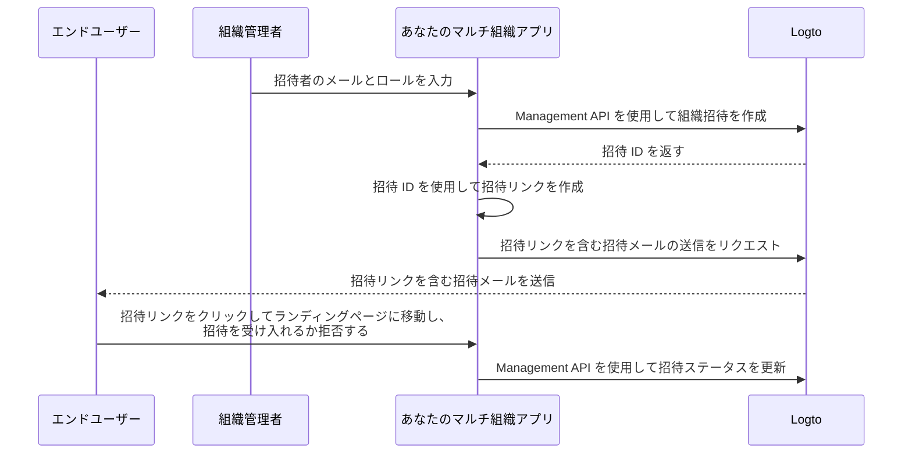

# 組織メンバーを招待する

マルチ組織アプリケーションとして、一般的な要件の一つは、メンバーを組織に招待することです。このガイドでは、アプリケーションでこの機能を実装するための手順と技術的な詳細を説明します。

## フローの概要

全体のプロセスは以下の図で示されています：



## 組織ロールを作成する

メンバーを組織に招待する前に、組織ロールを作成する必要があります。詳細な手順については、[組織テンプレートの設定](/authorization/organization-template/configure-organization-template)ガイドを確認してください。

このガイドでは、典型的な組織ロールとして `admin` と `member` を作成します。

`admin` ロールは組織内のすべてのリソースにフルアクセスを持ち、`member` ロールは制限されたアクセスを持ちます。例えば、各ロールは次のような権限セットを持つことができます：

- `admin` ロール：
  - `read:data` - すべての組織データリソースへの読み取りアクセス。
  - `write:data` - すべての組織データリソースへの書き込みアクセス。
  - `delete:data` - すべての組織データリソースの削除アクセス。
  - `invite:member` - 組織へのメンバー招待。
  - `manage:member` - 組織内のメンバー管理。
  - `delete:member` - 組織からのメンバー削除。
- `member` ロール：
  - `read:data` - すべての組織データリソースへの読み取りアクセス。
  - `write:data` - すべての組織データリソースへの書き込みアクセス。
  - `invite:member` - 組織へのメンバー招待。

これは [Logto Console](https://cloud.logto.io/) で簡単に行うことができます。また、[Logto Management API](https://openapi.logto.io/operation/operation-createorganizationrole) を使用してプログラム的に組織ロールを作成することもできます。

## メールコネクターを設定する

招待はメールで送信されるため、[メールコネクター](/connectors/email-connectors) が適切に設定されていることを確認してください。招待を送信するには、新たに導入された [メールテンプレート](/connectors/email-connectors/email-templates#email-template-types) 使用タイプ - `OrganizationInvitation` を設定する必要があります。

`OrganizationInvitation` 使用タイプのサンプルメールテンプレートは以下の通りです：

```json
{
  "subject": "Welcome to my organization",
  "content": "<p>Join my organization by this <a href=\"{{link}}\" target=\"_blank\">link</a>.</p>",
  "usageType": "OrganizationInvitation",
  "type": "text/html"
}
```

メールコンテンツ内の `{{link}}` プレースホルダーは、メール送信時に実際の招待リンクに置き換えられます。このガイドでは、`https://your-app.com/invitation/accept/{your-invitation-id}` になるとします。

:::note

Logto Cloud の組み込み「Logto メールサービス」は現在 `OrganizationInvitation` 使用タイプをサポートしていません。代わりに、メールコネクター（例：Sendgrid）を設定し、`OrganizationInvitation` テンプレートを設定する必要があります。

:::

## Logto Management API で招待を処理する

:::note

まだ Logto Management API を設定していない場合は、[Management API と連携する](/integrate-logto/interact-with-management-api) を確認してください。

:::

組織機能には招待関連の Management API を提供しています。これらの API を使用して、次のことができます：

- `POST /api/organization-invitations` 組織ロールを割り当てて組織招待を作成します。
- `POST /api/organization-invitations/{id}/message` 招待者にメールで組織招待を送信します。
  注：この API ペイロードは `link` プロパティをサポートしており、招待 ID に基づいて招待リンクを作成できます。例えば：

  ```json
  {
    "link": "https://your-app.com/invitation/accept/{your-invitation-id}"
  }
  ```

  それに応じて、招待者が招待リンクを通じてアプリケーションに移動したときにランディングページを実装する必要があります。

- `GET /api/organization-invitations` & `GET /api/organization-invitations/{id}` すべての招待または特定の招待を ID で取得します。
  ランディングページで、これらの API を使用してユーザーが受け取ったすべての招待または招待の詳細を一覧表示します。
- `PUT /api/organization-invitations/{id}/status` 招待ステータスを更新して招待を受け入れるか拒否します。
  この API を使用して、招待に対するユーザーの応答を処理します。

上記のすべての API は有効な「組織トークン」を必要とすることに注意してください。[このガイド](/authorization/organization-template/protect-organization-resources#step-2-fetch-the-organization-token) を確認して、組織トークンを取得する方法を学んでください。

## 組織ロールベースのアクセス制御 (RBAC) を使用してユーザー権限を管理する

上記の設定により、メールで招待を送信し、招待者は割り当てられたロールで組織に参加できるようになります。

異なる組織ロールを持つユーザーは、組織トークン内で異なるスコープ（権限）を持ちます。したがって、クライアントアプリとバックエンドサービスの両方がこれらのスコープを確認して、表示可能な機能と許可されたアクションを決定する必要があります。

## 組織トークン内のスコープ更新を処理する

:::note

アプリと組織を統合していることを確認してください。詳細については、[統合ガイド](/authorization/organization-template/protect-organization-resources) を確認してください。

:::

組織トークン内のスコープ更新を管理するには：

### 既存のスコープを取り消す

例えば、管理者を非管理者メンバーに降格する場合、ユーザーからスコープを削除する必要があります。この場合、キャッシュされた組織トークンをクリアし、リフレッシュトークンで新しいトークンを取得するだけです。縮小されたスコープは、新たに発行された組織トークンに即座に反映されます。

### 新しいスコープを付与する

これはさらに 2 つのシナリオに分けられます：

#### 認証システムで既に定義されている新しいスコープを付与する

スコープの取り消しと同様に、新たに付与されたスコープが認証サーバーに既に登録されている場合、新しい組織トークンを発行するだけで、新しいスコープが即座に反映されます。

#### 認証システムに新たに導入された新しいスコープを付与する

この場合、ユーザーの組織トークンを更新するために再ログインまたは再同意プロセスをトリガーする必要があります。例えば、Logto SDK の `signIn` メソッドを呼び出します。

[組織トークンの発行](/authorization/organization-template/protect-organization-resources/#fetch-the-organization-token) について詳しく学びましょう。

### リアルタイムの権限チェックと組織トークンの更新を実装する

Logto は、組織内のリアルタイムのユーザー権限を取得するための Management API を提供しています。

- `GET /api/organizations/{id}/users/{userId}/scopes` ([API リファレンス](https://openapi.logto.io/operation/operation-listorganizationuserscopes))

その後、ユーザーの組織トークン内のスコープとリアルタイムの権限を比較して、ユーザーが昇格または降格されたかどうかを判断できます。

- 降格された場合、キャッシュされた組織トークンをクリアするだけで、SDK は自動的に更新されたスコープを持つ新しいトークンを発行します。

  ```ts
  const { clearAccessToken } = useLogto();

  ...
  // 取得したリアルタイムスコープが組織トークンスコープより少ない場合
  await clearAccessToken();
  ```

  これには再ログインや再同意プロセスは必要ありません。新しい組織トークンは Logto SDK によって自動的に発行されます。

- 認証システムに新しいスコープが導入された場合、ユーザーの組織トークンを更新するために再ログインまたは再同意プロセスをトリガーします。React SDK を例にとります：

  ```ts
  const { clearAllTokens, signIn } = useLogto();

  ...
  // 取得したリアルタイムスコープが組織トークンスコープより新しく割り当てられたスコープを持つ場合
  await clearAllTokens();
  signIn({
    redirectUri: '<your-sign-in-redirect-uri>',
    prompt: 'consent',
  });
  ```

  上記のコードは、同意画面へのページナビゲーションをトリガーし、更新されたスコープを持つユーザーの組織トークンと共にアプリに自動的にリダイレクトします。

## 関連リソース

<Url href="https://blog.logto.io/implement-user-collaboration-in-your-app">
  マルチテナントアプリ内でのユーザーコラボレーションの実装方法
</Url>
