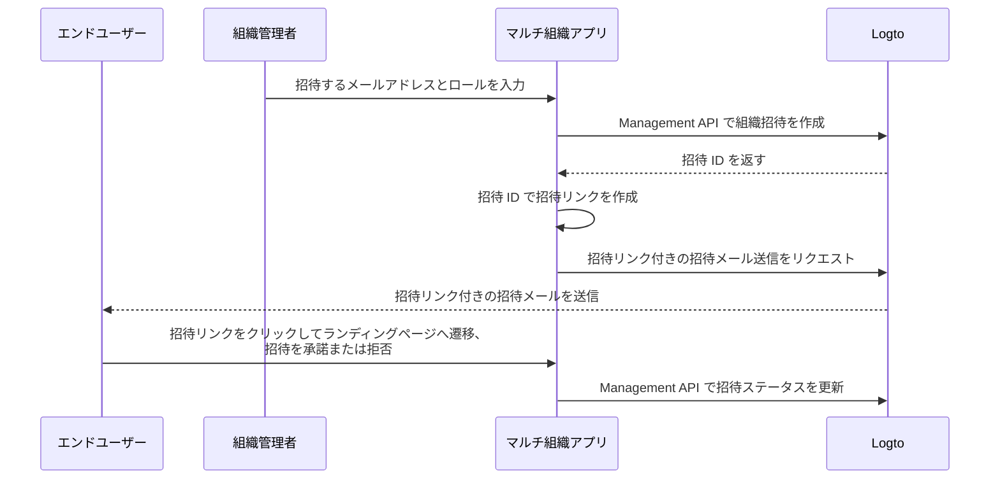

# 組織メンバーの招待

マルチ組織アプリケーションでは、組織にメンバーを招待することが一般的な要件です。このガイドでは、アプリケーションでこの機能を実装するための手順と技術的な詳細を説明します。

## フロー概要 \{#flow-overview}

全体のプロセスは、以下の図で示されています：



## 組織ロールの作成 \{#create-organization-roles}

組織にメンバーを招待する前に、組織ロールを作成する必要があります。組織ロールと権限については [組織テンプレート](/authorization/organization-template) をご覧ください。

このガイドでは、典型的な組織ロールとして `admin` と `member` を作成します。

`admin` ロールは組織内のすべてのリソースへのフルアクセス権を持ち、`member` ロールはアクセスが制限されます。例えば、各ロールには以下のような権限セットを持たせることができます：

- `admin` ロール:
  - `read:data` - 組織のすべてのデータリソースの読み取り権限
  - `write:data` - 組織のすべてのデータリソースの書き込み権限
  - `delete:data` - 組織のすべてのデータリソースの削除権限
  - `invite:member` - 組織へのメンバー招待
  - `manage:member` - 組織内メンバーの管理
  - `delete:member` - 組織からメンバーを削除
- `member` ロール:
  - `read:data` - 組織のすべてのデータリソースの読み取り権限
  - `write:data` - 組織のすべてのデータリソースの書き込み権限
  - `invite:member` - 組織へのメンバー招待

これらは [Logto Console](https://cloud.logto.io/) で簡単に設定できます。また、[Logto Management API](https://openapi.logto.io/operation/operation-createorganizationrole) を使ってプログラムで組織ロールを作成することも可能です。

## メールコネクターの設定 \{#configure-your-email-connector}

招待はメールで送信されるため、[メールコネクター](/connectors/email-connectors) が正しく設定されていることを確認してください。招待を送信するには、[メールテンプレート](/connectors/email-connectors/email-templates#email-template-types) の使用タイプとして `OrganizationInvitation` を設定する必要があります。メール内容には組織（例：組織名、ロゴ）や招待者（例：招待者のメールアドレス、名前）の [変数](/connectors/email-connectors/email-templates#email-template-variables) を含めたり、[多言語テンプレート](/connectors/email-connectors/email-templates#email-template-localization) をカスタマイズすることもできます。

`OrganizationInvitation` 用のサンプルメールテンプレートは以下の通りです：

```json
{
  "subject": "Welcome to my organization",
  "content": "<p>Join {{organization.name}} by this <a href=\"{{link}}\" target=\"_blank\">link</a>.</p>",
  "usageType": "OrganizationInvitation",
  "type": "text/html"
}
```

メール本文の `{{link}}` プレースホルダーは、メール送信時に実際の招待リンクに置き換えられます。このガイドでは、例えば `https://your-app.com/invitation/accept/{your-invitation-id}` となります。

:::note

Logto Cloud の組み込み「Logto email service」は現時点で `OrganizationInvitation` 使用タイプをサポートしていません。代わりに、メールコネクター（例：Sendgrid）を設定し、`OrganizationInvitation` テンプレートを用意してください。

:::

## Logto Management API で招待を処理する \{#handle-invitations-with-logto-management-api}

:::note

Logto Management API のセットアップがまだの場合は、[Management API との連携](/integrate-logto/interact-with-management-api) をご覧ください。

:::

### Cloud および OSS v1.27.0+ ユーザー向け \{#for-cloud-and-oss-v1-27-0-users}

[マジックリンク（ワンタイムトークン）](/end-user-flows/one-time-token) 機能を使って招待フローを処理できます。

Management API を呼び出してワンタイムトークンを作成し、トークンと招待先メールアドレスでマジックリンクを作成します。
このリンクを上記メールテンプレートの `{{link}}` プレースホルダーに挿入し、招待者にメールを送信します。
例えば、`https://your-app.com/landing-page?token={your-one-time-token}&email={invitee-email}` のようなリンクを作成できます（招待 ID を含むものの代わりに）。

この方法が推奨されます。なぜなら、招待者がまだアカウントを持っていない場合でも、マジックリンクで自動的に登録されるためです。

詳細は [マジックリンク（ワンタイムトークン）](/end-user-flows/one-time-token) ページをご覧ください。

### OSS v1.26.0- ユーザー向け \{#for-oss-v1-26-0--users}

組織機能に招待関連の Management API を用意しています。これらの API で以下が可能です：

- `POST /api/organization-invitations` で組織招待を作成し、組織ロールを割り当てる
- `POST /api/organization-invitations/{id}/message` で招待メールを送信
  ※この API のペイロードには `link` プロパティがあり、招待 ID を使って招待リンクを作成できます。例：

  ```json
  {
    "link": "https://your-app.com/invitation/accept/{your-invitation-id}"
  }
  ```

  招待者が招待リンクからアプリケーションに遷移した際のランディングページを実装する必要があります。

- `GET /api/organization-invitations` & `GET /api/organization-invitations/{id}` で全招待または特定の招待を取得
  ランディングページで、これらの API を使ってユーザーが受け取った招待一覧や詳細を表示できます。
- `PUT /api/organization-invitations/{id}/status` で招待の承諾または拒否
  この API でユーザーの招待への応答を処理します。

## 組織ロールベースのアクセス制御 (RBAC) でユーザー権限を管理 \{#use-organization-role-based-access-control-rbac-to-manage-user-permissions}

上記の設定により、メールで招待を送信し、招待者は割り当てられたロールで組織に参加できるようになります。

異なる組織ロールを持つユーザーは、組織トークン内のスコープ（権限）が異なります。そのため、クライアントアプリやバックエンドサービスはこれらのスコープを確認し、表示する機能や許可される操作を判断してください。

## 組織トークンのスコープ更新を処理する \{#handle-scope-updates-in-organization-tokens}

:::note
このセクションは、組織テンプレートや認可 (Authorization) シナリオの高度な内容を含みます。これらの概念に不慣れな場合は、[認可 (Authorization)](/authorization) および [組織テンプレート](/authorization/organization-template) を先にご覧ください。
:::

組織トークンのスコープ更新管理には以下が含まれます：

### 既存スコープの取り消し \{#revoking-existing-scopes}

例えば、管理者を一般メンバーに降格する場合、ユーザーからスコープを削除する必要があります。この場合、キャッシュされた組織トークンをクリアし、リフレッシュトークンで新しいトークンを取得するだけで OK です。縮小されたスコープは新しい組織トークンに即時反映されます。

### 新しいスコープの付与 \{#granting-new-scopes}

これはさらに 2 つのシナリオに分けられます：

#### 認証システムですでに定義済みの新しいスコープを付与 \{#grant-new-scopes-that-already-defined-in-your-auth-system}

スコープの取り消しと同様に、新たに付与されたスコープが認証サーバーにすでに登録されている場合は、新しい組織トークンを発行するだけで新しいスコープが即時反映されます。

#### 認証システムに新たに導入されたスコープを付与 \{#grant-new-scopes-that-are-newly-introduced-your-auth-system}

この場合、ユーザーの組織トークンを更新するために再ログインまたは再同意プロセスをトリガーする必要があります（例：Logto SDK の `signIn` メソッドを呼び出す）。

### リアルタイム権限チェックと組織トークンの更新 \{#implement-real-time-permission-check-and-update-organization-token}

Logto は Management API で組織内のユーザー権限をリアルタイムで取得できます。

- `GET /api/organizations/{id}/users/{userId}/scopes` ([API リファレンス](https://openapi.logto.io/operation/operation-listorganizationuserscopes))

ユーザーの組織トークン内のスコープとリアルタイム権限を比較し、昇格または降格されたかどうかを判断できます。

- 降格された場合は、キャッシュされた組織トークンをクリアするだけで、SDK が自動的に新しいスコープでトークンを発行します。

  ```ts
  const { clearAccessToken } = useLogto();

  ...
  // 取得したリアルタイムスコープが組織トークンスコープより少ない場合
  await clearAccessToken();
  ```

  この場合、再ログインや再同意プロセスは不要です。Logto SDK が自動的に新しい組織トークンを発行します。

- 新しいスコープが認証システムに追加された場合は、再ログインまたは再同意プロセスをトリガーして組織トークンを更新します。React SDK の例：

  ```ts
  const { clearAllTokens, signIn } = useLogto();

  ...
  // 取得したリアルタイムスコープが組織トークンスコープより新しいスコープを含む場合
  await clearAllTokens();
  signIn({
    redirectUri: '<your-sign-in-redirect-uri>',
    prompt: 'consent',
  });
  ```

  上記コードは同意画面へのページ遷移をトリガーし、ユーザーの組織トークンに更新されたスコープを付与してアプリに自動リダイレクトします。

## 関連リソース \{#related-resources}

<Url href="https://blog.logto.io/implement-user-collaboration-in-your-app">
  マルチテナントアプリでのユーザーコラボレーション実装方法
</Url>
