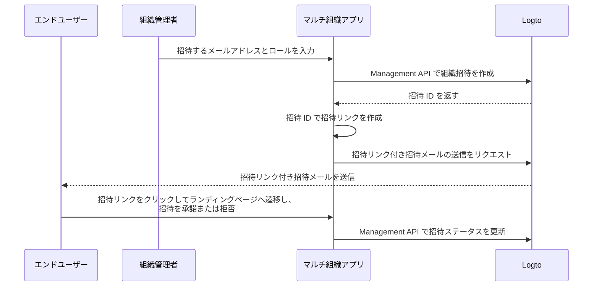

# 組織メンバーの招待

マルチテナンシーアプリケーションでは、組織にメンバーを招待することが一般的な要件です。このガイドでは、その機能を実装するための手順と技術的な詳細を説明します。

## フロー概要 \{#flow-overview}

全体のプロセスは、以下の図で示されています：



## 組織ロールの作成 \{#create-organization-roles}

メンバーを招待する前に、組織ロールを作成します。ロールと権限について詳しくは [組織テンプレート](/authorization/organization-template) を参照してください。

このガイドでは、典型的な組織ロールである `admin` と `member` を作成します。

`admin` ロールは組織内のすべてのリソースへのフルアクセス権を持ち、`member` ロールはアクセス権が制限されています。例えば：

- `admin` ロール:
  - `read:data` - 組織内のすべてのデータリソースの読み取り権限
  - `write:data` - 組織内のすべてのデータリソースの書き込み権限
  - `delete:data` - 組織内のすべてのデータリソースの削除権限
  - `invite:member` - 組織へのメンバー招待権限
  - `manage:member` - 組織内のメンバー管理権限
  - `delete:member` - 組織からメンバーを削除する権限
- `member` ロール:
  - `read:data` - 組織内のすべてのデータリソースの読み取り権限
  - `write:data` - 組織内のすべてのデータリソースの書き込み権限
  - `invite:member` - 組織へのメンバー招待権限

これは [Logto コンソール](https://cloud.logto.io/) で簡単に設定できます。また、[Logto Management API](https://openapi.logto.io/operation/operation-createorganizationrole) を使ってプログラムから組織ロールを作成することも可能です。

## メールコネクターの設定 \{#configure-your-email-connector}

招待はメールで送信されるため、[メールコネクター](/connectors/email-connectors) が正しく設定されていることを確認してください。招待を送信するには、使用タイプが `OrganizationInvitation` の [メールテンプレート](/connectors/email-connectors/email-templates#email-template-types) を設定します。組織（例：名前、ロゴ）や招待者（例：メールアドレス、名前）の [変数](/connectors/email-connectors/email-templates#email-template-variables) をコンテンツに含めることができ、必要に応じて [ローカライズされたテンプレート](/connectors/email-connectors/email-templates#email-template-localization) をカスタマイズできます。

`OrganizationInvitation` 用のサンプルメールテンプレートは以下の通りです：

```json
{
  "subject": "あなたは {{organization.name}} への招待を受けました",
  "content": "<p>こんにちは、</p><p>{{inviter.name}} ({{inviter.primaryEmail}}) さんが <strong>{{organization.name}}</strong> への参加を招待しています。</p><p>この <a href=\"{{link}}\" target=\"_blank\">リンク</a> をクリックして招待を承諾し、利用を開始してください。</p><p>この招待に心当たりがない場合は、このメールを無視してください。</p>",
  "usageType": "OrganizationInvitation",
  "type": "text/html"
}
```

メール本文の `{{link}}` プレースホルダーは、メール送信時に実際の招待リンクに置き換えられます。

## Logto Management API で招待を処理する \{#handle-invitations-with-logto-management-api}

:::note

Logto Management API のセットアップがまだの場合は、[Management API との連携](/integrate-logto/interact-with-management-api) を参照してください。

:::

### Logto Management API で組織招待を作成する \{#create-an-organization-invitation-with-logto-management-api}

組織機能には招待関連の Management API が用意されています。これらの API で次のことが可能です：

- `POST /api/organization-invitations`: 組織ロールを割り当てて組織招待を作成
- `POST /api/one-time-tokens`: 招待を承諾する際に招待者が認証するためのワンタイムトークンを作成 [詳細はこちら](/end-user-flows/one-time-token)
- `POST /api/organization-invitations/{id}/message`: 組織招待をメールで招待者に送信

:::note

ペイロードは `link` プロパティをサポートしているため、招待 ID をもとに独自の招待リンクを作成できます。例：

:::

```json
{
  "link": "https://your-app.com/invitation/join?id=your-invitation-id&token=your-one-time-token&email=invitee-email"
}
```
