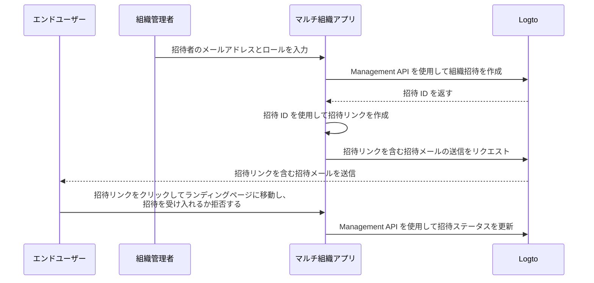

# 組織メンバーを招待する

マルチ組織アプリケーションとして、一般的な要件の一つに組織へのメンバー招待があります。このガイドでは、アプリケーションでこの機能を実装するための手順と技術的な詳細を説明します。

## フローの概要 \{#flow-overview}

全体のプロセスは以下の図で示されています：



## 組織ロールの作成 \{#create-organization-roles}

メンバーを組織に招待する前に、組織ロールを作成する必要があります。詳細な手順については、[組織テンプレートの設定](/authorization/organization-template/configure-organization-template)ガイドを参照してください。

このガイドでは、典型的な組織ロールとして `admin` と `member` の 2 つを作成します。

`admin` ロールは組織内のすべてのリソースにフルアクセスを持ち、`member` ロールは限定されたアクセスを持ちます。例えば、各ロールは次のような権限セットを持つことができます：

- `admin` ロール：
  - `read:data` - すべての組織データリソースへの読み取りアクセス。
  - `write:data` - すべての組織データリソースへの書き込みアクセス。
  - `delete:data` - すべての組織データリソースの削除アクセス。
  - `invite:member` - 組織へのメンバー招待。
  - `manage:member` - 組織内のメンバー管理。
  - `delete:member` - 組織からのメンバー削除。
- `member` ロール：
  - `read:data` - すべての組織データリソースへの読み取りアクセス。
  - `write:data` - すべての組織データリソースへの書き込みアクセス。
  - `invite:member` - 組織へのメンバー招待。

これは [Logto Console](https://cloud.logto.io/) で簡単に行えます。また、[Logto Management API](https://openapi.logto.io/operation/operation-createorganizationrole) を使用してプログラム的に組織ロールを作成することもできます。

## メールコネクターの設定 \{#configure-your-email-connector}

招待はメールで送信されるため、[メールコネクター](/connectors/email-connectors) が適切に設定されていることを確認してください。招待を送信するには、`OrganizationInvitation` という使用タイプの [メールテンプレート](/connectors/email-connectors/email-templates#email-template-types) を設定する必要があります。コンテンツには組織（例：組織名、ロゴ）や招待者（例：招待者のメール、名前）の [変数](/connectors/email-connectors/email-templates#email-template-variables) を含めることができ、必要に応じて [多言語テンプレート](/connectors/email-connectors/email-templates#email-template-localization) をカスタマイズすることもできます。

`OrganizationInvitation` 使用タイプのサンプルメールテンプレートは以下の通りです：

```json
{
  "subject": "Welcome to my organization",
  "content": "<p>Join {{organization.name}} by this <a href=\"{{link}}\" target=\"_blank\">link</a>.</p>",
  "usageType": "OrganizationInvitation",
  "type": "text/html"
}
```

メールコンテンツ内の `{{link}}` プレースホルダーは、メール送信時に実際の招待リンクに置き換えられます。このガイドでは、`https://your-app.com/invitation/accept/{your-invitation-id}` になるとします。

:::note

Logto Cloud の組み込み「Logto メールサービス」は現在 `OrganizationInvitation` 使用タイプをサポートしていません。代わりに、メールコネクター（例：Sendgrid）を設定し、`OrganizationInvitation` テンプレートを設定する必要があります。

:::

## Logto Management API を使用して招待を処理する \{#handle-invitations-with-logto-management-api}

:::note

まだ Logto Management API を設定していない場合は、[Management API と連携する](/integrate-logto/interact-with-management-api) を参照してください。

:::

組織機能には招待関連の Management API を提供しています。これらの API を使用して、次のことができます：

- `POST /api/organization-invitations` 組織ロールを割り当てた組織招待を作成します。
- `POST /api/organization-invitations/{id}/message` 招待者にメールで組織招待を送信します。
  注意：この API のペイロードは `link` プロパティをサポートしており、招待 ID に基づいて招待リンクを作成できます。例えば：

  ```json
  {
    "link": "https://your-app.com/invitation/accept/{your-invitation-id}"
  }
  ```

  それに応じて、招待者が招待リンクを通じてアプリケーションに移動した際にランディングページを実装する必要があります。

- `GET /api/organization-invitations` & `GET /api/organization-invitations/{id}` すべての招待または ID による特定の招待を取得します。
  ランディングページで、これらの API を使用してユーザーが受け取った招待の一覧または詳細を表示します。
- `PUT /api/organization-invitations/{id}/status` 招待ステータスを更新して招待を受け入れるか拒否します。
  この API を使用して、ユーザーの招待への応答を処理します。

上記のすべての API は有効な「組織トークン」を必要とすることに注意してください。[このガイド](/authorization/organization-template/protect-organization-resources#step-2-fetch-organization-token) を参照して、組織トークンを取得する方法を学んでください。

## 組織ロールベースのアクセス制御 (RBAC) を使用してユーザー権限を管理する \{#use-organization-role-based-access-control-rbac-to-manage-user-permissions}

上記の設定により、メールで招待を送信し、招待者は割り当てられたロールで組織に参加できます。

異なる組織ロールを持つユーザーは、組織トークン内で異なるスコープ（権限）を持ちます。したがって、クライアントアプリとバックエンドサービスの両方でこれらのスコープを確認し、表示可能な機能と許可されたアクションを決定する必要があります。

## 組織トークンのスコープ更新を処理する \{#handle-scope-updates-in-organization-tokens}

:::note

アプリに組織を統合していることを確認してください。詳細については、[統合ガイド](/authorization/organization-template/protect-organization-resources) を参照してください。

:::

組織トークンのスコープ更新を管理するには：

### 既存のスコープを取り消す \{#revoking-existing-scopes}

例えば、管理者を非管理者メンバーに降格する場合、ユーザーからスコープを削除する必要があります。この場合、キャッシュされた組織トークンをクリアし、リフレッシュトークンで新しいトークンを取得するだけで済みます。縮小されたスコープは、新しく発行された組織トークンに即座に反映されます。

### 新しいスコープを付与する \{#granting-new-scopes}

これはさらに 2 つのシナリオに分けられます：

#### 認証システムで既に定義されている新しいスコープを付与する \{#grant-new-scopes-that-already-defined-in-your-auth-system}

スコープの取り消しと同様に、新しく付与されたスコープが認証サーバーに既に登録されている場合、新しい組織トークンを発行するだけで、新しいスコープが即座に反映されます。

#### 認証システムに新たに導入された新しいスコープを付与する \{#grant-new-scopes-that-are-newly-introduced-your-auth-system}

この場合、ユーザーの組織トークンを更新するために再ログインまたは再同意プロセスをトリガーする必要があります。例えば、Logto SDK の `signIn` メソッドを呼び出します。

[組織トークンの発行](/authorization/organization-template/protect-organization-resources/#fetch-the-organization-token) について詳しく学びましょう。

### リアルタイムの権限チェックと組織トークンの更新を実装する \{#implement-real-time-permission-check-and-update-organization-token}

Logto は、組織内のリアルタイムユーザー権限を取得するための Management API を提供しています。

- `GET /api/organizations/{id}/users/{userId}/scopes` ([API リファレンス](https://openapi.logto.io/operation/operation-listorganizationuserscopes))

その後、ユーザーの組織トークン内のスコープをリアルタイムの権限と比較して、ユーザーが昇格または降格されたかどうかを判断できます。

- 降格された場合、キャッシュされた組織トークンをクリアするだけで、SDK は自動的に更新されたスコープを持つ新しいトークンを発行します。

  ```ts
  const { clearAccessToken } = useLogto();

  ...
  // 取得したリアルタイムスコープが組織トークンスコープより少ない場合
  await clearAccessToken();
  ```

  これには再ログインまたは再同意プロセスは必要ありません。新しい組織トークンは Logto SDK によって自動的に発行されます。

- 認証システムに新しいスコープが導入された場合、再ログインまたは再同意プロセスをトリガーしてユーザーの組織トークンを更新します。React SDK を例にとります：

  ```ts
  const { clearAllTokens, signIn } = useLogto();

  ...
  // 取得したリアルタイムスコープが組織トークンスコープより新しく割り当てられたスコープを持つ場合
  await clearAllTokens();
  signIn({
    redirectUri: '<your-sign-in-redirect-uri>',
    prompt: 'consent',
  });
  ```

  上記のコードは、同意画面へのページナビゲーションをトリガーし、更新されたスコープを持つユーザーの組織トークンと共にアプリに自動的にリダイレクトします。

## 関連リソース \{#related-resources}

<Url href="https://blog.logto.io/implement-user-collaboration-in-your-app">
  マルチテナントアプリ内でのユーザーコラボレーションの実装方法
</Url>
