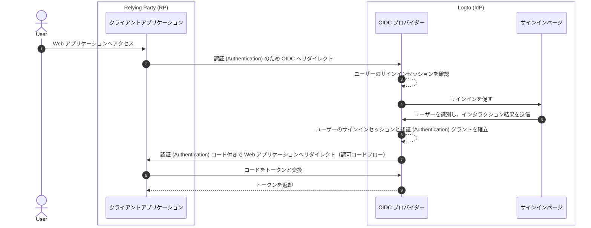

# サインアウト

Logto（OIDC ベースのアイデンティティプロバイダー）におけるサインアウトプロセスは、Logto が管理する集中型サインインセッションと、クライアントアプリケーションが管理する分散型認証 (Authentication) 状態の両方が関与するため、多面的な概念となっています。

## サインインセッション \{#sign-in-session}

サインアウトプロセスをよりよく理解するためには、まず Logto でユーザーのサインインセッションとその認証 (Authentication) 状態がどのように管理されているかを理解することが重要です。



1. ユーザーが Web アプリケーション（RP）へアクセスします。
2. クライアントアプリケーションがユーザーを Logto（IdP）へ [認証 (Authentication)](https://auth.wiki/authentication) のためリダイレクトします。
3. OIDC プロバイダーがユーザーのサインインセッション状態を確認します。セッションが存在しない、または期限切れの場合、ユーザーにサインインを促します。
4. ユーザーがサインインページで認証 (Authentication) を行います。
5. サインインが成功すると、Logto はユーザーの新しいセッションを作成し、認可コード付きでクライアントアプリケーションへリダイレクトします。
6. OIDC プロバイダーがユーザーの新しいサインインセッションと認証 (Authentication) グラントを作成します。
7. OIDC プロバイダーが認証 (Authentication) コード付きでユーザーをクライアントへリダイレクトします（[認可コードフロー](https://auth.wiki/authorization-code-flow)）。
8. クライアントが認証 (Authentication) コードを受け取り、トークンと交換します。
9. クライアントアプリケーションにトークンを付与します。

## コンポーネント \{#components}

### Logto が管理する集中型サインインセッション \{#centralized-sign-in-session-managed-by-logto}

上記のフローにおいて、集中型サインインセッションは Logto によって管理されます。ユーザーがサインインに成功するとセッションが作成され、サインアウト時またはセッションの有効期限切れ時に破棄されます。

Logto のサインインセッションはセッションクッキーで管理されます。ユーザーがサインインするとセッションクッキーが設定されます。すべての認証 (Authentication) リクエストはこのセッションクッキーに対して検証されます。セッションクッキーが存在し有効な場合、ユーザーは自動的に認証 (Authentication) され、認可コード付きでクライアントアプリケーションへ直接リダイレクトされます。そうでない場合は、サインインを促されます。

1. 共有 Logto セッションクッキー  
   同じユーザーエージェント（例：ブラウザ）から複数のクライアントアプリケーションにサインインするユーザーは、Logto ドメイン下で共有セッションクッキーを持ちます。つまり、一度サインインすれば他のクライアントアプリケーションでも自動的に認証 (Authentication) されます。

   ```mermaid
    flowchart TD
    subgraph User [ユーザーエージェント A]
      U[ユーザー]

      subgraph Layer1 [クライアントドメイン A]
        A[クライアントアプリケーション A]
      end

      subgraph Layer1 [クライアントドメイン B]
        B[クライアントアプリケーション B]
      end

      subgraph Layer2 [Logto ドメイン]
          C{{Logto サインインセッション?}}
          D[サインインページ]
      end
    end

    U --> |サインイン| A
    A --> |Logto へリダイレクト| C
    U --> |サインイン| B
    B --> |Logto へリダイレクト| C
    C --> |なし| D
    D --> |セッション作成| C
   ```

2. 分離された Logto セッションクッキー  
   異なるデバイスやブラウザから異なるクライアントアプリケーションにサインインするユーザーは、Logto ドメイン下で分離されたセッションクッキーを持ちます。つまり、それぞれのクライアントアプリケーションごとに個別にサインインが必要です。

   ```mermaid
    flowchart TD
    U[ユーザー]

    subgraph DeviceA [ユーザーエージェント A]
      subgraph Layer1 [クライアントドメイン A]
        A[クライアントアプリケーション A]
      end

      subgraph Layer2 [Logto ドメイン]
          C{{Logto サインインセッション?}}
          D[サインインページ]
      end
    end

    subgraph DeviceB [ユーザーエージェント B]
      subgraph Layer3 [クライアントドメイン B]
        B[クライアントアプリケーション B]
      end

      subgraph Layer4 [Logto ドメイン]
          E{{Logto サインインセッション?}}
          F[サインインページ]
      end
    end

    U --> |サインイン| A
    A --> |Logto へリダイレクト| C
    U --> |サインイン| B
    B --> |Logto へリダイレクト| E
    C --> |なし| D
    E --> |なし| F
    D --> |セッション作成| C
    F --> |セッション作成| E
   ```

## クライアントアプリケーションが管理する分散型認証 (Authentication) 状態 \{#distributed-authentication-status-managed-by-the-client-applications}

各クライアントアプリケーションは独自に認証 (Authentication) 状態を管理します。ネイティブ、SPA、Web アプリケーションいずれも、ユーザーの認証 (Authentication) 状態を管理する独自の方法を持っています。

サインインが成功すると、クライアントアプリケーションは [ID トークン](https://auth.wiki/id-token) や [アクセス トークン](https://auth.wiki/access-token) を受け取る場合があります。クライアントアプリケーションは ID トークンでユーザーのアイデンティティを判別し、アクセス トークンでユーザーのリソースにアクセスできます。ユーザーの認証 (Authentication) 状態はアクセス トークンの有効期限で表されます。

- ネイティブおよび SPA アプリケーション：  
  クライアントアプリケーションは、これらのトークンを安全に保存・管理し、ユーザーの認証 (Authentication) 状態を維持する必要があります。例：ローカルストレージやセッションストレージに保存し、サインアウト時にトークンを削除します。
- Web アプリケーション：  
  Next.js などのフレームワークで構築された Web アプリは、Logto から発行されたトークンと並行して独自のセッションを管理することがよくあります。サインイン後、Web アプリが Logto からトークンを受け取ったら、SPA アプリケーションと同様にクライアント側でトークンを保存するか、サーバー側でトークンを保存し、クッキーや他の仕組みでセッションを管理できます。

## サインアウトの仕組み \{#sign-out-mechanisms}

### クライアント側でトークンとローカルセッションをクリア \{#clear-tokens-and-local-session-at-the-client-side}

クライアント側でのシンプルなサインアウトは、ローカルセッションをクリアし、トークン（ID トークン、アクセス トークン、リフレッシュ トークン）をローカルストレージやセッションストレージから削除することです。これはクライアント側のみのサインアウトとなり、集中型セッションはそのまま残ります。この方法でサインアウトしたユーザーは、集中型セッションが期限切れまたは明示的に破棄されるまで、同じ認可サーバーセッション下の他のアプリケーションにアクセスできる場合があります。

### Logto でサインインセッションをクリア \{#clear-sign-in-session-at-logto}

ユーザーを明示的にサインアウトし、Logto 側のセッションをクリアするには、クライアントアプリケーションがユーザーを Logto の **end session endpoint** へリダイレクトする必要があります。

例： `https://{your-logto-domain}/oidc/session/end`

**end session endpoint** は、クライアントアプリケーションが認可サーバーにユーザーのサインアウトを通知できる標準 OIDC エンドポイントです。このエンドポイントは Logto 側の集中型サインインセッションをクリアします。

セッションがクリアされると、以降の認可リクエストでは再度サインインが必要となります。

**post-logout redirect URI** が指定されている場合、セッションがクリアされた後にユーザーは指定された URI へリダイレクトされます。指定がない場合は、Logto がホストするデフォルトのポストログアウトページへリダイレクトされます。

## フェデレーテッドサインアウト：バックチャネルログアウト \{#federated-sign-out-back-channel-logout}

より一貫したサインアウト管理のために、Logto は [バックチャネルログアウト](https://openid.net/specs/openid-connect-backchannel-1_0-final.html) をサポートしています。バックチャネルログアウトは、ユーザーがサインアウトした際に、同じサインインセッション下のすべてのクライアントアプリケーションへ Logto から通知する仕組みです。

これは、ユーザーがあるクライアントアプリケーションからサインアウトし、同じ Logto サインインセッション下の他のすべてのクライアントアプリケーションからもサインアウトされることを期待するシナリオで特に有用です。

クライアントアプリケーションでバックチャネルログアウトを有効にするには、Logto ダッシュボードのアプリケーション詳細ページでバックチャネルログアウト URI を登録してください。ユーザーがいずれかのクライアントアプリケーションからサインアウトリクエストを開始すると、Logto は登録されたすべての URI へログアウトトークンを送信します。

クライアントアプリケーションでサインインセッションをログアウトトークンに含める必要がある場合は、バックチャネルログアウト設定で `Is session required` を有効にしてください。ログアウトトークンに `sid` クレームが含まれ、Logto でのユーザーのサインインセッションを識別できます。

1. ユーザーがいずれかのクライアントアプリケーションからサインアウトリクエストを開始します。
2. Logto が end session リクエストを受信し、ログアウトトークンを生成し、登録されたすべてのバックチャネルログアウト URI へ送信します。
3. 各クライアントアプリケーションがログアウトトークンを受信し、サインアウト処理を実行します。

各クライアントアプリケーションがログアウトトークンを受信した際のサインアウト処理：

- ログアウトトークンを検証する。
- ローカルセッションをクリアし、ローカルストレージやセッションストレージからトークンを削除する。

## Logto SDK におけるサインアウト方法 \{#sign-out-methods-in-logto-sdks}

Logto の SDK を使ってクライアントアプリケーションと連携している場合：

- SPA や Web アプリケーションでは、`client.signOut()` メソッドがローカルトークンストレージをクリアし、ユーザーを Logto の end session endpoint へリダイレクトします。セッションがクリアされた後にユーザーをリダイレクトする **post-logout redirect URI** を指定できます。
- ネイティブアプリケーション（**React Native** や **Flutter** などのハイブリッドアプリを含む）では、ローカルトークンストレージのみがクリアされます。ネイティブアプリケーションでは、サインインプロセスにセッションレス WebView を使用するため、ネイティブブラウザにセッションクッキーが保存されません。そのため、Logto 側のサインインセッションをクリアする必要はありません。各認証 (Authentication) リクエストはセッションクッキーを持たない独立したリクエストとなります。

:::note
セッションレス WebView をサポートしない、または `emphasized` 設定を認識しないネイティブアプリケーション（**React Native** や **Flutter** SDK を使用した Android アプリなど）の場合、認可リクエストに `prompt=login` パラメータを渡すことで、ユーザーに再度サインインを促すことができます。
:::

## 毎回再認証 (Authentication) を強制する \{#enforce-re-authentication-on-every-access}

高セキュリティなシナリオ（例：機密操作前のユーザー本人確認）では、毎回ユーザーに再認証 (Authentication) を要求したい場合があります。この動作を強制するには、認証 (Authentication) リクエストに `prompt=login` を含めてください。

`prompt=login` を設定すると、ユーザーがアクティブなセッションを持っているか、最近サインインしたかに関わらず、Logto は必ずサインインページを表示します。これによりシングルサインオン (SSO) の動作をバイパスし、毎回ユーザーに認証情報の入力を促します。

アプリが offline_access スコープ（リフレッシュ トークンを受け取るため）をリクエストする場合、OpenID Connect 仕様により `prompt=consent` も含める必要があります。
ほとんどの場合、再認証 (Authentication) を強制し、かつリフレッシュ トークン発行を確実にするには、次のように設定します：

```
prompt=login consent
```

これにより、ユーザーは再認証 (Authentication) され、オフラインアクセスへの明示的な同意も行われます。

## よくある質問 \{#faqs}

<details>
  <summary>

### バックチャネルログアウト通知が届きません \{#im-not-receiving-the-back-channel-logout-notifications}

</summary>

- Logto ダッシュボードでバックチャネルログアウト URI が正しく登録されているか確認してください。
- クライアントアプリケーションに有効なアクティブサインインセッションがあり、サインアウトリクエストを開始したものと同じセッションであることを確認してください。

</details>

## 関連リソース \{#related-resources}

<Url href="https://blog.logto.io/oidc-back-channel-logout/">
  OIDC バックチャネルログアウトの理解
</Url>
