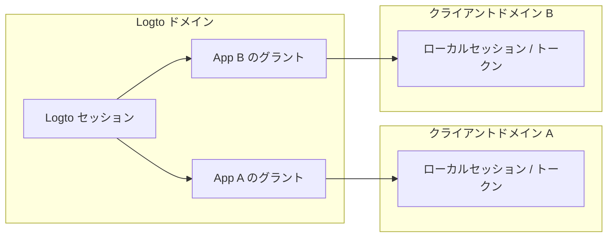
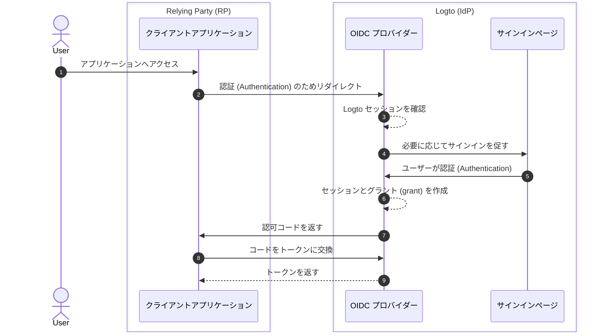
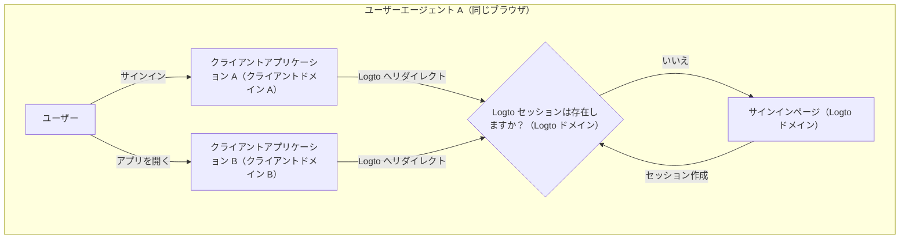
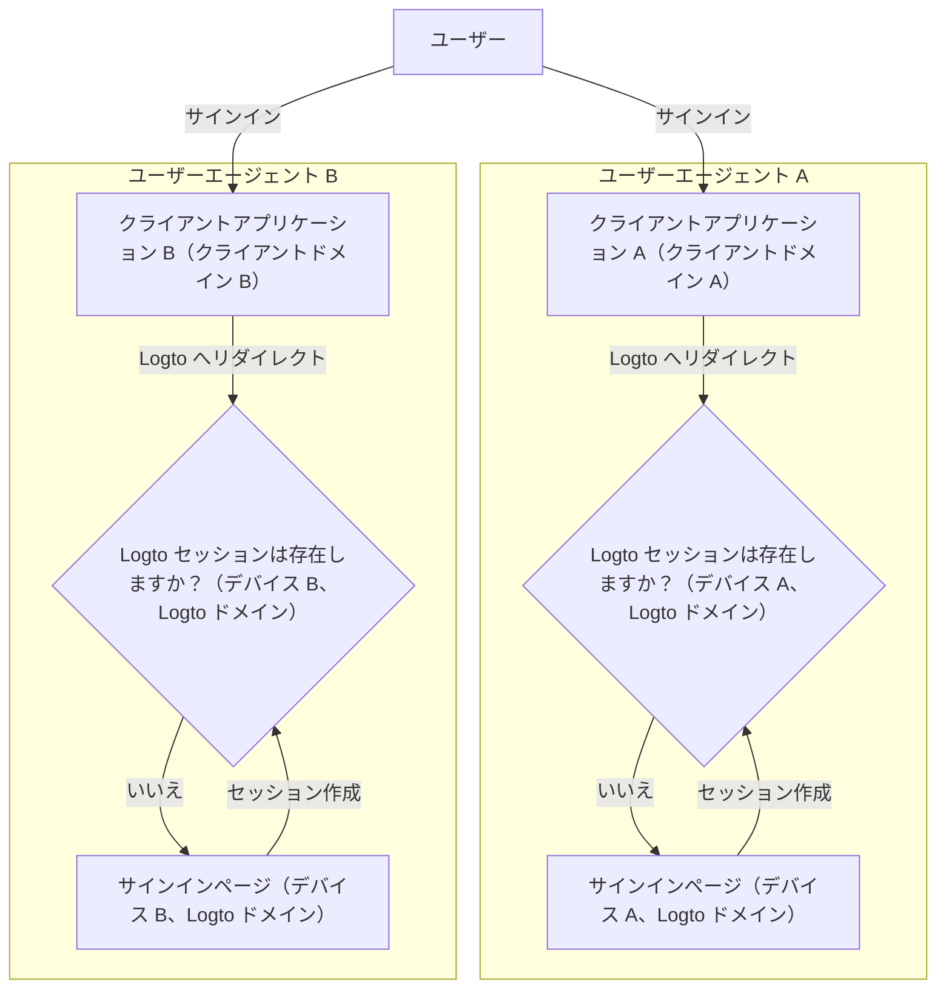
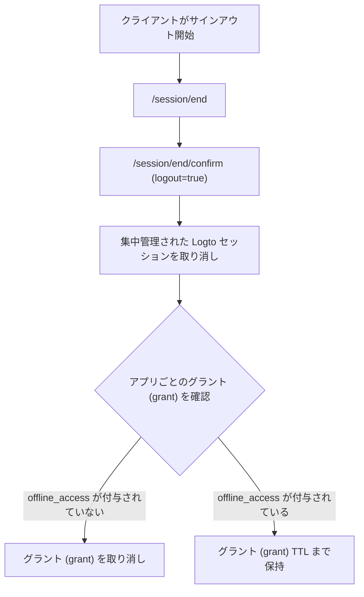

# サインアウト

Logto（OIDC アイデンティティプロバイダー (IdP) として）のサインアウトは、次の両方を含みます：

- **集中管理された Logto セッション**（Logto ドメイン配下のブラウザ Cookie）
- **分散されたクライアント側の認証状態**（各アプリのトークンやローカルアプリセッション）

サインアウトの挙動を理解するには、この 2 層を分けて考え、**グラント (grant)** がどのようにそれらをつなぐかを見ると分かりやすいです。

## コア概念 \{#core-concepts}

### Logto セッションとは？ \{#what-is-a-logto-session}

Logto セッションは、Logto によって管理される集中管理されたサインイン状態です。認証 (Authentication) に成功した後に作成され、Logto ドメイン配下の Cookie で表現されます。

セッション Cookie が有効な場合、同じ Logto テナントを信頼する複数のアプリ間でサイレント認証（シングルサインオン (SSO)）が可能です。

有効なセッションが存在しない場合、Logto はサインインページを表示します。

### グラント (grant) とは？ \{#what-are-grants}

**グラント (grant)** とは、特定のユーザーとクライアントアプリケーションの組み合わせに対する認可 (Authorization) 状態を表します。

- 1 つの Logto セッションは、複数のクライアントアプリのグラント (grant) を持つことができます。
- グラント (grant) は発行されたトークンと関連付けられます。
- このドキュメントセットでは、**グラント (grant)** をアプリ横断の認可 (Authorization) 単位として扱います。

### セッション、グラント (grant)、クライアント認証状態の関係 \{#how-session-grants-and-client-auth-status-relate}


```mermaid
flowchart LR
  subgraph Logto [Logto ドメイン]
    S[Logto セッション]
    G1[App A のグラント]
    G2[App B のグラント]
  end

  subgraph AppA [クライアントドメイン A]
    A[ローカルセッション / トークン]
  end

  subgraph AppB [クライアントドメイン B]
    B[ローカルセッション / トークン]
  end

  S --> G1
  S --> G2
  G1 --> A
  G2 --> B
```

- **Logto セッション** は集中管理された SSO 体験を制御します。
- **クライアントのローカルセッション / トークン** は、各アプリが現在ユーザーをサインイン済みとして扱うかどうかを制御します。
- **グラント (grant)** は、アプリ固有の認可 (Authorization) 状態を表現することで、この 2 つの世界をつなぎます。

## サインインの振り返り（なぜサインアウトが多層的なのか） \{#sign-in-recap-why-sign-out-is-multi-layered}


```mermaid
sequenceDiagram
  autonumber
  actor User

  box Relying Party (RP)
    participant Client as クライアントアプリケーション
  end

  box Logto (IdP)
    participant OIDC as OIDC プロバイダー
    participant SignIn as サインインページ
  end

  User ->> Client: アプリケーションへアクセス
  Client ->> OIDC: 認証 (Authentication) のためリダイレクト
  OIDC -->> OIDC: Logto セッションを確認
  OIDC ->> SignIn: 必要に応じてサインインを促す
  SignIn ->> OIDC: ユーザーが認証 (Authentication)
  OIDC -->> OIDC: セッションとグラント (grant) を作成
  OIDC ->> Client: 認可コードを返す
  Client ->> OIDC: コードをトークンに交換
  OIDC -->> Client: トークンを返す
```

## アプリ / デバイス間のセッショントポロジー \{#session-topology-across-apps-devices}

### 共有セッション Cookie（同じブラウザ / ユーザーエージェント） \{#shared-session-cookie-same-browser-user-agent}

ユーザーが同じブラウザから複数のアプリにサインインした場合、それらのアプリは同じ Logto セッション Cookie を再利用でき、SSO が適用されます。


```mermaid
flowchart TD
  U[ユーザー]
  A["クライアントアプリケーション A（クライアントドメイン A）"]
  B["クライアントアプリケーション B（クライアントドメイン B）"]
  C{"Logto セッションは存在しますか？（Logto ドメイン）"}
  D["サインインページ（Logto ドメイン）"]

  subgraph UA["ユーザーエージェント A（同じブラウザ）"]
    U
    A
    B
    C
    D
  end

  U -->|サインイン| A
  A -->|Logto へリダイレクト| C
  U -->|アプリを開く| B
  B -->|Logto へリダイレクト| C
  C -->|いいえ| D
  D -->|セッション作成| C
```

### 分離されたセッション Cookie（異なるデバイス / ブラウザ） \{#isolated-session-cookies-different-devices-browsers}

異なるブラウザ / デバイスは異なる Logto Cookie を保持するため、サインインセッション状態は分離されます。


```mermaid
flowchart TD
  U[ユーザー]
  A["クライアントアプリケーション A（クライアントドメイン A）"]
  C{"Logto セッションは存在しますか？（デバイス A、Logto ドメイン）"}
  D["サインインページ（デバイス A、Logto ドメイン）"]

  subgraph DeviceA["ユーザーエージェント A"]
    A
    C
    D
  end

  B["クライアントアプリケーション B（クライアントドメイン B）"]
  E{"Logto セッションは存在しますか？（デバイス B、Logto ドメイン）"}
  F["サインインページ（デバイス B、Logto ドメイン）"]

  subgraph DeviceB["ユーザーエージェント B"]
    B
    E
    F
  end

  U -->|サインイン| A
  A -->|Logto へリダイレクト| C
  U -->|サインイン| B
  B -->|Logto へリダイレクト| E
  C -->|いいえ| D
  E -->|いいえ| F
  D -->|セッション作成| C
  F -->|セッション作成| E
```

## サインアウトの仕組み \{#sign-out-mechanisms}

### 1) クライアント側のみのサインアウト \{#1-client-side-only-sign-out}

クライアントアプリが自身のローカルセッションやトークン（ID / アクセス / リフレッシュトークン）をクリアします。これにより、そのアプリのローカル状態のみでユーザーがサインアウトされます。

- Logto セッションは引き続き有効な場合があります。
- 同じ Logto セッション配下の他のアプリでは SSO が継続される場合があります。

### 2) Logto でのセッション終了（現行 Logto 実装でのグローバルサインアウト） \{#2-end-session-at-logto-global-sign-out-in-current-logto-implementation}

集中管理された Logto セッションをクリアするには、アプリがユーザーをエンドセッションエンドポイントへリダイレクトします。例：

`https://{your-logto-domain}/oidc/session/end`

現行の Logto SDK の挙動：

1. `signOut()` は `/session/end` へリダイレクトします。
2. その後 `/session/end/confirm` へ遷移します。
3. デフォルトの確認フォームが自動で `logout=true` をポストします。

このため、現行 SDK のサインアウトは **グローバルサインアウト** として扱われます。

### グローバルサインアウト時に何が起こるか \{#what-happens-during-global-sign-out}


```mermaid
flowchart TD
  A["クライアントがサインアウト開始"] --> B["/session/end"]
  B --> C["/session/end/confirm (logout=true)"]
  C --> D["集中管理された Logto セッションを取り消し"]
  D --> E{"アプリごとのグラント (grant) を確認"}
  E -->|"offline_access が付与されていない"| F["グラント (grant) を取り消し"]
  E -->|"offline_access が付与されている"| G["グラント (grant) TTL まで保持"]
```

グローバルサインアウト中：

- 集中管理された Logto セッションが取り消されます。
- 関連するアプリのグラント (grant) はアプリごとの認可 (Authorization) 状態に応じて処理されます：
  - `offline_access` が **付与されていない** 場合、関連グラント (grant) は取り消されます。
  - `offline_access` が **付与されている** 場合、エンドセッションではグラント (grant) は取り消されません。
- `offline_access` の場合、リフレッシュトークンやグラント (grant) はグラント (grant) の有効期限まで有効です。

## グラント (grant) の有効期間と `offline_access` の影響 \{#grant-lifetime-and-offline-access-impact}

- デフォルトの Logto グラント (grant) TTL は **180 日** です。
- `offline_access` が付与されている場合、エンドセッションではそのアプリのグラント (grant) はデフォルトで取り消されません。
- そのグラント (grant) に紐づくリフレッシュトークンチェーンは、グラント (grant) の有効期限まで（または明示的に取り消されるまで）継続できます。

## フェデレーテッドサインアウト：バックチャネルログアウト \{#federated-sign-out-back-channel-logout}

アプリ間の一貫性のため、Logto は [バックチャネルログアウト](https://openid.net/specs/openid-connect-backchannel-1_0-final.html) をサポートしています。

ユーザーが 1 つのアプリからサインアウトすると、Logto は同じセッションに参加しているすべてのアプリに対し、登録済みのバックチャネルログアウト URI へログアウトトークンを送信して通知できます。

アプリのバックチャネル設定で `Is session required` が有効な場合、ログアウトトークンには Logto セッションを識別する `sid` が含まれます。

一般的なフロー：

1. ユーザーが 1 つのアプリからサインアウトを開始
2. Logto がエンドセッションを処理し、登録済みのバックチャネルログアウト URI へログアウトトークンを送信
3. 各アプリがログアウトトークンを検証し、自身のローカルセッション / トークンをクリア

## Logto SDK におけるサインアウト方法 \{#sign-out-methods-in-logto-sdks}

- **SPA および Web**：`client.signOut()` はローカルトークンストレージをクリアし、Logto のエンドセッションエンドポイントへリダイレクトします。ポストログアウトリダイレクト URI を指定することも可能です。
- **ネイティブ（React Native / Flutter を含む）**：通常はローカルトークンストレージのみをクリアします。セッションレス WebView のため、Logto のブラウザ Cookie をクリアすることはありません。

:::note
セッションレス WebView をサポートしないネイティブアプリや、`emphasized` 設定を認識しない場合（**React Native** や **Flutter** SDK を利用した Android アプリなど）、認証リクエスト時に `prompt=login` パラメータを渡すことで、毎回サインイン画面を強制表示できます。
:::

## 毎回再認証を強制する \{#enforce-re-authentication-on-every-access}

高セキュリティな操作には、認証リクエストに `prompt=login` を含めて SSO をバイパスし、毎回資格情報の入力を強制できます。

リフレッシュトークン（`offline_access`）を要求する場合は、`consent` も含めて `prompt=login consent` とします。

一般的な組み合わせ設定：

```txt
prompt=login consent
```

## よくある質問 (FAQs) \{#faqs}

<details>
  <summary>

### バックチャネルログアウト通知が届きません \{#im-not-receiving-the-back-channel-logout-notifications}

</summary>

- Logto ダッシュボードでバックチャネルログアウト URI が正しく登録されているか確認してください。
- アプリが同じユーザー / セッションコンテキストでアクティブなサインイン状態であることを確認してください。

</details>

## 関連リソース \{#related-resources}

<Url href="https://blog.logto.io/oidc-back-channel-logout/">
  OIDC バックチャネルログアウトの理解
</Url>
