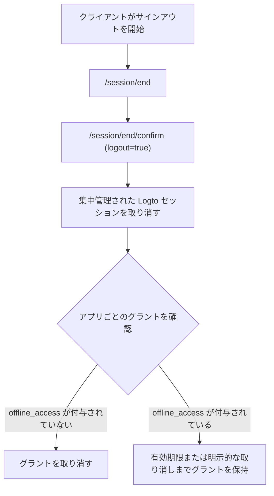

# サインアウト

Logto のサインアウトは 2 層構造です：

- **Logto セッションのサインアウト**：Logto ドメイン下の集中サインインセッションを終了します。
- **アプリのサインアウト**：クライアントアプリケーション内のローカルセッション状態とトークンをクリアします。

Logto でのセッションの仕組みをより理解するには、 [セッション](/sessions) を参照してください。

## サインアウトの仕組み \{#sign-out-mechanisms}

### 1) クライアントサイドのみのサインアウト \{#1-client-side-only-sign-out}

クライアントアプリが自身のローカルセッションとトークン（ID トークン / アクセス トークン / リフレッシュ トークン）をクリアします。これにより、そのアプリのローカル状態からのみユーザーがサインアウトされます。

- Logto セッションはまだ有効な場合があります。
- 同じ Logto セッション下の他のアプリは引き続き SSO 可能です。

### 2) Logto でセッション終了（現在の Logto 実装でのグローバルサインアウト） \{#2-end-session-at-logto-global-sign-out-in-current-logto-implementation}

集中管理された Logto セッションをクリアするには、アプリがユーザーをエンドセッションエンドポイントにリダイレクトします。例：

`https://{your-logto-domain}/oidc/session/end`

現在の Logto SDK の挙動：

1. `signOut()` が `/session/end` へリダイレクトします。
2. その後 `/session/end/confirm` へ進みます。
3. デフォルトの確認フォームが自動で `logout=true` をポストします。

この結果、現在の SDK のサインアウトは **グローバルサインアウト** として扱われます。

:::note

- **グローバルサインアウト**：集中管理された Logto セッションを取り消します。

:::

### グローバルサインアウト時に何が起こるか \{#what-happens-during-global-sign-out}


```mermaid
flowchart TD
  A["クライアントがサインアウトを開始"] --> B["/session/end"]
  B --> C["/session/end/confirm (logout=true)"]
  C --> D["集中管理された Logto セッションを取り消す"]
  D --> E{"アプリごとのグラントを確認"}
  E -->|"offline_access が付与されていない"| F["グラントを取り消す"]
  E -->|"offline_access が付与されている"| G["有効期限または明示的な取り消しまでグラントを保持"]
```

グローバルサインアウト時：

- 集中管理された Logto セッションが取り消されます。
- 関連するアプリのグラントはアプリごとの認可状態に応じて処理されます：
  - `offline_access` が **付与されていない** 場合、関連グラントは取り消されます。
  - `offline_access` が **付与されている** 場合、エンドセッションではグラントは取り消されません。
- `offline_access` の場合、リフレッシュ トークンとグラントは、グラントの有効期限、リフレッシュ トークンの有効期限、または明示的な取り消しのいずれか早い方まで有効です。

## グラントの有効期間と `offline_access` の影響 \{#grant-lifetime-and-offline-access-impact}

- デフォルトの Logto グラント TTL は **180 日** です。
- `offline_access` が付与されている場合、エンドセッションではそのアプリのグラントはデフォルトで取り消されません。
- そのグラントに紐づくリフレッシュ トークンチェーンは、グラントの有効期限、リフレッシュ トークンの有効期限、またはグラントの明示的な取り消しまで継続します。
- シングルページアプリケーション（SPA）の場合、リフレッシュ トークンのローテーションではリフレッシュ トークンの TTL は延長されないため、リフレッシュ トークンがグラントより先に失効する場合があります。

## フェデレーテッドサインアウト：バックチャネルログアウト \{#federated-sign-out-back-channel-logout}

アプリ間の一貫性のため、Logto は [バックチャネルログアウト](https://openid.net/specs/openid-connect-backchannel-1_0-final.html) をサポートしています。

ユーザーが 1 つのアプリからサインアウトすると、Logto は同じセッションに参加しているすべてのアプリに、登録済みのバックチャネルログアウト URI へログアウトトークンを送信して通知できます。

アプリのバックチャネル設定で `Is session required` が有効な場合、ログアウトトークンには Logto セッションを識別するための `sid` が含まれます。

一般的なフロー：

1. ユーザーが 1 つのアプリからサインアウトを開始します。
2. Logto がエンドセッションを処理し、登録済みのバックチャネルログアウト URI へログアウトトークンを送信します。
3. 各アプリがログアウトトークンを検証し、自身のローカルセッション / トークンをクリアします。

## Logto SDK におけるサインアウト方法 \{#sign-out-methods-in-logto-sdks}

- **SPA および Web**：`client.signOut()` はローカルトークンストレージをクリアし、Logto のエンドセッションエンドポイントへリダイレクトします。ポストログアウトリダイレクト URI を指定することも可能です。
- **ネイティブ（React Native / Flutter を含む）**：通常はローカルトークンストレージのみをクリアします。セッションレス WebView のため、Logto のブラウザ Cookie をクリアする必要はありません。

:::note
セッションレス WebView をサポートしないネイティブアプリや、`emphasized` 設定を認識しないアプリ（**React Native** や **Flutter** SDK を利用した Android アプリなど）の場合、認可リクエストに `prompt=login` パラメータを付与することで、再度サインインを強制できます。
:::

## 毎回再認証を強制する \{#enforce-re-authentication-on-every-access}

高セキュリティな操作のためには、認証リクエストに `prompt=login` を含めて SSO をバイパスし、毎回資格情報の入力を強制できます。

`offline_access`（リフレッシュ トークンを受け取るため）をリクエストする場合は、`consent` も含めて `prompt=login consent` とします。

一般的な組み合わせ設定：

```txt
prompt=login consent
```

## よくある質問 \{#faqs}

<details>
  <summary>

### バックチャネルログアウト通知が届きません \{#im-not-receiving-the-back-channel-logout-notifications}

</summary>

- Logto ダッシュボードでバックチャネルログアウト URI が正しく登録されているか確認してください。
- アプリが同じユーザー / セッションコンテキストでアクティブなサインイン状態であることを確認してください。

</details>

## 関連リソース \{#related-resources}

<Url href="https://blog.logto.io/oidc-back-channel-logout/">
  OIDC バックチャネルログアウトの理解
</Url>
