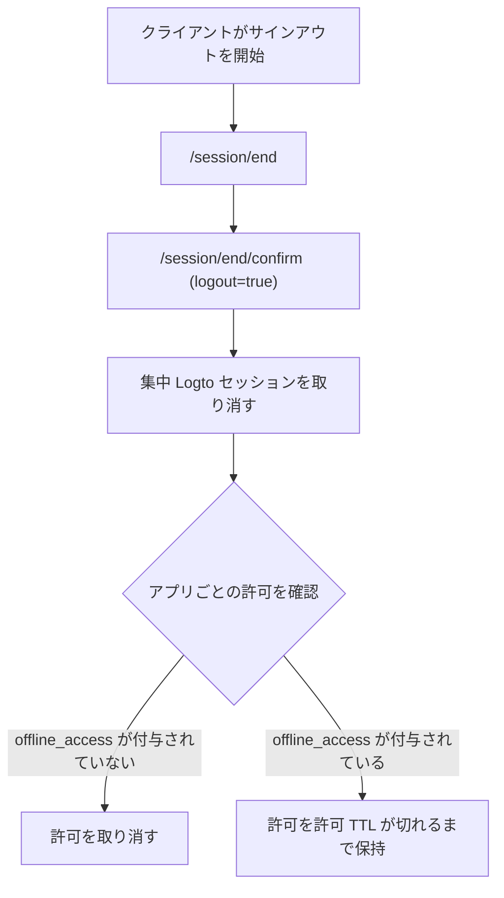

# サインアウト

Logto でのサインアウトは、2 つのレイヤーに分かれています：

- **Logto セッションのサインアウト**：Logto ドメイン下での集中サインインセッションを終了します。
- **アプリのサインアウト**：クライアントアプリケーション内のローカルセッション状態とトークンをクリアします。

Logto でのセッションの動作をよりよく理解するには、[セッション](/sessions) を参照してください。

## サインアウトメカニズム \{#sign-out-mechanisms}

### 1) クライアントサイドのみのサインアウト \{#1-client-side-only-sign-out}

クライアントアプリは、自身のローカルセッションとトークン（ID トークン / アクセス トークン / リフレッシュ トークン）をクリアします。これにより、ユーザーはそのアプリのローカル状態からのみサインアウトされます。

- Logto セッションはまだアクティブかもしれません。
- 同じ Logto セッション下の他のアプリはまだ SSO 可能です。

### 2) Logto でのセッション終了（現在の Logto 実装でのグローバルサインアウト） \{#2-end-session-at-logto-global-sign-out-in-current-logto-implementation}

集中 Logto セッションをクリアするには、アプリがユーザーをセッション終了エンドポイントにリダイレクトします。例えば：

`https://{your-logto-domain}/oidc/session/end`

現在の Logto SDK の動作では：

1. `signOut()` は `/session/end` にリダイレクトします。
2. 次に `/session/end/confirm` に進みます。
3. デフォルトの確認フォームは `logout=true` を自動投稿します。

その結果、現在の SDK のサインアウトは **グローバルサインアウト** として扱われます。

:::note

- **グローバルサインアウト**：集中 Logto セッションを取り消します。

:::

### グローバルサインアウト中に何が起こるか \{#what-happens-during-global-sign-out}


```mermaid
flowchart TD
  A["クライアントがサインアウトを開始"] --> B["/session/end"]
  B --> C["/session/end/confirm (logout=true)"]
  C --> D["集中 Logto セッションを取り消す"]
  D --> E{"アプリごとの許可を確認"}
  E -->|"offline_access が付与されていない"| F["許可を取り消す"]
  E -->|"offline_access が付与されている"| G["許可を許可 TTL が切れるまで保持"]
```

グローバルサインアウト中：

- 集中 Logto セッションが取り消されます。
- 関連するアプリの許可は、アプリの認可状態に応じて処理されます：
  - `offline_access` が付与されていない場合、関連する許可は取り消されます。
  - `offline_access` が付与されている場合、セッション終了によって許可は取り消されません。
- `offline_access` の場合、リフレッシュ トークンと許可は、許可の有効期限が切れるまで有効です。

## 許可の有効期間と `offline_access` の影響 \{#grant-lifetime-and-offline-access-impact}

- デフォルトの Logto 許可 TTL は **180 日**です。
- `offline_access` が付与されている場合、セッション終了はそのアプリの許可をデフォルトで取り消しません。
- その許可に関連付けられたリフレッシュ トークンチェーンは、許可が期限切れになるまで（または明示的に取り消されるまで）続行できます。

## フェデレーテッドサインアウト：バックチャネルログアウト \{#federated-sign-out-back-channel-logout}

クロスアプリの一貫性のために、Logto は [バックチャネルログアウト](https://openid.net/specs/openid-connect-backchannel-1_0-final.html) をサポートしています。

ユーザーがあるアプリからサインアウトすると、Logto は同じセッションに参加しているすべてのアプリにログアウトトークンを送信して通知できます。

アプリのバックチャネル設定で `Is session required` が有効になっている場合、ログアウトトークンには Logto セッションを識別するための `sid` が含まれます。

一般的なフロー：

1. ユーザーがあるアプリからサインアウトを開始します。
2. Logto はセッション終了を処理し、登録されたバックチャネルログアウト URI にログアウトトークンを送信します。
3. 各アプリはログアウトトークンを検証し、自身のローカルセッション / トークンをクリアします。

## Logto SDK でのサインアウト方法 \{#sign-out-methods-in-logto-sdks}

- **SPA とウェブ**：`client.signOut()` はローカルトークンストレージをクリアし、Logto セッション終了エンドポイントにリダイレクトします。ログアウト後のリダイレクト URI を指定することができます。
- **ネイティブ（React Native / Flutter を含む）**：通常はローカルトークンストレージのみをクリアします。セッションレスの WebView では、Logto ブラウザクッキーをクリアすることはありません。

:::note
セッションレス WebView をサポートしていないネイティブアプリケーションや、`emphasized` 設定を認識しないアプリケーション（**React Native** または **Flutter** SDK を使用する Android アプリ）では、認証リクエストに `prompt=login` パラメータを渡すことで、ユーザーに再度サインインを促すことができます。
:::

## アクセスごとに再認証を強制する \{#enforce-re-authentication-on-every-access}

高セキュリティのアクションには、認証リクエストに `prompt=login` を含めて SSO をバイパスし、毎回資格情報の入力を強制します。

リフレッシュ トークンを受け取るために `offline_access` を要求する場合は、`consent` も含めてください。`prompt=login consent`。

一般的な組み合わせ設定：

```txt
prompt=login consent
```

## よくある質問 \{#faqs}

<details>
  <summary>

### バックチャネルログアウト通知を受け取っていません。 \{#im-not-receiving-the-back-channel-logout-notifications}

</summary>

- Logto ダッシュボードでバックチャネルログアウト URI が正しく登録されていることを確認してください。
- アプリが同じユーザー / セッションコンテキストでアクティブなサインイン状態を持っていることを確認してください。

</details>

## 関連リソース \{#related-resources}

<Url href="https://blog.logto.io/oidc-back-channel-logout/">
  OIDC バックチャネルログアウトの理解
</Url>
