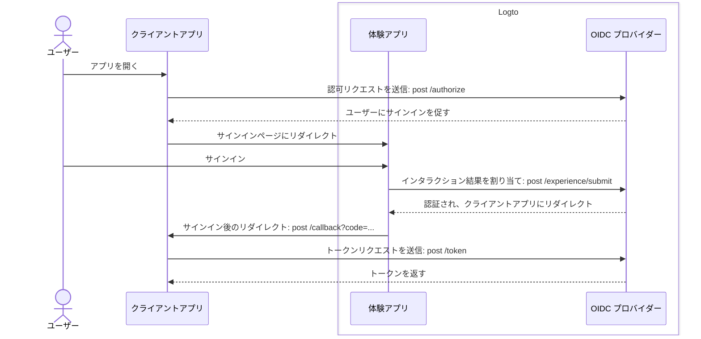
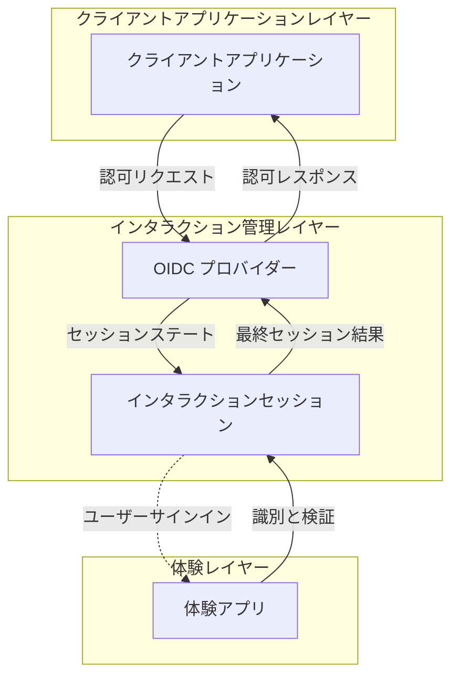

# サインアップとサインイン

サインアップとサインインは、エンドユーザーがクライアントアプリケーションへのアクセスを認証 (Authentication) し、認可 (Authorization) するための主要なインタラクションプロセスです。Logto は、集中管理された OIDC ベースの [CIAM](https://auth.wiki/iam) プラットフォームとして、複数のクライアントアプリケーションやプラットフォームにわたるユーザーのためのユニバーサルなサインイン体験を提供します。

## ユーザーフロー \{#user-flow}

一般的な [OIDC](https://auth.wiki/openid-connect) 認証 (Authentication) フローでは、ユーザーはクライアントアプリを開くことから始めます。クライアントアプリは Logto OIDC プロバイダーに [認可リクエスト](https://auth.wiki/authorization-request) を送信します。ユーザーがアクティブなセッションを持っていない場合、Logto はユーザーを Logto ホストのサインイン体験ページに促します。ユーザーは Logto 体験ページと対話し、必要な資格情報を提供して認証 (Authentication) されます。ユーザーが正常に認証 (Authentication) されると、Logto はユーザーをクライアントアプリに [認可コード](https://auth.wiki/authorization-code-flow#how-does-authorization-code-flow-work) と共にリダイレクトします。クライアントアプリはその後、Logto OIDC プロバイダーに認可コードを使用して [トークンリクエスト](https://auth.wiki/token-request) を送信し、トークンを取得します。

## ユーザーインタラクション \{#user-interaction}

クライアントアプリが認可リクエストを開始すると、各ユーザーインタラクションに対して **インタラクションセッション** が作成されます。このセッションは、複数のクライアントアプリケーションにわたるユーザーインタラクションのステータスを集中管理し、Logto が一貫したサインイン体験を提供できるようにします。ユーザーがクライアントアプリ間を切り替えると、インタラクションセッションは一貫性を保ち、ユーザーの認証 (Authentication) ステータスを維持し、プラットフォーム間での繰り返しサインインの必要性を減らします。**インタラクションセッション** が確立されると、ユーザーは Logto にサインインするよう促されます。

Logto の **体験アプリ** は、サインイン体験を促進するための専用のホストアプリケーションです。ユーザーが認証 (Authentication) を必要とする場合、彼らは **体験アプリ** に誘導され、そこでサインインを完了し、Logto と対話します。**体験アプリ** は、アクティブなインタラクションセッションを利用して、ユーザーのインタラクションの進捗を追跡しサポートします。

このユーザージャーニーをサポートし制御するために、Logto はセッションベースの **Experience API** を提供します。これらの API により、**体験アプリ** はインタラクションセッションのステータスをリアルタイムで更新およびアクセスすることで、さまざまなユーザーの識別および検証方法を処理できます。

ユーザーがすべての検証および確認要件を満たすと、インタラクションセッションは OIDC プロバイダーへの結果提出で終了し、ユーザーは完全に認証 (Authentication) され、同意を提供し、安全なサインインプロセスを完了します。

## サインイン体験のカスタマイズ \{#sign-in-experience-customization}

Logto は、さまざまなビジネス要件に対応する柔軟でカスタマイズ可能なユーザー体験を提供します。カスタムブランディング、ユーザーインターフェース、およびユーザーインタラクションフローを含みます。**体験アプリ** は、クライアントアプリケーションのブランディングとセキュリティ要件に合わせて調整できます。

Logto でのサインイン体験の [設定](/end-user-flows/sign-up-and-sign-in/sign-up) と [カスタマイズ](/customization) についてさらに学び続けてください。

## よくある質問 \{#faqs}

  

### アプリごとのサインイン体験方法またはブランディング \{#per-app-sign-in-experience-method-or-branding}

異なる **サインイン UI** を必要とするアプリケーションや組織のために、Logto は [アプリ固有のブランディング](/customization/match-your-brand#app-specific-branding) と [組織固有のブランディング](/customization/match-your-brand#organization-specific-branding) のカスタマイズをサポートしています。

ユーザータイプやサイトに基づいて異なる **サインイン方法** を提供する必要がある場合は、[認証パラメーター](/end-user-flows/authentication-parameters)（例：`first_screen` や `direct_sign_in`）を使用して、ユーザーをカスタマイズされたサインインオプションを持つエンドユーザーページにルーティングします。

  

### メールドメイン / IP アドレス / 地域の制限 \{#limit-email-domain--ip-address--region}

属性ベースのアクセス制御のために、例えばメールドメイン、IP アドレス、または地域に基づいてサインインを制限する場合、Logto の [カスタムトークンクレーム](/developers/custom-token-claims/) 機能を使用して、ユーザーの属性に基づいて認可リクエストを拒否または許可できます。

  

### サインインとサインアップのためのヘッドレス API \{#headless-api-for-sign-in-and-sign-up}

現在、Logto はサインインとサインアップのためのヘッドレス API を提供していません。ただし、[独自の UI を持ち込む](/customization/bring-your-ui/) を使用して、サインインとサインアップの体験をカスタマイズできます。

## 関連リソース \{#related-resources}

<Url href="https://blog.logto.io/deprecated-ropc-grant-type">
  リソースオーナーパスワードクレデンシャル (ROPC) グラントタイプを廃止すべき理由
</Url>

<Url href="https://blog.logto.io/implicit-flow-is-dead">
  なぜインプリシットフローではなく認可コードフローを使用すべきか？
</Url>

<Url href="https://blog.logto.io/token-based-authentication-vs-session-based-authentication">
  トークンベースの認証 (Authentication) とセッションベースの認証 (Authentication) の比較
</Url>
