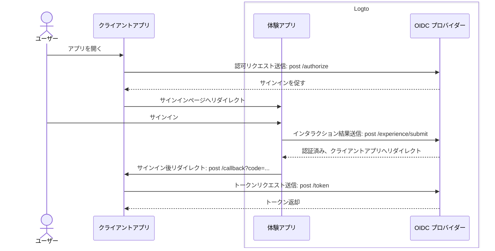
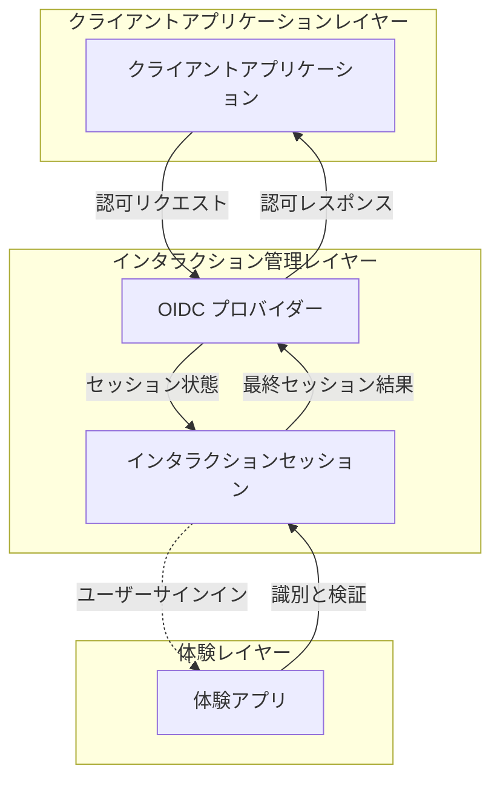

# サインアップとサインイン

サインアップとサインインは、エンドユーザーがクライアントアプリケーションへのアクセスを認証 (Authentication) および認可 (Authorization) するためのコアなインタラクションプロセスです。中央集約型の OIDC ベース [CIAM](https://auth.wiki/iam) プラットフォームとして、Logto は複数のクライアントアプリケーションやプラットフォームにわたるユーザーのためのユニバーサルなサインイン体験を提供します。

## ユーザーフロー \{#user-flow}

一般的な [OIDC](https://auth.wiki/openid-connect) 認証 (Authentication) フローでは、ユーザーはクライアントアプリを開くことから始まります。クライアントアプリは [認可リクエスト (Authorization request)](https://auth.wiki/authorization-request) を Logto OIDC プロバイダーに送信します。ユーザーにアクティブなセッションがない場合、Logto はユーザーを Logto ホストのサインイン体験ページに誘導します。ユーザーは Logto 体験ページで必要な認証情報を入力し、認証 (Authentication) されます。認証 (Authentication) に成功すると、Logto は [認可コード (Authorization code)](https://auth.wiki/authorization-code-flow#how-does-authorization-code-flow-work) とともにユーザーをクライアントアプリにリダイレクトします。クライアントアプリはその認可コードを使って [トークンリクエスト (Token request)](https://auth.wiki/token-request) を Logto OIDC プロバイダーに送り、トークンを取得します。

```mermaid
sequenceDiagram
  actor user as ユーザー
  participant client as クライアントアプリ

  box Logto
    participant experience as 体験アプリ
    participant oidc as OIDC プロバイダー
  end

  user ->> client: アプリを開く
  client ->> oidc: 認可リクエスト送信: post /authorize
  oidc -->> client: サインインを促す
  client ->> experience: サインインページへリダイレクト
  user ->> experience: サインイン
  experience ->> oidc: インタラクション結果送信: post /experience/submit
  oidc -->> experience: 認証済み、クライアントアプリへリダイレクト
  experience ->> client: サインイン後リダイレクト: post /callback?code=...
  client ->> oidc: トークンリクエスト送信: post /token
  oidc -->> client: トークン返却
```

## ユーザーインタラクション \{#user-interaction}

クライアントアプリが認可リクエストを開始すると、各ユーザーインタラクションごとに **インタラクションセッション** が作成されます。このセッションは複数のクライアントアプリケーション間でユーザーインタラクションの状態を一元管理し、Logto が一貫したサインイン体験を提供できるようにします。ユーザーがクライアントアプリ間を移動しても、インタラクションセッションは一貫性を保ち、認証 (Authentication) 状態を維持し、プラットフォーム間での繰り返しサインインの必要性を減らします。**インタラクションセッション** が確立されると、ユーザーは Logto へのサインインを促されます。

Logto の **体験アプリ (Experience app)** は、サインイン体験を提供する専用のホストアプリケーションです。ユーザーが認証 (Authentication) する必要がある場合、**体験アプリ** に誘導され、サインインを完了し Logto とやり取りします。**体験アプリ** はアクティブなインタラクションセッションを利用して、ユーザーのインタラクション進行状況を追跡・サポートします。

このユーザージャーニーをサポート・制御するために、Logto はセッションベースの **Experience API** を提供します。これらの API により、**体験アプリ** はインタラクションセッションの状態をリアルタイムで更新・取得しながら、幅広いユーザー識別・検証方法に対応できます。

ユーザーがすべての検証要件を満たすと、インタラクションセッションは OIDC プロバイダーへの結果送信で終了し、ユーザーは完全に認証 (Authentication) され、同意も提供され、安全なサインインプロセスが完了します。

```mermaid
flowchart TD
  %% レイヤー
  subgraph Layer1 [クライアントアプリケーションレイヤー]
      A[クライアントアプリケーション]
  end

  subgraph Layer2 [インタラクション管理レイヤー]
      B[OIDC プロバイダー]
      C[インタラクションセッション]
  end

  subgraph Layer3 [体験レイヤー]
      D[体験アプリ]
  end

  %% 接続
  A --> |認可リクエスト| B
  B --> |セッション状態| C
  C -.-> |ユーザーサインイン| D
  D --> |識別と検証| C
  C --> |最終セッション結果| B
  B --> |認可レスポンス| A
```

:::note
体験ページは認証 (Authentication) フローを通じてのみアクセスできるよう設計されています。検索エンジンによるインデックス化や直接アクセスを防ぐため、Logto は体験 HTML ページに自動的に `<meta name="robots" content="noindex, nofollow" />` を追加します。
:::

## サインイン体験のカスタマイズ \{#sign-in-experience-customization}

Logto は、さまざまなビジネス要件に対応する柔軟でカスタマイズ可能なユーザー体験を提供します。カスタムブランディング、ユーザーインターフェース、ユーザーインタラクションフローなどが含まれます。**体験アプリ** は、クライアントアプリケーションのブランディングやセキュリティ要件に合わせて調整できます。

Logto でのサインイン体験の [セットアップ](/end-user-flows/sign-up-and-sign-in/sign-up) や [カスタマイズ](/customization) について、さらに学びましょう。

## 一般的なサインイン方法 \{#common-sign-in-methods}

プロダクト要件に応じて、同じ Logto ホストの体験内で複数のサインイン方法を組み合わせることができます：

- [メール / 電話 / ユーザー名サインイン](/end-user-flows/sign-up-and-sign-in/sign-in)：パスワードまたは認証コードによるクラシックな識別子優先サインイン。
- [ソーシャルサインイン](/end-user-flows/sign-up-and-sign-in/social-sign-in)：Google、GitHub、Facebook などのソーシャルプロバイダーでサインイン。
- [パスキーサインイン](/end-user-flows/sign-up-and-sign-in/passkey-sign-in)：WebAuthn パスキーによるパスワードレスサインイン（ダイレクトボタン、識別子優先パスキー認証、オートフィルベースサインインを含む）。

## よくある質問 \{#faqs}

  

### アプリごとのサインイン体験方法やブランディング \{#per-app-sign-in-experience-method-or-branding}

アプリケーションや組織ごとに異なる **サインイン UI** が必要な場合、Logto は [アプリ固有のブランディング](/customization/match-your-brand#app-specific-branding) や [組織固有のブランディング](/customization/match-your-brand#organization-specific-branding) のカスタマイズをサポートしています。

ユーザータイプやサイトごとに異なる **サインイン方法** を提供したい場合は、[認証パラメーター](/end-user-flows/authentication-parameters)（例：`first_screen` や `direct_sign_in`）を利用して、ユーザーをカスタマイズされたサインインオプション付きのエンドユーザーページへ誘導できます。

  

### メールドメイン / IP アドレス / 地域による制限 \{#limit-email-domain--ip-address--region}

属性ベースのアクセス制御（例：メールドメイン、IP アドレス、地域によるサインイン制限）には、Logto の [カスタムトークンクレーム](/developers/custom-token-claims/) 機能を利用し、ユーザー属性に基づいて認可リクエストを拒否または許可できます。

  

### サインイン・サインアップ用のヘッドレス API \{#headless-api-for-sign-in-and-sign-up}

現在、Logto はサインイン・サインアップ用のヘッドレス API を提供していません。ただし、[独自 UI の持ち込み](/customization/bring-your-ui/) を利用して、サインイン・サインアップ体験をカスタマイズできます。

## 関連リソース \{#related-resources}

<Url href="https://blog.logto.io/deprecated-ropc-grant-type">
  Resource Owner Password Credentials (ROPC) グラントタイプを非推奨にすべき理由
</Url>

<Url href="https://blog.logto.io/implicit-flow-is-dead">
  なぜインプリシットフローではなく認可コードフローを使うべきか？
</Url>

<Url href="https://blog.logto.io/token-based-authentication-vs-session-based-authentication">
  トークンベース認証 (Authentication) とセッションベース認証 (Authentication) の比較
</Url>
