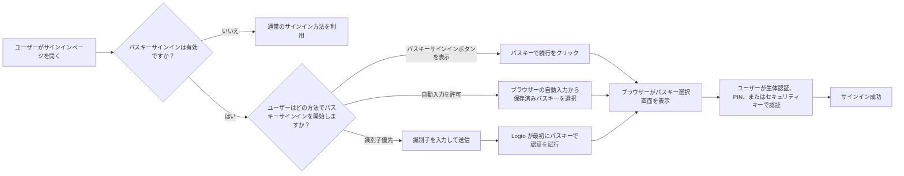
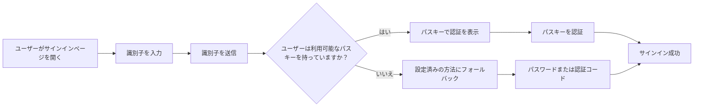
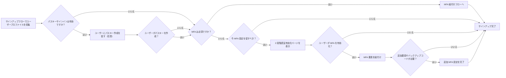

# パスキーサインイン

パスキーサインインでは、ユーザーがサインイン時にパスワードや認証コードを入力せず、WebAuthn クレデンシャルで直接認証 (Authentication) できます。Logto では、パスキーサインインに使用されるクレデンシャルは MFA で使われる WebAuthn クレデンシャルモデルと同じなので、サインイン体験と MFA 体験は密接に関連しています。

このドキュメントでは、Logto の組み込みサインイン体験におけるパスキーサインインの仕組み、エンドユーザー向けの異なるエントリーパス、MFA との連携について説明します。

## パスキーサインインの仕組み \{#how-passkey-sign-in-works}

パスキーサインインを利用するには、まず <CloudLink to="/sign-in-experience/sign-up-and-sign-in">サインイン体験</CloudLink>
設定で有効化する必要があります。有効化後、Logto はサインインページで最大 3 つの方法でパスキーサインインを提供できます：

- 最初のサインイン画面に専用の `パスキーで続行` ボタンを表示
- ユーザーがメールアドレス、電話番号、またはユーザー名を入力した後に `パスキーで認証` を試みる識別子優先フロー
- 識別子入力欄でのブラウザーの自動入力機能により、現在のデバイスから利用可能なパスキーを直接提案

全体的な体験は次のようになります：

## 3 つのパスキーサインインパス \{#three-passkey-sign-in-paths}

### 1. 「パスキーで続行」ボタンを表示する場合 \{#1-show-continue-with-passkey-button-enabled}

`「パスキーで続行」ボタンを表示` オプションが有効な場合、サインインページの最初の画面下部に `パスキーで続行` ボタンが表示されます。

ユーザーフローは次の通りです：

1. サインインページを開く
2. `パスキーで続行` をクリック
3. ブラウザーや OS のプロンプトからパスキーを選択
4. 生体認証、PIN、またはハードウェアキーで認証を完了
5. サインイン成功

これは最も直接的なパスです。すでに保存済みパスキーを持っていて、ワンステップでログインしたいユーザーに最適です。

### 2. 「パスキーで続行」ボタンを表示しない場合 \{#2-show-continue-with-passkey-button-disabled}

`「パスキーで続行」ボタンを表示` オプションが無効な場合、Logto は最初の画面で識別子優先体験に切り替わります。ページはまずユーザーの識別子のみを尋ねます。

ユーザーが識別子を送信した後：

1. Logto はパスキーサインインが有効かつ、識別されたユーザーが利用可能なパスキーを持っているかを確認
2. パスキーが利用可能な場合、Logto は最初に「パスキーで認証」フローを開始
3. ユーザーはパスキー認証を完了し、即座にサインイン可能
4. パスキーが利用できない場合や、他の方法を希望する場合は、Logto は他の設定済み認証方法にフォールバック

利用可能なフォールバック方法は、現在のテナントのサインイン体験設定によって異なります。たとえば、パスワード、メール認証コード、電話認証コードなど、識別子に対して有効な要素に切り替えられます。

### 3. プロンプトと自動入力を許可 \{#3-allow-prompting-and-autofill}

`プロンプトと自動入力を許可` オプションが有効な場合、対応ブラウザーは識別子入力欄から保存済みパスキーを直接提案できます。

ユーザーフローは次の通りです：

1. サインインページで識別子入力欄にフォーカス
2. ブラウザーが現在のオリジン用の保存済みパスキーを提案
3. ユーザーが自動入力リストからパスキーを選択
4. ブラウザーが生体認証、PIN、またはハードウェアキーでの認証を要求
5. サインイン成功

このフローは、プラットフォームでパスキーがすでに同期されているデバイスで特に便利です。ユーザーは手動で次のページに移動したり、専用のパスキーボタンをタップしたりせずにサインインできます。

## サインアップとパスキー紐付けフロー \{#sign-up-and-passkey-binding-flow}

パスキーサインインは単なるサインインの入り口ではありません。登録後の動作にも影響します。なぜなら、同じ WebAuthn クレデンシャルは後でサインインと MFA の両方に再利用できるからです。

ユーザーが通常のサインアップ手順を完了した後、Logto はパスキー作成を促すことができます。このプロンプトはエンドユーザーにとって任意ですが、一度パスキーを作成すると、次のステップはテナントの MFA ポリシーとユーザー自身の MFA 状態によって異なります。

主なロジックは次の通りです：

## パスキーサインインと MFA の関係 \{#relationship-between-passkey-sign-in-and-mfa}

### パスキーサインインは自動的に MFA 認証をスキップ \{#passkey-sign-in-automatically-skips-mfa-verification}

パスキーサインインに使われるパスキーは WebAuthn クレデンシャルに裏付けられており、そのクレデンシャルは WebAuthn MFA 要素としても扱われます。そのため、パスキーサインインと WebAuthn MFA はクレデンシャルの観点から実質的に同等です。

これにより、2 つの重要な挙動が生じます：

- ユーザーがパスキーでサインインした場合、Logto は別途 MFA 認証ステップをスキップします。
- パスキーサインイン有効化前にすでに WebAuthn を MFA 要素として紐付けていた場合、その既存クレデンシャルはパスキーサインイン用クレデンシャルとして再利用できます。再度紐付ける必要はありません。

つまり、パスキーサインインが成功すれば、MFA で求められる WebAuthn ベースの本人確認要件はすでに満たされています。

### パスキー紐付けはユーザー管理テナントで自動的に MFA を強制しない \{#binding-a-passkey-does-not-automatically-force-mfa-for-user-controlled-tenants}

MFA が必須でないテナントのユーザーの場合、サインアップやアカウント設定時にパスキーを紐付けても、アカウントで自動的に MFA が有効になることはありません。

代わりに、パスキー作成後、Logto は「2 段階認証を有効化」ページを表示します。

そのページでユーザーは：

- 「2 段階認証を有効化」ボタンをクリックして明示的に MFA を有効化し、次の紐付けステップに進む
- プロンプトをスキップして、MFA を有効化せずに現在のフローを完了

ユーザーが MFA を有効化することを選択した場合、Logto は通常の MFA 設定フローを続行し、テナントの MFA 設定に応じて追加要素の紐付けを求める場合があります。たとえば、他の MFA 要素がテナントで有効な場合、Logto は追加要素やバックアップコードの紐付けを続行できます。

### 後からパスキーサインインを無効化した場合 \{#what-happens-when-passkey-sign-in-is-disabled-later}

後からパスキーサインインをオフにしても、以前に紐付けたパスキーは WebAuthn クレデンシャルとして残ります。つまり、テナントで WebAuthn MFA が利用可能な限り、MFA 要素として引き続き利用できます。

パスキーサインインを無効化すると、パスキーは直接のサインインエントリーポイントとしては使えなくなりますが、基盤となる WebAuthn MFA クレデンシャルは無効化されません。

## 制限事項と互換性 \{#limitations-and-compatibility}

- パスキーサインインはエンタープライズシングルサインオン (SSO) ユーザーには利用できません。
- パスキーサインインはブラウザーおよびプラットフォームの WebAuthn サポートに依存します。
- 「プロンプトと自動入力を許可」は、パスキー自動入力 / 条件付き UI をサポートするブラウザーや環境でのみ動作します。
- パスキーはオリジンに紐付いています。あるドメインで登録したパスキーは、別のドメインでは利用できません。

## Q&A \{#q-a}

  

### パスキーサインインでも MFA 認証は必要ですか？ \{#does-passkey-sign-in-still-require-mfa-verification}

  

いいえ。パスキーサインインが成功すれば、WebAuthn ベースの認証要件はすでに満たされているため、Logto は別途 MFA 認証ステップをスキップします。

  

### パスキーサインイン用に紐付けたパスキーは、パスキーサインイン無効化後も MFA 要素として使えますか？ \{#can-a-passkey-bound-for-passkey-sign-in-still-be-used-as-an-mfa-factor-after-passkey-sign-in-is-disabled}

  

はい。パスキーサインインと WebAuthn MFA は同じ基盤クレデンシャルモデルに基づいています。後からパスキーサインインを無効化しても、紐付けたパスキーは WebAuthn MFA 要素として引き続き利用できます。

  

### エンタープライズシングルサインオン (SSO) ユーザーはパスキーサインインを利用できますか？ \{#can-enterprise-sso-users-use-passkey-sign-in}

  

いいえ。エンタープライズシングルサインオン (SSO) ユーザーはパスキーサインインの対象外です。

  

### パスキーサインインでも CAPTCHA は必要ですか？ \{#does-passkey-sign-in-still-require-captcha}

  

いいえ。パスキーサインイン自体には追加の CAPTCHA ステップは不要です。CAPTCHA はページ上の他のサインインアクション（パスワードや認証コードによる送信など）には適用される場合がありますが、パスキー認証フロー自体には適用されません。

