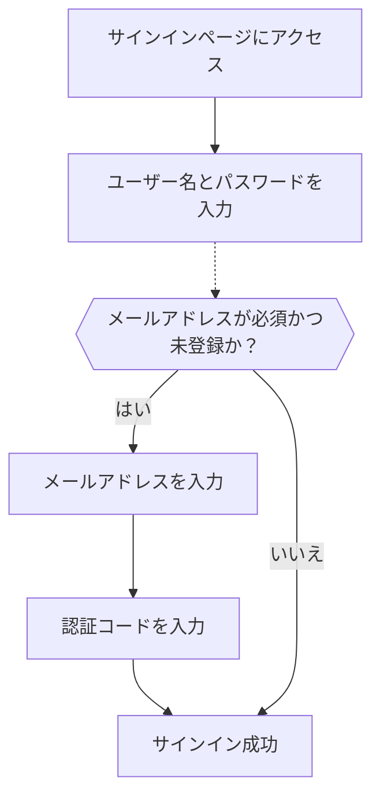

# メール / 電話番号 / ユーザー名でのサインイン

## 識別子サインインフローの設定 \{#configure-the-identifier-sign-in-flow}

前述の通り、さまざまな識別子タイプは [サインアップフロー](/end-user-flows/sign-up-and-sign-in/sign-up) や [Logto での直接アカウント作成](/user-management/manage-users#add-users) を通じてユーザーから収集できます。さらに、ユーザーは製品を利用する中で追加情報を入力・完了することもあります。これらの識別子は Logto のシステム内でユーザーを一意に識別し、Logto と連携したアプリケーションへの認証 (Authentication) およびサインインを可能にします。

Logto がホストする事前構築済みサインインページを利用する場合でも、[独自のカスタムサインイン UI を構築する](/customization#custom-ui)場合でも、エンドユーザー向けの利用可能なサインイン方法と認証設定を構成する必要があります。

## 識別子および認証 (Authentication) 設定のセットアップ \{#set-up-the-identifier-and-authentication-settings}

### 1. サポートするサインイン識別子の設定 \{#1-set-the-supported-sign-in-identifiers}

ドロップダウンリストから複数の識別子を追加し、エンドユーザー向けの有効なサインイン方法として設定できます。利用可能なオプションは以下の通りです：

- **ユーザー名**
- **メールアドレス**
- **電話番号**

識別子の順序を変更すると、サインインページでの表示順も変わります。最初の識別子がユーザーの主要なサインイン方法となります。

### 2. 認証 (Authentication) 設定の構成 \{#2-set-the-authentication-settings}

各サインイン識別子ごとに、ユーザーのアイデンティティを確認するための有効な認証要素を少なくとも 1 つ設定する必要があります。選択できる要素は 2 つあります：

- **パスワード**：すべての識別子タイプで利用可能です。有効化すると、ユーザーはサインイン時にパスワードの入力が必須となります。
- **認証コード**：**メールアドレス** および **電話番号** 識別子でのみ利用可能です。有効化すると、ユーザーはメールまたは電話番号に送信された認証コードを入力してサインインを完了します。

両方の要素が有効な場合、ユーザーはどちらかの方法でサインインを完了できます。また、要素の順序を変更することで、サインインページでの表示順も変わります。最初の要素が主要な認証方法として使用され、2 番目の要素は代替リンクとして表示されます。

## 識別子サインインフローのユーザー体験 \{#identifier-sign-in-flow-user-experience}

サインイン体験は、選択された識別子と利用可能な認証要素に応じて変化します。

- **複数識別子のスマート入力：**
  複数の識別子サインイン方法が有効な場合、Logto の組み込みサインインページはユーザーが入力した識別子のタイプを自動的に判別し、対応する認証オプションを表示します。たとえば、**メールアドレス** と **電話番号** の両方が有効な場合、サインインページはユーザーが入力した識別子のタイプを自動判別し、対応する認証オプションを表示します。連続して数字が入力された場合は地域コード付きの電話番号形式に、"@" 記号が使われた場合はメール形式に自動で切り替わります。
  - 電話番号の国コードはユーザーのブラウザロケールをデフォルトとしますが、ユーザーが手動で切り替えることも可能です。特定のデフォルト国コードを設定するには [`ui_locales`](/end-user-flows/authentication-parameters/ui-locales) パラメーターを利用できます。詳細は [ローカライズ言語](/customization/localized-languages#how-can-i-set-a-default-phone-number-country-code-for-the-sign-in-experience) を参照してください。
- **有効な認証要素：**
  - **パスワードのみ：** 識別子とパスワードの両方の入力欄が最初の画面に表示されます。
  - **認証コードのみ：** 最初の画面に識別子欄が表示され、その後 2 番目の画面で認証コード欄が表示されます。
  - **パスワードと認証コード：** 最初の画面で識別子を入力し、2 番目の画面で認証順に応じてパスワードまたは認証コードを入力します。2 つの認証方法を切り替えるためのリンクも表示されます。

### 例 \{#examples}

  

### 例 1: メールアドレス + パスワード認証 \{#example-1-email-address-with-password-verification}

サインイン識別子として **メールアドレス** を追加し、認証要素として **パスワード** を有効化します。

  

### 例 2: メール / 電話番号 + パスワード（主要）と認証コード（代替）認証 \{#example-2-emailphone-with-passwordprimary-and-verification-code-alternative-verification-enabled}

**メールアドレス** と **電話番号** の両方をサインイン識別子として追加します。
両方の識別子に対して **パスワード** と **認証コード** の要素を有効化します。

## サインイン時に追加ユーザープロフィールを収集 \{#collect-additional-user-profile-on-sign-in}

Logto のサインインフローでは、サインアップ識別子設定が更新された場合、プロフィール補完プロセスがトリガーされることがあります。これにより、既存ユーザーを含むすべてのユーザーが新たに必須となった識別子を提供することが保証されます。

開発者が新しい識別子（例：メールアドレス）を追加すると、すべてのユーザーに必須となります。既存の識別子（例：ユーザー名）でサインインしたユーザーは、プロフィールにその識別子が未登録の場合、新しい識別子の入力と認証を求められます。このステップを完了して初めてアプリケーションにアクセスできるため、要件変更へのスムーズかつ一貫した移行が実現します。

プロセスの流れ：

1. **ユーザー名** が以前サインアップ識別子として設定され、**パスワード作成** 設定が自動有効化されていました。
2. 後から **メールアドレス** がサインアップ識別子として設定されます。**メールアドレス** 識別子は自動的に有効なサインインオプションとして追加されます。
3. 既存ユーザーがユーザー名とパスワードでサインインします。
4. 初回サインイン後、ユーザーはメールアドレスの入力と認証を求められます。

同じプロセスは **パスワード作成** サインアップ設定にも適用されます。サインアップフローで新たに **パスワード作成** 設定が有効化された場合、**パスワード** 要素は選択したすべてのサインイン識別子で自動的に有効化されます。パスワード未登録の既存ユーザーは、サインイン時にパスワード作成を求められます。

:::note
注：カスタムサインインフローについては、[Bring your UI](/customization/bring-your-ui/) 機能を参照してください。
:::

## よくある質問 \{#faqs}

  

### セルフホスト型サインイン体験（埋め込みサインイン） \{#self-hosted-sign-in-experience-embedded-sign-in}

Logto は現在、サインインおよびサインアップ用のヘッドレス API をサポートしていません。ただし、[Bring your UI](/customization/bring-your-ui/) 機能を利用して、独自のサインインフォームを Logto にアップロードできます。また、アプリケーションで収集したユーザー識別子でサインインフォームを事前入力したり、サードパーティのソーシャルやエンタープライズ SSO プロバイダーで直接サインインしたりするための複数のサインインパラメーターもサポートしています。詳細は [認証 (Authentication) パラメーター](/end-user-flows/authentication-parameters/) をご覧ください。

## 関連リソース \{#related-resources}

<Url href="https://www.youtube.com/watch?v=64rBXpWbScc">メールサインアップ・サインイン体験</Url>

<Url href="https://www.youtube.com/watch?v=chQxCJX6e6w">ユーザー名サインアップ・サインイン体験</Url>
