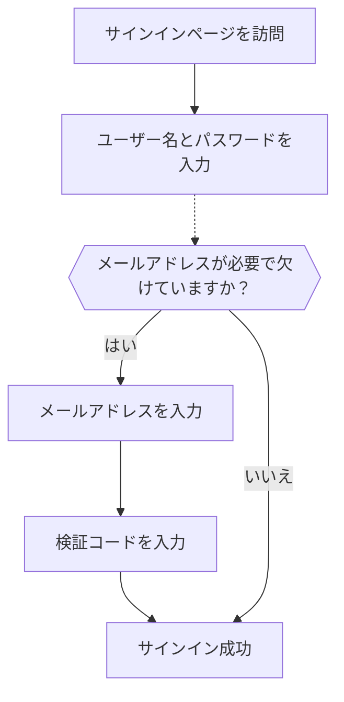

# メール / 電話 / ユーザー名でのサインイン

## 識別子サインインフローの設定

前述のように、さまざまな識別子タイプは、[サインアップフロー](/end-user-flows/sign-up-and-sign-in/sign-up) または [Logto での直接アカウント作成](/user-management/manage-users#add-users) を通じてユーザーから収集される場合があります。さらに、ユーザーは製品を探索し利用する中で追加情報を入力し完了することがあります。これらの識別子は、Logto のシステムでユーザーを一意に識別し、Logto と統合されたアプリケーションに認証 (Authentication) されサインインできるようにするために使用されます。

Logto がホストする事前構築されたサインインページを使用するか、[独自のカスタムサインイン UI を構築する](/customization#custom-ui) 計画を立てるかに関わらず、エンドユーザーのための利用可能なサインイン方法と検証設定を構成する必要があります。

## 識別子と認証 (Authentication) 設定のセットアップ

### 1. サポートされるサインイン識別子を設定する

ドロップダウンリストから複数のサポートされる識別子を追加して、エンドユーザーのための有効なサインイン方法として設定できます。利用可能なオプションは次のとおりです：

- **ユーザー名**
- **メールアドレス**
- **電話番号**

識別子の順序を変更すると、サインインページに表示される順序が変わります。最初の識別子がユーザーの主要なサインイン方法になります。

### 2. 認証 (Authentication) 設定を設定する

各サインイン識別子について、ユーザーのアイデンティティを確認するために少なくとも 1 つの有効な検証要素を設定する必要があります。選択できる要素は次の 2 つです：

- **パスワード**：すべてのタイプのサインイン識別子で利用可能です。有効にすると、ユーザーはサインインプロセスを完了するためにパスワードを提供する必要があります。
- **検証コード**：**メールアドレス**および **電話番号** 識別子のみで利用可能です。有効にすると、ユーザーはサインインプロセスを完了するために、メールまたは電話番号に送信された検証コードを入力する必要があります。

両方の要素が有効になっている場合、ユーザーはどちらの方法でもサインインプロセスを完了できます。また、要素の順序を変更して、サインインページに表示される順序を変更できます。最初の要素がユーザーの主要な検証方法として使用され、2 番目の要素が代替リンクとして表示されます。

## 識別子サインインフローのユーザー体験

サインイン体験は、選択された識別子と利用可能な認証 (Authentication) 要素に基づいて適応します。

- **複数の識別子のスマート入力：**
  複数の識別子サインイン方法が有効になっている場合、Logto の組み込みサインインページは、ユーザーが入力した識別子のタイプを自動的に検出し、対応する検証オプションを表示します。たとえば、**メールアドレス**と**電話番号**の両方が有効になっている場合、サインインページはユーザーが入力した識別子のタイプを自動的に検出し、対応する検証オプションを表示します。連続して数字が入力された場合は地域コード付きの電話番号形式に、"@" 記号が使用された場合はメール形式に切り替わります。
- **有効な検証要素：**
  - **パスワードのみ：** 識別子とパスワードの両方のフィールドが最初の画面に表示されます。
  - **検証コードのみ：** 識別子フィールドが最初の画面に表示され、次に検証コードフィールドが 2 番目の画面に表示されます。
  - **パスワードと検証コード：** 識別子フィールドが最初の画面に入力され、次に検証順序に基づいてパスワードまたは検証コードを入力する手順が 2 番目の画面に表示されます。ユーザーが 2 つの検証方法を切り替えることができるスイッチリンクが提供されます。

### 例

  

### 例 1: パスワード検証付きメールアドレス

**メールアドレス**をサインイン識別子として追加し、検証のために**パスワード**要素を有効にします。

  

### 例 2: パスワード (主要) と検証コード (代替) 検証が有効なメール / 電話

**メールアドレス**と**電話番号**の両方をサインイン識別子として追加します。
**パスワード**と**検証コード**要素を両方の識別子に対して有効にします。

## サインイン時に追加のユーザープロファイルを収集する

Logto のサインインフローでは、サインアップ識別子設定が更新された場合にプロファイル充足プロセスがトリガーされることがあります。これにより、既存のユーザーを含むすべてのユーザーが新たに必要とされる識別子を提供することが保証されます。

開発者が新しい識別子（例えばメールアドレス）を追加すると、それはすべてのユーザーにとって必須になります。既存の識別子（例えばユーザー名）でサインインするユーザーは、プロファイルに欠けている場合、新しい識別子を提供し検証するよう求められます。このステップを完了した後にのみ、アプリケーションにアクセスできるようになり、更新された要件へのスムーズで一貫した移行が保証されます。

プロセスの詳細：

1. **ユーザー名**が以前にサインアップ識別子として設定され、**パスワードを作成する**設定が自動的に有効になっています。
2. **メールアドレス**が後でサインアップ識別子として設定されます。**メールアドレス**識別子は、有効なサインインオプションとして自動的に追加されます。
3. 既存のユーザーがユーザー名とパスワードでサインインします。
4. ユーザーは、最初のサインインステップの後にメールアドレスを提供し検証するよう求められます。

同じプロセスは、**パスワードを作成する**サインアップ設定にも適用されます。サインアップフローで新たに有効になった場合、**パスワードを作成する**設定は、選択したすべてのサインイン識別子に対して自動的に有効になります。パスワードを持たないすべての既存のユーザーは、サインインプロセス中にパスワードを作成するよう求められます。

:::note
注：カスタムサインインフローについては、[Bring your UI](/customization/bring-your-ui/) 機能を参照してください。
:::

## よくある質問

  

### セルフホスト型サインイン体験（埋め込みサインイン）

Logto は現在、サインインおよびサインアップのためのヘッドレス API をサポートしていません。ただし、[Bring your UI](/customization/bring-your-ui/) 機能を使用して、カスタムサインインフォームを Logto にアップロードできます。また、アプリケーションから収集したユーザー識別子でサインインフォームを事前入力したり、サードパーティのソーシャルまたはエンタープライズ SSO プロバイダーで直接サインインしたりするために使用できる複数のサインインパラメータをサポートしています。詳細は [認証 (Authentication) パラメータ](/end-user-flows/authentication-parameters/) を参照してください。

## 関連リソース

<Url href="https://www.youtube.com/watch?v=64rBXpWbScc">メールサインアップとサインイン体験</Url>

<Url href="https://www.youtube.com/watch?v=chQxCJX6e6w">ユーザー名サインアップとサインイン体験</Url>
