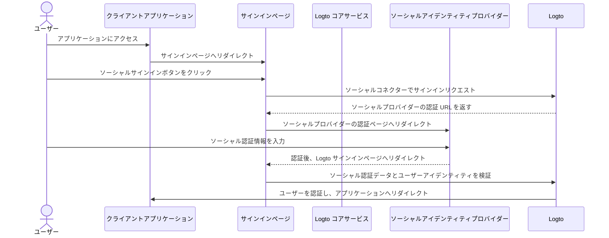
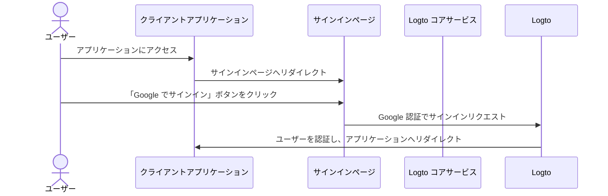

# ソーシャルサインイン

ソーシャルサインインは、Google、Facebook、Twitter、LinkedIn などの既存のソーシャルメディアアカウントを利用してサインインやサインアップができる、広く利用されている認証 (Authentication) 方法です。

ソーシャルサインインのメリット：

- **オンボーディングプロセスの簡素化**：ソーシャルサインインにより、ユーザーは新しいアカウントを作成したり、別のパスワードを覚えたりすることなく、ワンクリックでサインアップやサインインが可能です。これにより摩擦が減り、ユーザーエンゲージメントが向上します。
- **信頼性とセキュリティの向上**：Google や Facebook などの確立された信頼性の高いプラットフォームを活用することで、ユーザーはアプリケーションに対してより安心感を持つことができます。
- **ユーザーデータの充実**：ソーシャルサインインを利用することで、名前、メールアドレス、プロフィール画像など、ソーシャルプラットフォームから追加のプロフィール情報を取得できます。

## ソーシャルサインインの実装 \{#implement-social-sign-in}

1. **ソーシャルコネクターの設定**：<br/>
   <CloudLink to="/connectors/social">コンソール > コネクター > ソーシャルコネクター</CloudLink> に移動します。「ソーシャルコネクターを追加」ボタンをクリックし、追加したいソーシャルコネクター（例：Google
   や Github）を選択します。詳細な手順は [ソーシャルコネクター](/connectors/social-connectors/)
   を参照してください。
2. **ソーシャルログインボタンの追加**：<br/>
   デフォルトでは、新しく追加したソーシャルコネクターはエンドユーザーのサインインページに表示されません。サインインページにソーシャルサインインボタンを追加するには、サインイン体験設定でソーシャルコネクターを有効にする必要があります。

   <CloudLink to="/sign-in-experience/sign-up-and-sign-in">
     コンソール > サインイン体験 > サインアップとサインイン
   </CloudLink>
   に移動します。「ソーシャルコネクターを追加」ボタンをクリックして、サインアップおよびログインページにソーシャルログインボタンを統合します。ドラッグ＆ドロップで
   UI 上の順序を調整できます。

3. **アカウント連携オプションの設定**：<br/>
   [ソーシャルアイデンティティ](/user-management/user-data#social-identities) で新規登録するユーザーの場合、Logto ではソーシャルアカウントを既存のメールアドレスまたは電話番号アカウントに連携できます。デフォルトでは、ソーシャルサインアップ時に関連する [アカウント連携](#account-linking) ページが表示され、既存アカウントへの連携や新規作成が可能です。

   このプロセスを簡略化するには、サインイン体験設定で **自動アカウント連携** オプションを有効にできます。これにより、メールアドレスまたは電話番号が一致する場合、自動的にソーシャルアカウントが既存アカウントに連携されます。

4. **変更内容の保存**：<br/>
   変更内容をよく確認し、設定を適用するために保存してください。

## ソーシャルサインインのユーザー体験 \{#user-experience-of-social-sign-in}

ソーシャルサインインを利用することで、Logto でのサインアップおよびサインインプロセスがユーザーにとってスムーズになります。



1. **ソーシャルでサインイン**：サインインページに表示されたソーシャルサインインボタンをユーザーがクリックします。
2. **リダイレクト**：ユーザーはソーシャルアイデンティティプロバイダーの認証ページへリダイレクトされます。
3. **ソーシャル認証**：ユーザーはソーシャル認証情報を入力し、ソーシャルプロバイダーで認証します。すでにソーシャルプロバイダーにログインしている場合は自動的に認証されることもあります。複数のサインインセッションが検出された場合、正しいアカウントの選択を促されることがあります（例：複数の Google アカウント）。
   :::note
   Google の「prompt」パラメーターは Google コネクターで設定でき、Google ログイン時のアカウント選択や同意画面のユーザー体験をカスタマイズできます。
   :::
4. **Logto への戻り**：認証が成功すると、ソーシャルプロバイダーは認証データとともにユーザーを Logto サインインページへリダイレクトします。
5. **ソーシャルアイデンティティの検証**：Logto はソーシャル認証データとユーザーアイデンティティを検証します。ソーシャルアイデンティティに紐づくユーザーアカウントが存在しない場合は、新しいアカウントが作成されます。
6. **ユーザー認証**：Logto はユーザーを認証し、クライアントアプリケーションへリダイレクトして認証プロセスを完了します。

## アカウント連携 \{#account-linking}

前述の通り、Logto ではソーシャルアカウントを既存のメールアドレスまたは電話番号アカウントに連携できます。このプロセスは、異なる認証 (Authentication) 方法やアイデンティティプロバイダー間で統一されたユーザーアカウントを維持するために重要です。

- **新規アカウント作成**：
  [ソーシャルアイデンティティ](/user-management/user-data#social-identities) でサインインしたユーザーが Logto システムに存在せず、提供されたメールアドレスや電話番号が既存ユーザーアカウントと一致しない場合、Logto に新規アカウントが直接作成されます。
- **既存アカウントへの連携**：
  ソーシャルアイデンティティが提供するメールアドレスや電話番号がすでに Logto の既存アカウントに紐づいている場合、柔軟なアカウント連携プロセスを提供します。

  - **自動アカウント連携**：<CloudLink to="/sign-in-experience/sign-up-and-sign-in">サインイン体験</CloudLink> 設定で「自動アカウント連携」オプションが有効な場合、Logto はメールアドレスまたは電話番号が一致する既存アカウントに自動的にソーシャルアカウントを連携します。ユーザーは連携を促されることなく、既存アカウントに即座にサインインできます。ソーシャルアカウントが連携され、今後どちらの方法でもサインイン可能になります。
  - **手動アカウント連携**：「自動アカウント連携」オプションが無効な場合、サインインプロセス中にユーザーにソーシャルアカウントの連携を促します。ユーザーはアカウントを連携するか、新規作成するかを選択できます。

    

    ```mermaid
    flowchart TD
    A[ソーシャルアイデンティティで認証] --> B{{ソーシャルアイデンティティは Logto に存在するか？}}
    B -- はい --> C[既存アカウントでサインイン]
    B -- いいえ --> D{{メール／電話が既存アカウントと一致するか？}}
    D -- はい --> E{{自動アカウント連携は有効か？}}
    E -- はい --> G[ソーシャルアイデンティティを既存アカウントに連携]
    G --> C
    D -- いいえ --> H[新規アカウント作成＆サインイン]
    E -- いいえ --> I{{ソーシャルアカウントを連携するか？}}
    I -- はい --> G
    I -- いいえ --> H
    ```

:::note
ソーシャルサインアップ時に、メールアドレスや電話番号が既存アカウントと一致し、ユーザーがアカウント連携を選択しなかった場合、そのメールアドレスや電話番号は新規アカウントには同期されません。これにより、すべてのユーザーアカウントでメールアドレスや電話番号の一意性が保たれます。

メールアドレスや電話番号が必須のサインアップ識別子である場合、サインアッププロセス中に別のメールアドレスや電話番号の入力を求められます。詳細は [追加ユーザープロフィールの収集](#collect-additional-user-profile-data) を参照してください。
:::

## 追加ユーザープロフィール情報の収集 \{#collect-additional-user-profile-data}

ソーシャルサインアッププロセス中、設定した必須サインアップ識別子（**メールアドレス**、**電話番号**、**ユーザー名**）に応じて、ユーザーはソーシャルプロバイダーで認証後、追加の確認済み情報の入力を求められる場合があります。

例えば、**メールアドレス** と **ユーザー名** が必須サインアップ識別子に設定されている場合：

1. **確認済みメールアドレスを提供するソーシャルアイデンティティでサインアップ**

   ソーシャルアイデンティティが確認済みメールアドレスを提供する場合、そのメールアドレスはユーザープロフィールに同期され、ユーザーはサインアップ完了のためにユーザー名の入力を求められます。

   ```mermaid
   flowchart TD
      A[ソーシャルアイデンティティで認証] --> B{{確認済みメールアドレスを含むか？}}
      B -- はい --> C[ユーザー名を入力]
      C --> D[サインアップ成功]
   ```

2. **確認済みメールアドレスを提供しないソーシャルアイデンティティでサインアップ**

   ソーシャルアイデンティティが確認済みメールアドレスを提供しない場合、サインアッププロセス中にメールアドレスの入力を求められます。ユーザーは入力したメールアドレスに送信された認証コードを入力して確認する必要があります。

   ```mermaid
   flowchart TD
      A[ソーシャルアイデンティティで認証] --> B{{確認済みメールアドレスを含むか？}}
      B -- いいえ --> C[メールアドレスを入力]
      C --> D[認証コードを入力]
      D --> E[ユーザー名を入力]
      E --> F[サインアップ成功]
   ```

3. **既に登録済みメールアドレスを提供するソーシャルアイデンティティでサインアップ**

   ソーシャルアイデンティティが Logto システムですでに登録されているメールアドレスを提供する場合、ユーザーはソーシャルアカウントを既存アカウントに連携するか、新規アカウントを作成するかを選択するよう促されます。新規アカウント作成を選択した場合、新しいメールアドレスの入力と確認が求められます。

   ```mermaid
      flowchart TD
       A[ソーシャルアイデンティティで認証] --> B{{メールアドレスが既存アカウントと一致するか？}}
       B -- はい --> C{{ソーシャルアカウントを連携するか？}}
       C -- はい --> D[ソーシャルアイデンティティを既存アカウントに連携]
       D --> E[サインイン成功]
       C -- いいえ --> F[新しいメールアドレスを入力]
       F --> G[認証コードを入力]
       G --> H[ユーザー名を入力]
       H --> I[サインアップ成功]
       B -- いいえ --> H
   ```

## Google One-tap \{#google-one-tap}

Logto は Google コネクターで [Google One-tap](https://developers.google.com/identity/gsi/web/guides/features) サインイン方式もサポートしており、ユーザーはワンクリックでサインインできます。この機能により、Google 認証ページへのリダイレクトが不要となり、サインインプロセスがさらに簡単になります。

Google One-tap サインインを有効にするには、[Google コネクター](/integrations/google) 設定の手順に従ってください。有効化後、サインインページにアクセスした際に「Google でサインイン」ポップアップが表示されます。クリックすると、Google アカウントで自動的に認証され、アプリケーションへリダイレクトされます。




## ソーシャルアカウントの連携・解除 \{#link-or-unlink-social-accounts}

初回のソーシャルサインイン後、ユーザーはアカウント設定から接続済みソーシャルアカウントを管理できます。これにより、既存プロフィールに追加のソーシャルアカウントを連携したり、不要なソーシャル連携を解除したりできます。

ユーザーはセルフサービスのアカウントセンターから以下の操作が可能です：

- **新しいソーシャルアカウントの連携**：同じユーザープロフィールに追加のソーシャルプロバイダーを接続
- **既存ソーシャルアカウントの解除**：他の方法でのアクセスを維持しつつソーシャル連携を解除
- **接続済みアカウントの表示**：現在連携されているすべてのソーシャルアイデンティティを確認

アカウント管理機能の実装については [アカウント設定](/end-user-flows/account-settings) ドキュメントを参照してください。

## トークンの保存とサードパーティ API の呼び出し \{#store-tokens-and-call-third-party-apis}

対応するソーシャルコネクターでサードパーティトークンの保存を有効にすると、ユーザーが認証し権限を付与した後、プロバイダー発行のアクセス トークンおよびリフレッシュ トークンが Logto のシークレットボールトに安全に保存されます。アプリケーションは（Account API 経由で）これらを取得し、ユーザーに再認証を求めることなくプロバイダー API（例：Google カレンダーへのイベント追加など）を呼び出せます。セットアップの詳細は [サードパーティトークンの保存](/secret-vault/federated-token-set) を参照してください。

## よくある質問 \{#faqs}

<details>
  <summary>

### サイトにソーシャルログインボタンを追加し、直接ソーシャルでサインインさせるには？ \{#how-to-add-social-login-buttons-and-directly-sign-in-with-social-on-my-website}

</summary>

Logto では、サイトにソーシャルログインボタンを追加し、デフォルトのサインインフォームを表示せずに直接ソーシャルサインインプロセスを開始できます。詳細な手順は [ダイレクトサインイン](/end-user-flows/authentication-parameters/direct-sign-in/) ガイドを参照してください。

</details>

<details>
  <summary>

### ソーシャルでサインアップした後、メールアドレスや電話番号が反映されないのはなぜですか？ \{#why-my-emails-or-phone-numbers-are-not-populated-after-signing-up-with-social}

</summary>

Logto では、メールアドレスや電話番号はユーザーを一意に識別するサインイン識別子として利用できます。識別子としては確認済みのメールアドレスや電話番号のみが受け入れられます。ソーシャルアイデンティティが `email_verified` または `phone_number_verified` クレームを提供しない場合、メールアドレスや電話番号はユーザープロフィールに同期されませんが、ユーザープロフィール内のソーシャルアイデンティティデータとしては確認できます。

未確認のメールアドレスや電話番号をユーザープロフィールとしてサポートする機能も今後追加予定です。

</details>

## 関連リソース \{#related-resources}

<Url href="https://www.youtube.com/watch?v=sv60N9eW8Ew">ソーシャルサインイン体験</Url>

<Url href="https://blog.logto.io/maximize-google-sign-in-conversions">
  6 つの設定で Google ログインコンバージョンを最大化
</Url>
