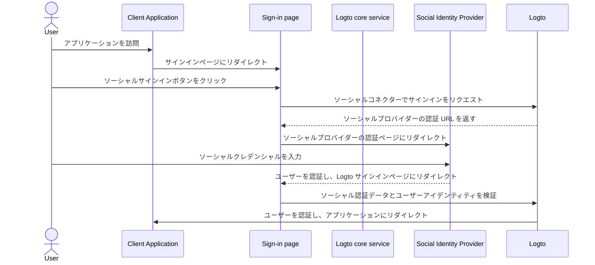
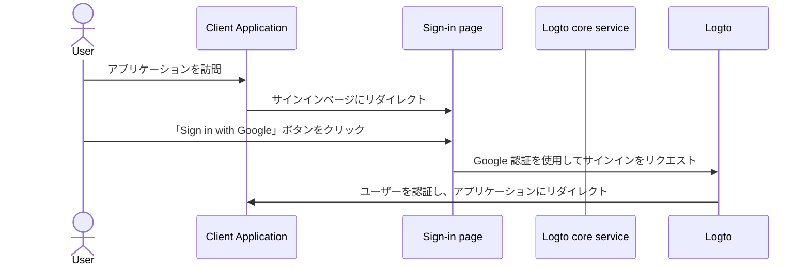

# ソーシャルサインイン

ソーシャルサインインは、Google、Facebook、Twitter、LinkedIn などの既存のソーシャルメディアアカウントを使用してユーザーがサインインおよびサインアップできる、広く使用されている認証 (Authentication) 方法です。

ソーシャルサインインの利点：

- **簡素化されたオンボーディングプロセス**：ソーシャルサインインにより、ユーザーは新しいアカウントを作成したり、別のパスワードを覚えたりすることなく、ワンクリックでサインアップまたはサインインできます。これにより、摩擦が減少し、ユーザーエンゲージメントが向上します。
- **信頼性とセキュリティの向上**：Google や Facebook などの確立された信頼できるプラットフォームを活用することで、ユーザーはアプリケーションに対してより自信を持つことができます。
- **ユーザーデータの充実**：ソーシャルサインインにより、名前、メールアドレス、プロフィール写真など、ソーシャルプラットフォームから追加のプロフィール情報を収集できます。

## ソーシャルサインインの実装 \{#implement-social-sign-in}

1. **ソーシャルコネクターを設定する**:<br/>
   <CloudLink to="/connectors/social">Console > Connectors > Social connectors</CloudLink> に移動します。「Add Social Connector」ボタンをクリックし、追加したいソーシャルコネクター（例：Google や Github）を見つけます。詳細な手順については、[ソーシャルコネクター](/connectors/social-connectors/) のドキュメントを参照してください。
2. **ソーシャルログインボタンを追加する**:<br/>
   デフォルトでは、新しく追加したソーシャルコネクターはエンドユーザーのサインインページに表示されません。サインインページにソーシャルサインインボタンを追加するには、サインイン体験設定でソーシャルコネクターを有効にする必要があります。

   <CloudLink to="/sign-in-experience/sign-up-and-sign-in">Console > Sign-in experience > Sign-up and sign-in</CloudLink> に移動します。「Add social connector」ボタンをクリックして、サインアップおよびログインページにソーシャルログインボタンを統合します。ドラッグアンドドロップで UI 上の順序を調整します。

3. **アカウントリンクオプションを設定する**:<br/>
   [ソーシャルアイデンティティ](/user-management/user-data#social-identities) でサインアップする新しいユーザーに対して、Logto はソーシャルアカウントを Logto システム内の既存のメールまたは電話番号アカウントにリンクすることを可能にします。デフォルトでは、ソーシャルサインアップ中に関連する [アカウントリンク](#account-linking) ページがユーザーに表示され、ソーシャルアカウントを既存のアカウントにリンクするか、新しいアカウントを作成するかを選択できます。

   このプロセスを簡素化するために、サインイン体験設定で **自動アカウントリンク** オプションを有効にすることができます。これにより、メールまたは電話番号が一致する場合、ソーシャルアカウントが自動的に既存のアカウントにリンクされます。

4. **変更を保存する**:<br/>
   変更を慎重に確認し、設定を適用するために保存します。

## ソーシャルサインインのユーザー体験 \{#user-experience-of-social-sign-in}

ソーシャルサインインを使用すると、Logto でのサインアップおよびサインインプロセスがユーザーにとって簡素化されます。



1. **ソーシャルでサインイン**: ユーザーがサインインページに表示されたソーシャルサインインボタンをクリックします。
2. **リダイレクション**: ユーザーはソーシャルアイデンティティプロバイダーの認証ページにリダイレクトされます。
3. **ソーシャル認証**: ユーザーはソーシャルプロバイダーでソーシャルクレデンシャルを入力して認証します。ユーザーがすでにソーシャルプロバイダーにログインしている場合、自動的に認証されることがあります。複数のサインインセッションが検出された場合、ユーザーは正しいアカウントを選択するよう促されることがあります（例：複数の Google アカウント）。
   :::note
   Google の「prompt」パラメータは Google コネクターで設定でき、Google ログインのアカウント選択および同意画面のユーザー体験をカスタマイズできます。
   :::
4. **Logto に戻る**: 認証が成功すると、ソーシャルプロバイダーはユーザーを認証データと共に Logto サインインページにリダイレクトします。
5. **ソーシャルアイデンティティの検証**: Logto はソーシャル認証データとユーザーアイデンティティを検証します。ソーシャルアイデンティティに関連付けられたユーザーアカウントが存在しない場合、新しいアカウントが作成されます。
6. **ユーザー認証**: Logto はユーザーを認証し、クライアントアプリケーションにリダイレクトして認証プロセスを完了します。

### Google One-tap \{#google-one-tap}

Logto は、Google コネクターの [Google One-tap](https://developers.google.com/identity/gsi/web/guides/features) サインイン方法もサポートしており、ユーザーはワンクリックでサインインできます。この機能により、ユーザーが Google 認証ページにリダイレクトされる必要がなくなり、サインインプロセスがさらに簡素化されます。

Google One-tap サインインを有効にするには、[Google コネクター](/integrations/google) 設定の指示に従ってください。有効にすると、ユーザーがサインインページにアクセスすると「Sign in with Google」ポップアップが表示されます。これをクリックすると、Google アカウントで自動的に認証され、アプリケーションにリダイレクトされます。




## アカウントリンク \{#account-linking}

前述のように、Logto はユーザーがソーシャルアカウントを Logto システム内の既存のメールまたは電話番号アカウントにリンクすることを可能にします。このプロセスは、異なる認証 (Authentication) 方法やアイデンティティプロバイダー間で統一されたユーザーアカウントを維持するために重要です。

- **新しいアカウントの作成**:
  [ソーシャルアイデンティティ](/user-management/user-data#social-identities) でサインインするユーザーが Logto システムに存在せず、提供されたメールまたは電話番号が既存のユーザーアカウントと一致しない場合、新しいアカウントが Logto に直接作成されます。
- **既存のアカウントリンク**:
  ソーシャルアイデンティティによって提供されたメールまたは電話番号が Logto の既存のアカウントにすでに関連付けられている場合、柔軟なアカウントリンクプロセスを提供します。

  - **自動アカウントリンク**: <CloudLink to="/sign-in-experience/sign-up-and-sign-in">Sign-in experience</CloudLink> 設定で「自動アカウントリンク」オプションが有効になっている場合、Logto は一致するメールまたは電話番号に基づいてソーシャルアカウントを既存のアカウントに自動的にリンクします。ユーザーはアカウントをリンクするように促されず、既存のアカウントに即座にサインインされます。ソーシャルアカウントはリンクされ、将来的にどちらの方法でもサインインできるようになります。
  - **手動アカウントリンク**: 「自動アカウントリンク」オプションが無効になっている場合、ユーザーはサインインプロセス中にソーシャルアカウントを既存のアカウントにリンクするよう促されます。ユーザーはアカウントをリンクするか、新しいアカウントを作成するかを選択できます。

    

    ```mermaid
    flowchart TD
    A[ソーシャルアイデンティティで認証] --> B{{Logto にソーシャルアイデンティティが存在するか？}}
    B -- はい --> C[既存のアカウントでサインイン]
    B -- いいえ --> D{{メール/電話が既存のアカウントと一致するか？}}
    D -- はい --> E{{自動アカウントリンクが有効か？}}
    E -- はい --> G[ソーシャルアイデンティティを既存のアカウントにリンク]
    G --> C
    D -- いいえ --> H[新しいアカウントを作成してサインイン]
    E -- いいえ --> I{{ソーシャルアカウントをリンクするか？}}
    I -- はい --> G
    I -- いいえ --> H
    ```

:::note
ソーシャルサインアッププロセス中にメールまたは電話番号が既存のアカウントと一致する関連アカウントが見つかった場合、ユーザーがアカウントをリンクしないことを選択した場合、メールまたは電話番号は Logto の新しいアカウントに同期されません。これにより、メールと電話番号がすべてのユーザーアカウントで一意であることが保証されます。

メールまたは電話番号が必須のサインアップ識別子である場合、ユーザーはサインアッププロセス中に別のメールまたは電話番号を提供するよう求められます。詳細については、[追加のユーザープロフィールを収集する](#collect-additional-user-profile-data) を参照してください。
:::

## 追加のユーザープロフィールデータを収集する \{#collect-additional-user-profile-data}

ソーシャルサインアッププロセス中に、設定した必須のサインアップ識別子（**メールアドレス**、**電話番号**、**ユーザー名**）に応じて、ユーザーはソーシャルプロバイダーで認証された後、サインアップまたはサインアッププロセスを完了するために追加の確認済み情報を提供するよう求められることがあります。

例えば、**メールアドレス** と **ユーザー名** が必須のサインアップ識別子として設定されている場合：

1. **確認済みメールアドレスを提供するソーシャルアイデンティティでサインアップする**

   ソーシャルアイデンティティによって確認済みメールアドレスが提供される場合、メールアドレスはユーザープロフィールに同期され、ユーザーはサインアッププロセスを完了するためにユーザー名を提供するよう求められます。

   ```mermaid
   flowchart TD
      A[ソーシャルアイデンティティで認証] --> B{{確認済みメールアドレスが含まれているか？}}
      B -- はい --> C[ユーザー名を入力]
      C --> D[サインアップ成功]
   ```

2. **確認済みメールアドレスを提供しないソーシャルアイデンティティでサインアップする**

   ソーシャルアイデンティティが確認済みメールアドレスを提供しない場合、ユーザーはサインアッププロセス中にメールアドレスを提供するよう求められます。ユーザーは提供されたメールアドレスに送信された確認コードを入力してメールアドレスを確認する必要があります。

   ```mermaid
   flowchart TD
      A[ソーシャルアイデンティティで認証] --> B{{確認済みメールアドレスが含まれているか？}}
      B -- いいえ --> C[メールアドレスを入力]
      C --> D[確認コードを入力]
      D --> E[ユーザー名を入力]
      E --> F[サインアップ成功]
   ```

3. **登録済みメールアドレスを提供するソーシャルアイデンティティでサインアップする**

   ソーシャルアイデンティティが Logto システムにすでに登録されているメールアドレスを提供する場合、ユーザーはソーシャルアカウントを既存のアカウントにリンクするか、新しいアカウントを作成するよう求められます。ユーザーが新しいアカウントを作成することを選択した場合、新しいメールアドレスを提供し、それを確認するよう求められます。

   ```mermaid
      flowchart TD
       A[ソーシャルアイデンティティで認証] --> B{{メールアドレスが既存のアカウントと一致するか？}}
       B -- はい --> C{{ソーシャルアカウントをリンクするか？}}
       C -- はい --> D[ソーシャルアイデンティティを既存のアカウントにリンク]
       D --> E[サインイン成功]
       C -- いいえ --> F[新しいメールアドレスを入力]
       F --> G[確認コードを入力]
       G --> H[ユーザー名を入力]
       H --> I[サインアップ成功]
       B -- いいえ --> H
   ```

## よくある質問 \{#faqs}

<details>
  <summary>

### ウェブサイトにソーシャルログインボタンを追加して直接ソーシャルでサインインするにはどうすればよいですか？ \{#how-to-add-social-login-buttons-and-directly-sign-in-with-social-on-my-website}

</summary>

Logto では、ウェブサイトにソーシャルログインボタンを追加し、デフォルトのサインインフォームを表示せずにソーシャルサインインプロセスを直接開始することができます。詳細な手順については、[直接サインイン](/end-user-flows/authentication-parameters/direct-sign-in/) ガイドを参照してください。

</details>

<details>
  <summary>

### ソーシャルでサインアップした後にメールや電話番号が表示されないのはなぜですか？ \{#why-my-emails-or-phone-numbers-are-not-populated-after-signing-up-with-social}

</summary>

Logto では、メールアドレスと電話番号はユーザーを一意に識別するためのサインイン識別子として使用できます。確認済みのメールアドレスと電話番号のみが識別子として受け入れられます。ソーシャルアイデンティティが `email_verified` または `phone_number_verified` クレームを提供しない場合、メールアドレスまたは電話番号はユーザープロフィールに同期されません。それでも、ユーザープロフィールのソーシャルアイデンティティデータの下でそれらを見つけることができます。

未確認のメールまたは電話番号をユーザープロフィールとしてサポートする機能は近日中に利用可能になります。

</details>

## 関連リソース \{#related-resources}

<Url href="https://www.youtube.com/watch?v=sv60N9eW8Ew">ソーシャルサインイン体験</Url>

<Url href="https://blog.logto.io/maximize-google-sign-in-conversions">
  6 つの設定で Google ログインコンバージョンを最大化
</Url>