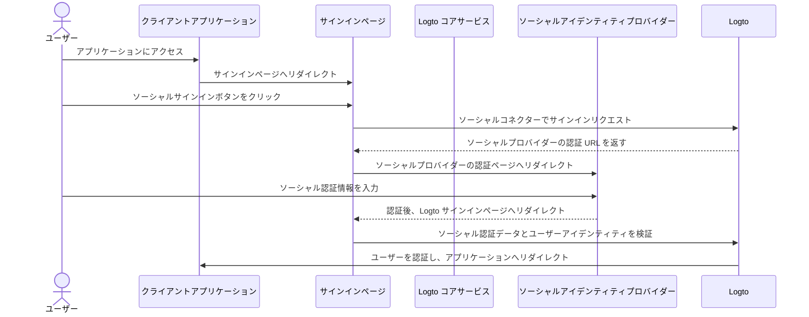
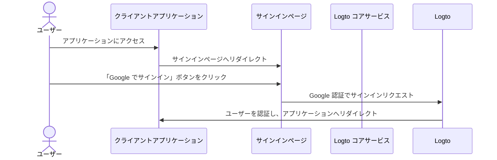

# ソーシャルサインイン

ソーシャルサインインは、Google、Facebook、Twitter、LinkedIn などの既存のソーシャルメディアアカウントを利用してサインインやサインアップができる、広く利用されている認証 (Authentication) 方法です。

ソーシャルサインインのメリット：

- **オンボーディングプロセスの簡素化**：ソーシャルサインインにより、ユーザーは新しいアカウントを作成したり、別のパスワードを覚えたりすることなく、ワンクリックでサインアップやサインインが可能です。これにより摩擦が減り、ユーザーエンゲージメントが向上します。
- **信頼性とセキュリティの向上**：Google や Facebook などの信頼されたプラットフォームを活用することで、ユーザーはアプリケーションに対してより安心感を持てます。
- **ユーザーデータの充実**：ソーシャルサインインを利用することで、名前、メールアドレス、プロフィール画像など、ソーシャルプラットフォームから追加のプロフィール情報を取得できます。

## ソーシャルサインインの実装 \{#implement-social-sign-in}

1. **ソーシャルコネクターの設定**：<br/>
   <CloudLink to="/connectors/social">コンソール > コネクター > ソーシャルコネクター</CloudLink> に移動します。「ソーシャルコネクターを追加」ボタンをクリックし、追加したいソーシャルコネクター（例：Google
   や Github）を選択します。詳細な手順は [ソーシャルコネクター](/connectors/social-connectors/)
   を参照してください。
2. **ソーシャルログインボタンの追加**：<br/>
   デフォルトでは、新しく追加したソーシャルコネクターはエンドユーザーのサインインページに表示されません。サインインページにソーシャルサインインボタンを追加するには、サインイン体験設定でソーシャルコネクターを有効にする必要があります。

   <CloudLink to="/sign-in-experience/sign-up-and-sign-in">
     コンソール > サインイン体験 > サインアップとサインイン
   </CloudLink>
   に移動します。「ソーシャルコネクターを追加」ボタンをクリックして、サインアップおよびログインページにソーシャルログインボタンを統合します。ドラッグ＆ドロップで
   UI 上の順序を調整できます。

3. **アカウント連携オプションの設定**：<br/>
   [ソーシャルアイデンティティ](/user-management/user-data#social-identities) でサインアップする新規ユーザー向けに、Logto ではソーシャルアカウントを Logto システム内の既存のメールまたは電話番号アカウントに連携できます。デフォルトでは、関連する [アカウント連携](#account-linking) ページがソーシャルサインアップ時に表示され、既存アカウントへの連携または新規作成が可能です。

   このプロセスを簡略化するには、サインイン体験設定で **自動アカウント連携** オプションを有効にできます。これにより、メールまたは電話番号が一致する場合、自動的にソーシャルアカウントが既存アカウントに連携されます。

4. **変更内容の保存**：<br/>
   変更内容を慎重に確認し、保存して設定を適用してください。

## ソーシャルサインインのユーザー体験 \{#user-experience-of-social-sign-in}

ソーシャルサインインにより、Logto でのサインアップおよびサインインプロセスがユーザーにとってスムーズになります。



1. **ソーシャルでサインイン**：サインインページに表示されたソーシャルサインインボタンをユーザーがクリックします。
2. **リダイレクト**：ユーザーはソーシャルアイデンティティプロバイダーの認証ページにリダイレクトされます。
3. **ソーシャル認証**：ユーザーはソーシャル認証情報を入力し、ソーシャルプロバイダーで認証します。すでにソーシャルプロバイダーにログインしている場合は自動的に認証されることもあります。複数のサインインセッションが検出された場合、ユーザーは正しいアカウント（例：複数の Google アカウント）を選択するよう促される場合があります。
   :::note
   Google の「prompt」パラメーターは Google コネクターで設定でき、Google ログイン時のアカウント選択や同意画面のユーザー体験をカスタマイズできます。
   :::
4. **Logto への戻り**：認証が成功すると、ソーシャルプロバイダーは認証データとともにユーザーを Logto サインインページにリダイレクトします。
5. **ソーシャルアイデンティティの検証**：Logto はソーシャル認証データとユーザーアイデンティティを検証します。ソーシャルアイデンティティに紐づくユーザーアカウントが存在しない場合は、新しいアカウントが作成されます。
6. **ユーザー認証**：Logto はユーザーを認証し、クライアントアプリケーションへリダイレクトして認証プロセスを完了します。

## アカウント連携 \{#account-linking}

前述の通り、Logto ではユーザーがソーシャルアカウントを Logto システム内の既存のメールまたは電話番号アカウントに連携できます。このプロセスは、異なる認証 (Authentication) 方法やアイデンティティプロバイダー間で統一されたユーザーアカウントを維持するために重要です。

- **新規アカウント作成**：
  [ソーシャルアイデンティティ](/user-management/user-data#social-identities) でサインインし、そのメールまたは電話番号が Logto システム内に存在しない場合は、新しいアカウントが直接作成されます。
- **既存アカウントへの連携**：
  ソーシャルアイデンティティが提供するメールまたは電話番号がすでに Logto の既存アカウントに紐づいている場合、柔軟なアカウント連携プロセスを提供します。

  - **自動アカウント連携**：<CloudLink to="/sign-in-experience/sign-up-and-sign-in">サインイン体験</CloudLink> 設定で「自動アカウント連携」オプションが有効な場合、Logto はメールまたは電話番号が一致する既存アカウントに自動的にソーシャルアカウントを連携します。ユーザーは連携を促されず、既存アカウントに即座にサインインできます。ソーシャルアカウントが連携され、今後どちらの方法でもサインイン可能になります。
  - **手動アカウント連携**：「自動アカウント連携」オプションが無効な場合、サインインプロセス中にユーザーはソーシャルアカウントを既存アカウントに連携するか、新規作成するかを選択できます。

    

    ```mermaid
    flowchart TD
    A[ソーシャルアイデンティティで認証] --> B{{ソーシャルアイデンティティは Logto に存在するか？}}
    B -- はい --> C[既存アカウントでサインイン]
    B -- いいえ --> D{{メール／電話が既存アカウントと一致するか？}}
    D -- はい --> E{{自動アカウント連携が有効か？}}
    E -- はい --> G[ソーシャルアイデンティティを既存アカウントに連携]
    G --> C
    D -- いいえ --> H[新規アカウントを作成してサインイン]
    E -- いいえ --> I{{ソーシャルアカウントを連携するか？}}
    I -- はい --> G
    I -- いいえ --> H
    ```

:::note
ソーシャルサインアップ時に、メールまたは電話番号が既存アカウントと一致し、ユーザーがアカウント連携を選択しなかった場合、そのメールまたは電話番号は新しい Logto アカウントには同期されません。これにより、すべてのユーザーアカウントでメールと電話番号の一意性が保たれます。

メールまたは電話番号が必須のサインアップ識別子である場合、サインアッププロセス中に別のメールまたは電話番号の入力を求められます。詳細は [追加ユーザープロフィールの収集](#collect-additional-user-profile-data) を参照してください。
:::

## 追加ユーザープロフィールデータの収集 \{#collect-additional-user-profile-data}

### サインアップ識別子の収集 \{#collect-sign-up-identifiers}

ソーシャルサインアッププロセス中、設定した必須サインアップ識別子（**メールアドレス**、**電話番号**、**ユーザー名**）に応じて、ユーザーはソーシャルプロバイダーで認証後、追加の認証済み情報の入力を求められる場合があります。

例：**メールアドレス** と **ユーザー名** が必須サインアップ識別子に設定されている場合：

1. **認証済みメールアドレスを提供するソーシャルアイデンティティでサインアップ**

   ソーシャルアイデンティティが認証済みメールアドレスを提供する場合、そのメールアドレスはユーザープロフィールに同期され、ユーザーはサインアップ完了のためにユーザー名の入力を求められます。

   ```mermaid
   flowchart TD
      A[ソーシャルアイデンティティで認証] --> B{{認証済みメールアドレスを含むか？}}
      B -- はい --> C[ユーザー名を入力]
      C --> D[サインアップ成功]
   ```

2. **認証済みメールアドレスを提供しないソーシャルアイデンティティでサインアップ**

   ソーシャルアイデンティティが認証済みメールアドレスを提供しない場合、サインアッププロセス中にメールアドレスの入力を求められます。ユーザーは、入力したメールアドレスに送信された認証コードを入力して認証する必要があります。

   ```mermaid
   flowchart TD
      A[ソーシャルアイデンティティで認証] --> B{{認証済みメールアドレスを含むか？}}
      B -- いいえ --> C[メールアドレスを入力]
      C --> D[認証コードを入力]
      D --> E[ユーザー名を入力]
      E --> F[サインアップ成功]
   ```

3. **既に登録済みメールアドレスを提供するソーシャルアイデンティティでサインアップ**

   ソーシャルアイデンティティが Logto システムですでに登録されているメールアドレスを提供する場合、ユーザーはソーシャルアカウントを既存アカウントに連携するか、新規アカウントを作成するかを選択するよう促されます。新規アカウント作成を選択した場合、新しいメールアドレスの入力と認証が求められます。

   ```mermaid
      flowchart TD
       A[ソーシャルアイデンティティで認証] --> B{{メールアドレスが既存アカウントと一致するか？}}
       B -- はい --> C{{ソーシャルアカウントを連携するか？}}
       C -- はい --> D[ソーシャルアイデンティティを既存アカウントに連携]
       D --> E[サインイン成功]
       C -- いいえ --> F[新しいメールアドレスを入力]
       F --> G[認証コードを入力]
       G --> H[ユーザー名を入力]
       H --> I[サインアップ成功]
       B -- いいえ --> H
   ```

### その他のユーザープロフィールの収集 \{#collect-other-user-profile}

必須サインアップ識別子に加えて、ソーシャルサインアッププロセス中に他のプロフィール情報（氏名、生年月日、カスタムフィールドなど）も収集できます。

**オプション 1: ユーザープロフィールの収集**

Logto の組み込み「自己紹介」ステップをサインアップフローに直接追加できます。ユーザーは登録完了前にすべての必須項目を入力する必要があります。この方法はコード不要で簡単に導入できます。

<CloudLink to="/sign-in-experience/collect-user-profile">
  コンソール > サインイン体験 > ユーザープロフィールの収集
</CloudLink>
で、あらかじめ用意された基本データ項目から選択したり、柔軟なバリデーション付きのカスタム項目を作成できます。詳細は
[ユーザープロフィールの収集](/end-user-flows/collect-user-profile) を参照してください。

:::note

ソーシャルサインイン時のサインアップ識別子（メール、電話、ユーザー名）の収集と、その他のユーザープロフィールデータの収集は異なります：

- **サインアップ識別子**：新規・既存ユーザーの両方に必須で、ユーザー識別や通知に不可欠です。
- **その他のプロフィールデータ**（氏名、誕生日など）：新規ユーザー登録時のみ収集され、識別には必須ではなく、後から Account API で取得可能です。

:::

**オプション 2: 独自オンボーディングフロー**

サインアップ完了後、独自のカスタムオンボーディングフローにリダイレクトして、より柔軟で複雑な多段階データ収集を実現できます。

[Account API](/end-user-flows/account-settings/by-account-api) を利用して、ユーザープロフィールデータをプログラムで管理できます。

## Google One-tap \{#google-one-tap}

Logto は [Google One-tap](https://developers.google.com/identity/gsi/web/guides/features) サインイン方式も Google コネクターでサポートしており、ユーザーはワンクリックでサインインできます。この機能により、Google 認証ページへのリダイレクトが不要となり、サインインプロセスがさらに簡素化されます。

Google One-tap サインインを有効にするには、[Google コネクター](/integrations/google) 設定の手順に従ってください。有効化後、サインインページに「Google でサインイン」ポップアップが表示され、クリックすると自動的に Google アカウントで認証され、アプリケーションにリダイレクトされます。




## ソーシャルアカウントの連携・解除 \{#link-or-unlink-social-accounts}

初回ソーシャルサインイン後、ユーザーはアカウント設定から接続済みソーシャルアカウントを管理できます。これにより、既存プロフィールに追加のソーシャルアカウントを連携したり、不要なソーシャル連携を解除したりできます。

セルフサービスのアカウントセンターから以下の操作が可能です：

- **新しいソーシャルアカウントの連携**：追加のソーシャルプロバイダーを同一ユーザープロフィールに接続
- **既存ソーシャルアカウントの解除**：他の方法でのアクセスを維持しつつソーシャル連携を解除
- **接続済みアカウントの表示**：現在連携されているすべてのソーシャルアイデンティティを確認

アカウント管理機能の実装については [アカウント設定](/end-user-flows/account-settings) ドキュメントを参照してください。

## トークンの保存とサードパーティ API の呼び出し \{#store-tokens-and-call-third-party-apis}

サポートされているソーシャルコネクターでサードパーティトークン保存を有効にすると、ユーザーが認証し権限を付与した後、プロバイダー発行のアクセス トークン (アクセス トークン) やリフレッシュ トークン (リフレッシュ トークン) が Logto のシークレットボールトに安全に保存されます。アプリケーションは（Account API 経由で）これらを取得し、ユーザーに再認証を求めることなくプロバイダー API（例：Google カレンダーへのイベント追加など）を呼び出せます。設定方法は [サードパーティトークン保存](/secret-vault/federated-token-set) を参照してください。

## よくある質問 \{#faqs}

<details>
  <summary>

### サイトにソーシャルログインボタンを追加し、直接ソーシャルでサインインするには？ \{#how-to-add-social-login-buttons-and-directly-sign-in-with-social-on-my-website}

</summary>

Logto では、サイトにソーシャルログインボタンを追加し、デフォルトのサインインフォームを表示せずに直接ソーシャルサインインプロセスを開始できます。詳細な手順は [ダイレクトサインイン](/end-user-flows/authentication-parameters/direct-sign-in/) ガイドを参照してください。

</details>

<details>
  <summary>

### ソーシャルでサインアップしたのにメールや電話番号が反映されないのはなぜ？ \{#why-my-emails-or-phone-numbers-are-not-populated-after-signing-up-with-social}

</summary>

Logto では、メールアドレスや電話番号はユーザーを一意に識別するサインイン識別子として利用できます。識別子として認められるのは認証済みのメールアドレスや電話番号のみです。ソーシャルアイデンティティが `email_verified` または `phone_number_verified` クレームを提供しない場合、メールアドレスや電話番号はユーザープロフィールに同期されません。ただし、ユーザープロフィール内のソーシャルアイデンティティデータとしては確認できます。

未認証のメールや電話番号をユーザープロフィールとしてサポートする機能は近日中に提供予定です。

</details>

## 関連リソース \{#related-resources}

<Url href="https://www.youtube.com/watch?v=sv60N9eW8Ew">ソーシャルサインイン体験</Url>

<Url href="https://blog.logto.io/maximize-google-sign-in-conversions">
  6 つの設定で Google ログインコンバージョンを最大化
</Url>
