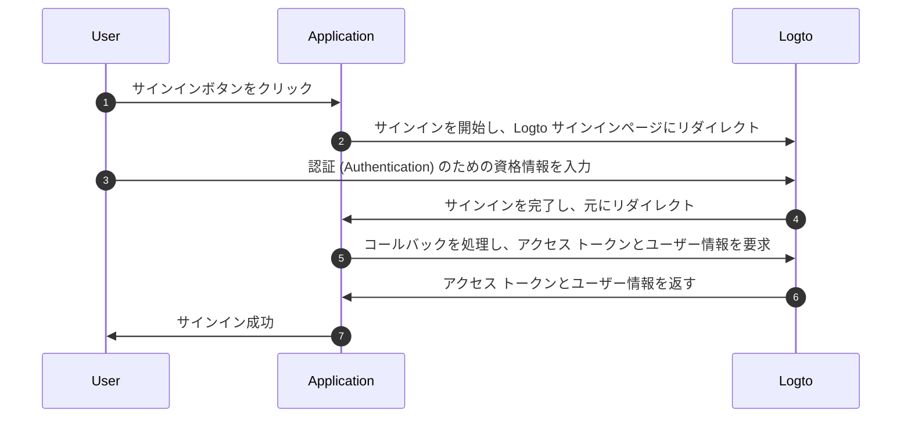
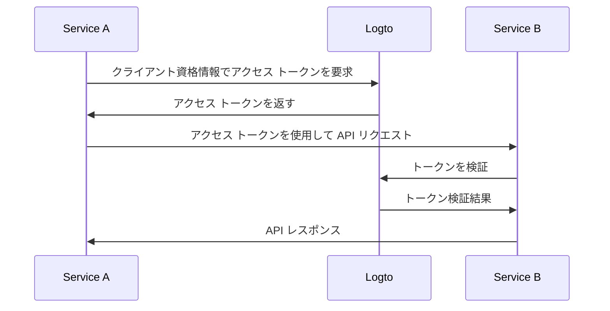

# 認証 (Authentication) フローを理解する

Logto は [OAuth 2.0](https://auth.wiki/oauth-2.0) と [OpenID Connect (OIDC)](https://auth.wiki/openid-connect) 標準に基づいて構築されています。これらの認証 (Authentication) 標準を理解することで、統合プロセスがよりスムーズで簡単になります。

### ユーザー認証 (Authentication) フロー

ユーザーが Logto でサインインする際に何が起こるかを示します：

このフローでは、統合プロセスにおいていくつかの重要な概念があります：

- `Application`: これは Logto 内のあなたのアプリを表します。実際のアプリケーションと Logto サービス間の接続を確立するために、Logto コンソールでアプリケーション設定を作成します。詳細は [Application](/integrate-logto/application-data-structure/#introduction) を参照してください。
- `Redirect URI`: ユーザーが Logto サインインページで認証 (Authentication) を完了した後、Logto はこの URI を介してユーザーをアプリケーションにリダイレクトします。アプリケーション設定で Redirect URI を設定する必要があります。詳細は [Redirect URIs](/integrate-logto/application-data-structure/#redirect-uris) を参照してください。
- `Handle sign-in callback`: Logto がユーザーをアプリケーションにリダイレクトしたとき、アプリは認証 (Authentication) データを処理し、アクセス トークンとユーザー情報を要求する必要があります。心配しないでください - Logto SDK がこれを自動的に処理します。

この概要は、迅速な統合のための基本をカバーしています。より深く理解するためには、[サインイン体験の説明](/concepts/sign-in-experience/) ガイドをチェックしてください。

### マシン間通信 (M2M) 認証 (Authentication) フロー

Logto は、サービス間の直接認証 (Authentication) を可能にする [マシン間通信 (M2M) アプリケーション](/quick-starts/m2m) タイプを提供しています。これは [OAuth 2.0 クライアント資格情報フロー](https://auth.wiki/client-credentials-flow) に基づいています：

このマシン間通信 (M2M) 認証 (Authentication) フローは、ユーザーの操作なしでリソースと直接通信する必要があるアプリケーション（したがって UI なし）を対象としています。例えば、Logto でユーザーデータを更新する API サービスや、日次注文を取得する統計サービスなどです。

このフローでは、サービスはクライアント資格情報を使用して認証 (Authentication) します。これは、サービスを一意に識別し認証 (Authentication) する [Application ID](/integrate-logto/application-data-structure/#application-id) と [Application Secret](/integrate-logto/application-data-structure/#application-secret) の組み合わせです。これらの資格情報は、Logto から [アクセス トークン](https://auth.wiki/access-token) を要求する際のサービスのアイデンティティとして機能します。

## 関連リソース

<Url href="https://blog.logto.io/secure-cloud-apps-with-oauth-and-openid-connect">
  ブログ: OAuth 2.0 と OpenID Connect でクラウドベースのアプリケーションを保護する
</Url>

<Url href="https://blog.logto.io/sso-is-better">
  なぜ複数のアプリケーションにシングルサインオン (SSO) が良いのか
</Url>

<Url href="https://blog.logto.io/centralized-identity-system">
  なぜマルチアプリビジネスに中央集権的なアイデンティティシステムが必要なのか
</Url>
