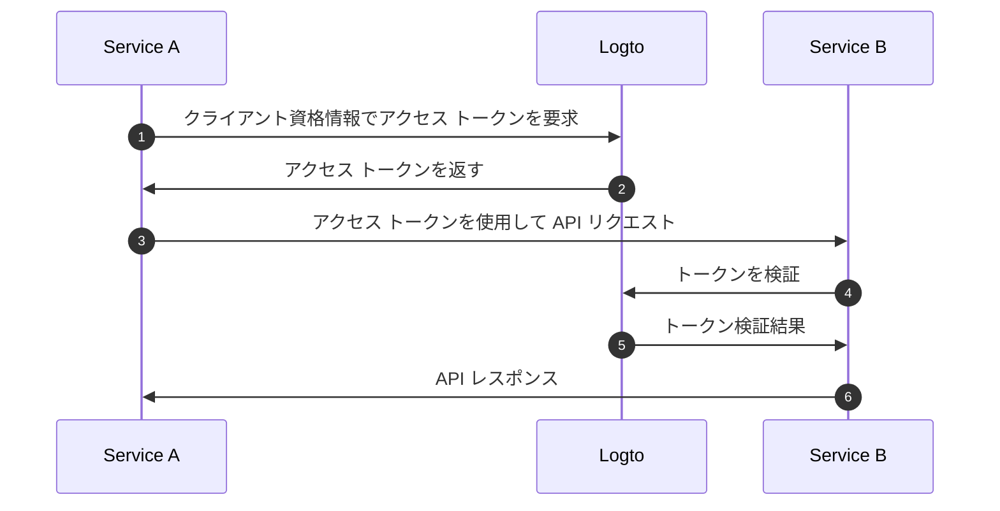
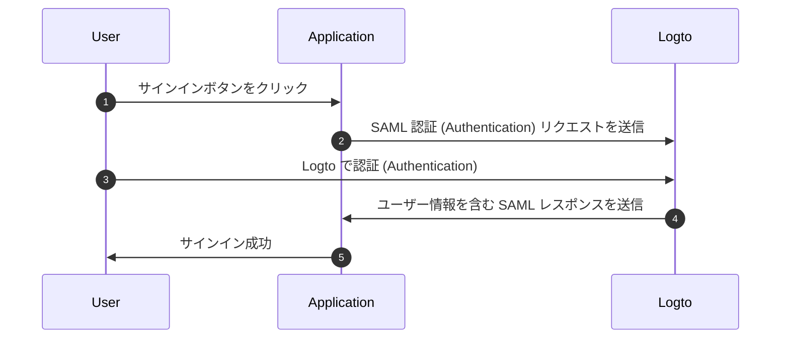

# OIDC 認証 (Authentication) フローを理解する

Logto は [OAuth 2.0](https://auth.wiki/oauth-2.0) と [OpenID Connect (OIDC)](https://auth.wiki/openid-connect) 標準に基づいて構築されています。これらの認証 (Authentication) 標準を理解することで、統合プロセスがよりスムーズで簡単になります。

### ユーザー認証 (Authentication) フロー \{#user-authentication-flow}

ユーザーが Logto でサインインする際に起こることは次のとおりです：

このフローでは、統合プロセスにおいていくつかの重要な概念があります：

- `Application`: これは Logto 内のあなたのアプリを表します。実際のアプリケーションと Logto サービス間の接続を確立するために、Logto コンソールでアプリケーション設定を作成します。詳細は [Application](/integrate-logto/application-data-structure/#introduction) を参照してください。
- `Redirect URI`: ユーザーが Logto サインインページで認証 (Authentication) を完了した後、Logto はこの URI を通じてアプリケーションにリダイレクトします。アプリケーション設定で Redirect URI を設定する必要があります。詳細は [Redirect URIs](/integrate-logto/application-data-structure/#redirect-uris) を参照してください。
- `Handle sign-in callback`: Logto がユーザーをアプリケーションにリダイレクトしたとき、アプリは認証 (Authentication) データを処理し、アクセス トークンとユーザー情報を要求する必要があります。心配しないでください - Logto SDK がこれを自動的に処理します。

この概要は迅速な統合のための基本をカバーしています。より深く理解するためには、[サインイン体験の説明](/concepts/sign-in-experience/) ガイドをチェックしてください。

### マシン間通信 (M2M) 認証 (Authentication) フロー \{#machine-to-machine-authentication-flow}

Logto は、サービス間の直接認証 (Authentication) を可能にする [マシン間通信 (M2M) アプリケーション](/quick-starts/m2m) タイプを提供しており、[OAuth 2.0 クライアント資格情報フロー](https://auth.wiki/client-credentials-flow) に基づいています：

このマシン間通信 (M2M) 認証 (Authentication) フローは、ユーザーの操作なしでリソースと直接通信する必要があるアプリケーション（したがって UI がない）向けに設計されています。例えば、Logto でユーザーデータを更新する API サービスや、日次注文を取得する統計サービスなどです。

このフローでは、サービスはクライアント資格情報を使用して認証 (Authentication) します。これは、サービスを一意に識別し認証 (Authentication) する [Application ID](/integrate-logto/application-data-structure/#application-id) と [Application Secret](/integrate-logto/application-data-structure/#application-secret) の組み合わせです。これらの資格情報は、Logto から [アクセス トークン](https://auth.wiki/access-token) を要求する際のサービスのアイデンティティとして機能します。

### SAML 認証 (Authentication) フロー \{#saml-authentication-flow}

OAuth 2.0 と OIDC に加えて、Logto は SAML (Security Assertion Markup Language) 認証 (Authentication) もサポートしており、エンタープライズアプリケーションとの統合を可能にするアイデンティティプロバイダー (IdP) として機能します。現在、Logto は SP-initiated 認証 (Authentication) フローをサポートしています：

#### SP-initiated フロー \{#saml-authentication-flow-sp-init}

SP-initiated フローでは、認証 (Authentication) プロセスはサービスプロバイダー（あなたのアプリケーション）から始まります：

このフローでは：

- ユーザーはあなたのアプリケーション（サービスプロバイダー）から認証 (Authentication) プロセスを開始します
- あなたのアプリケーションは SAML リクエストを生成し、ユーザーを Logto（アイデンティティプロバイダー）にリダイレクトします
- Logto での認証 (Authentication) が成功すると、SAML レスポンスがあなたのアプリケーションに返されます
- あなたのアプリケーションは SAML レスポンスを処理し、認証 (Authentication) を完了します

#### IdP-initiated フロー \{#saml-authentication-flow-idp-init}

Logto は将来のリリースで IdP-initiated フローをサポートし、ユーザーが Logto のポータルから直接認証 (Authentication) プロセスを開始できるようにします。この機能の更新情報をお待ちください。

この SAML 統合により、エンタープライズアプリケーションは Logto をアイデンティティプロバイダーとして活用し、モダンおよびレガシーの SAML ベースのサービスプロバイダーの両方をサポートします。

## 関連リソース \{#related-resources}

<Url href="https://blog.logto.io/secure-cloud-apps-with-oauth-and-openid-connect">
  ブログ: OAuth 2.0 と OpenID Connect でクラウドベースのアプリケーションを保護する
</Url>

<Url href="https://blog.logto.io/sso-is-better">
  複数のアプリケーションに対するシングルサインオン (SSO) が優れている理由
</Url>

<Url href="https://blog.logto.io/centralized-identity-system">
  マルチアプリビジネスに中央集権的なアイデンティティシステムが必要な理由
</Url>
