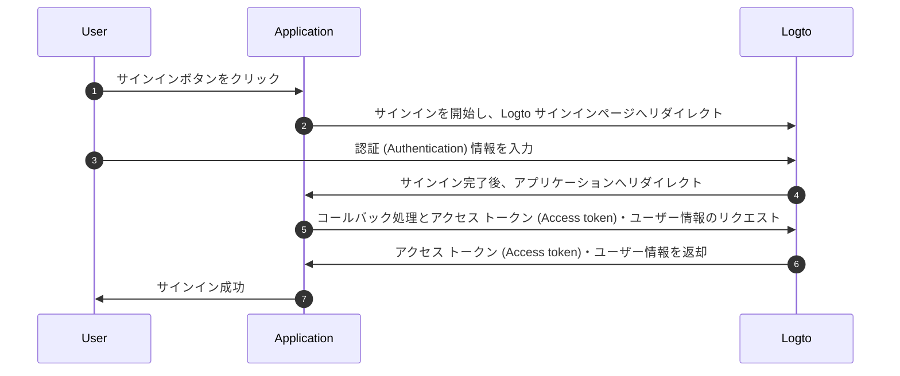
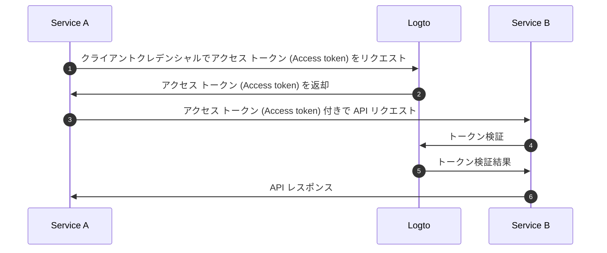
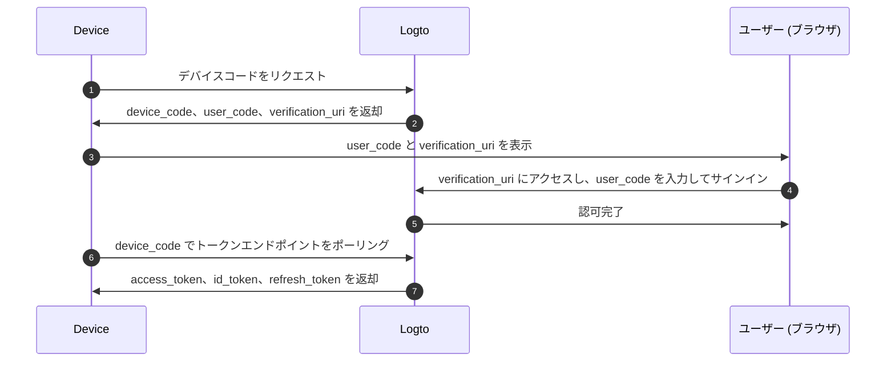
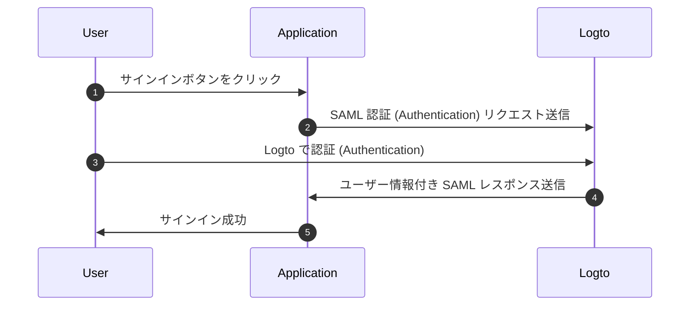

# OIDC 認証 (Authentication) フローを理解する

Logto は [OAuth 2.0](https://auth.wiki/oauth-2-0) および [OpenID Connect (OIDC)](https://auth.wiki/openid-connect) 標準に基づいて構築されています。これらの認証 (Authentication) 標準を理解することで、統合プロセスがよりスムーズかつ簡単になります。

### ユーザー認証 (Authentication) フロー \{#user-authentication-flow}

ユーザーが Logto でサインインする際の流れは次の通りです：

```mermaid
sequenceDiagram
    autonumber
    participant User
    participant Application
    participant Logto

    User->>Application: サインインボタンをクリック
    Application->>Logto: サインインを開始し、Logto サインインページへリダイレクト
    User->>Logto: 認証 (Authentication) 情報を入力
    Logto->>Application: サインイン完了後、アプリケーションへリダイレクト
    Application->>Logto: コールバック処理とアクセス トークン (Access token)・ユーザー情報のリクエスト
    Logto->>Application: アクセス トークン (Access token)・ユーザー情報を返却
    Application->>User: サインイン成功
```

このフローでは、統合プロセスにおいていくつかの重要な概念があります：

- `Application`：これは Logto 上でのアプリケーションを指します。Logto コンソールでアプリケーション設定を作成し、実際のアプリケーションと Logto サービス間の接続を確立します。詳細は [Application](/integrate-logto/application-data-structure/#introduction) を参照してください。
- `Redirect URI`：ユーザーが Logto サインインページで認証 (Authentication) を完了した後、この URI を通じて Logto からアプリケーションへリダイレクトされます。アプリケーション設定で Redirect URI を設定する必要があります。詳細は [Redirect URIs](/integrate-logto/application-data-structure/#redirect-uris) を参照してください。
- `サインインコールバックの処理`：Logto からユーザーがアプリケーションへリダイレクトされた際、アプリケーションは認証 (Authentication) データを処理し、アクセス トークン (Access token) とユーザー情報をリクエストする必要があります。ご安心ください ― Logto SDK が自動的に処理します。

この概要で素早く統合するための要点をカバーしています。さらに詳しく知りたい場合は、[サインイン体験の解説](/concepts/sign-in-experience/) ガイドをご覧ください。

### マシン間通信 (M2M) 認証 (Authentication) フロー \{#machine-to-machine-authentication-flow}

Logto は [マシン間通信 (M2M) アプリケーション](/quick-starts/m2m) タイプを提供し、[OAuth 2.0 クライアントクレデンシャルフロー](https://auth.wiki/client-credentials-flow) に基づいてサービス間の直接認証 (Authentication) を可能にします：

```mermaid
sequenceDiagram
    autonumber
    participant Service A
    participant Logto
    participant Service B

    Service A->>Logto: クライアントクレデンシャルでアクセス トークン (Access token) をリクエスト
    Logto->>Service A: アクセス トークン (Access token) を返却
    Service A->>Service B: アクセス トークン (Access token) 付きで API リクエスト
    Service B->>Logto: トークン検証
    Logto->>Service B: トークン検証結果
    Service B->>Service A: API レスポンス
```

このマシン間通信 (M2M) 認証 (Authentication) フローは、ユーザー操作なし（UI なし）でリソースと直接通信する必要があるアプリケーション向けに設計されています。例えば、Logto 上のユーザーデータを更新する API サービスや、日次注文データを取得する統計サービスなどです。

このフローでは、サービスはクライアントクレデンシャル（[Application ID](/integrate-logto/application-data-structure/#application-id) と [Application Secret](/integrate-logto/application-data-structure/#application-secret) の組み合わせ）を使って認証 (Authentication) します。これらのクレデンシャルは、Logto から [アクセス トークン (Access token)](https://auth.wiki/access-token) をリクエストする際のサービスのアイデンティティとなります。

### デバイスフロー（入力制限デバイス向け） \{#device-flow}

入力機能が制限されたデバイス（例：スマート TV、ゲーム機、CLI ツール、IoT デバイス）向けに、Logto は [OAuth 2.0 デバイス認可グラント](https://auth.wiki/device-flow) をサポートしています。デバイスはコードと URL を表示し、ユーザーは別のデバイス（ブラウザ）で認証 (Authentication) を完了します：

```mermaid
sequenceDiagram
    autonumber
    participant Device
    participant Logto
    participant User as ユーザー (ブラウザ)

    Device->>Logto: デバイスコードをリクエスト
    Logto->>Device: device_code、user_code、verification_uri を返却
    Device->>User: user_code と verification_uri を表示
    User->>Logto: verification_uri にアクセスし、user_code を入力してサインイン
    Logto->>User: 認可完了
    Device->>Logto: device_code でトークンエンドポイントをポーリング
    Logto->>Device: access_token、id_token、refresh_token を返却
```

このフローでは：

- デバイスが Logto からデバイスコードをリクエストし、短い `user_code` と `verification_uri` を受け取ります。
- ユーザーは別のデバイス（スマートフォンやノート PC など）で認証用 URL にアクセスし、コードを入力してサインインします。
- デバイスはユーザーが認可を完了するまでトークンエンドポイントをポーリングし、完了後にトークンを受け取ります。

標準のユーザーフローと異なり、デバイスフローではデバイス自体にリダイレクト URI やブラウザ機能は不要です。詳細は [デバイスフロー クイックスタート](/quick-starts/device-flow) をご覧ください。

### SAML 認証 (Authentication) フロー \{#saml-authentication-flow}

OAuth 2.0 や OIDC に加え、Logto は SAML（Security Assertion Markup Language）認証 (Authentication) もサポートしており、アイデンティティプロバイダー (IdP) としてエンタープライズアプリケーションとの統合を可能にします。現在、Logto は SP-initiated 認証 (Authentication) フローをサポートしています：

#### SP-initiated フロー \{#saml-authentication-flow-sp-init}

SP-initiated フローでは、認証 (Authentication) プロセスはサービスプロバイダー（アプリケーション）から開始されます：

```mermaid
sequenceDiagram
    autonumber
    participant User
    participant Application
    participant Logto

    User->>Application: サインインボタンをクリック
    Application->>Logto: SAML 認証 (Authentication) リクエスト送信
    User->>Logto: Logto で認証 (Authentication)
    Logto->>Application: ユーザー情報付き SAML レスポンス送信
    Application->>User: サインイン成功
```

このフローでは：

- ユーザーがアプリケーション（サービスプロバイダー）から認証 (Authentication) を開始します
- アプリケーションが SAML リクエストを生成し、ユーザーを Logto（アイデンティティプロバイダー）へリダイレクトします
- Logto で認証 (Authentication) が成功すると、SAML レスポンスがアプリケーションへ返されます
- アプリケーションが SAML レスポンスを処理し、認証 (Authentication) を完了します

#### IdP-initiated フロー \{#saml-authentication-flow-idp-init}

Logto は今後のリリースで IdP-initiated フローもサポート予定です。これにより、ユーザーは Logto のポータルから直接認証 (Authentication) プロセスを開始できるようになります。今後のアップデートにご期待ください。

この SAML 統合により、エンタープライズアプリケーションは Logto をアイデンティティプロバイダーとして活用でき、最新およびレガシーな SAML ベースのサービスプロバイダーの両方をサポートします。

## 関連リソース \{#related-resources}

<Url href="https://blog.logto.io/secure-cloud-apps-with-oauth-and-openid-connect">
  ブログ：OAuth 2.0 と OpenID Connect でクラウドアプリケーションを安全に
</Url>

<Url href="https://blog.logto.io/sso-is-better">
  複数アプリケーション向けシングルサインオン (SSO) の利点
</Url>

<Url href="https://blog.logto.io/centralized-identity-system">
  複数アプリビジネスにおける中央集権型アイデンティティシステムの必要性
</Url>
