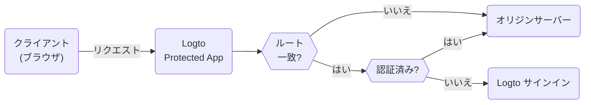

# Protected App

Protected App は、[SDK 統合](/quick-starts) の複雑さを排除するために設計されており、アプリケーションから [認証 (Authentication)](https://auth.wiki/authentication) レイヤーを分離します。私たちは認証 (Authentication) を処理し、あなたはコア機能に集中できます。ユーザーが認証 (Authentication) されると、Protected App はサーバーからコンテンツを提供します。

## Protected App の仕組み \{#how-protected-app-works}

Protected App は Cloudflare によって強化され、エッジネットワーク上でグローバルに動作し、アプリケーションに低遅延と高可用性を保証します。

Protected App はセッション状態とユーザー情報を維持します。ユーザーが認証 (Authentication) されていない場合、Protected App はサインインページにリダイレクトします。認証 (Authentication) されると、Protected App はユーザーのリクエストを認証 (Authentication) とユーザー情報でラップし、それをオリジンサーバーに転送します。

このプロセスは次のフローチャートで視覚化されています：



## オリジンサーバーを保護する \{#protect-your-origin-server}

オリジンサーバーは、Logto の Protected App が所有していない物理または仮想デバイスであり、アプリケーションコンテンツが存在します。コンテンツデリバリーネットワーク (CDN) サーバーと同様に、Protected App は認証 (Authentication) プロセスを管理し、オリジンサーバーからコンテンツを取得します。したがって、ユーザーがオリジンサーバーに直接アクセスできる場合、認証 (Authentication) をバイパスでき、アプリケーションはもはや保護されません。

したがって、オリジン接続を保護することが重要です。これにより、攻撃者が認証 (Authentication) なしでオリジンサーバーを発見しアクセスするのを防ぎます。これを行う方法はいくつかあります：

1. HTTP ヘッダー検証
2. JSON Web Tokens (JWT) 検証

### HTTP ヘッダー検証 \{#http-header-validation}

オリジンサーバーを保護するには、[HTTP Basic Authentication](https://developer.mozilla.org/en-US/docs/Web/HTTP/Authentication#basic_authentication_scheme) を使用してオリジンサーバーを保護できます。

Protected App からの各リクエストには次のヘッダーが含まれます：

```
Authorization: Basic base64(appId:appSecret)
```

このヘッダーを検証することで、リクエストが Protected App からのものであることを確認し、このヘッダーを含まないリクエストを拒否できます。

Nginx または Apache を使用している場合、オリジンサーバーで HTTP Basic Authentication を実装するための次のガイドを参照できます：

1. Nginx: [HTTP Basic Authentication の設定](https://docs.nginx.com/nginx/admin-guide/security-controls/configuring-http-basic-authentication/)
2. Apache: [認証 (Authentication) と認可 (Authorization)](https://httpd.apache.org/docs/2.4/howto/auth.html)

アプリケーション内でヘッダーを確認するには、Cloudflare が提供する [HTTP Basic Authentication の例](https://developers.cloudflare.com/workers/examples/basic-auth/) を参照して、HTTP Basic スキーマを使用してアクセスを制限する方法を学んでください。

### JSON Web Tokens (JWT) 検証 \{#json-web-tokens-jwt-validation}

オリジンサーバーを保護するもう一つの方法は、JSON Web Tokens (JWT) を使用することです。

Protected App からの各認証済みリクエストには次のヘッダーが含まれます：

```
Logto-ID-Token: <JWT>
```

JWT は [ID トークン](https://auth.wiki/id-token) と呼ばれ、Logto によって署名され、ユーザー情報を含んでいます。この JWT を検証することで、リクエストが Protected App からのものであることを確認し、このヘッダーを含まないリクエストを拒否できます。

トークンは [JWS](https://auth.wiki/jws) トークンとして暗号化および署名されています。

検証手順：

1. [JWT の検証](https://datatracker.ietf.org/doc/html/rfc7519#section-7.2)
2. [JWS 署名の検証](https://datatracker.ietf.org/doc/html/rfc7515#section-5.2)
3. トークンの発行者は `https://<your-logto-domain>/oidc`（あなたの Logto 認証サーバーによって発行）

```js
const express = require('express');
const jwksClient = require('jwks-rsa');
const jwt = require('jsonwebtoken');

const ISSUER = 'https://<your-logto-domain>/oidc';
const CERTS_URL = 'https://<your-logto-domain>/oidc/jwks';

const client = jwksClient({
  jwksUri: CERTS_URL,
});

const getKey = (header, callback) => {
  client.getSigningKey(header.kid, function (err, key) {
    callback(err, key?.getPublicKey());
  });
};

const verifyToken = (req, res, next) => {
  const token = req.headers['Logto-ID-Token'];

  // リクエストにトークンヘッダーが含まれていることを確認
  if (!token) {
    return res
      .status(403)
      .send({ status: false, message: '必要な Logto-ID-Token ヘッダーがありません' });
  }

  jwt.verify(token, getKey, { issuer: ISSUER }, (err, decoded) => {
    if (err) {
      return res.status(403).send({ status: false, message: '無効な ID トークン' });
    }

    req.user = decoded;
    next();
  });
};

const app = express();

app.use(verifyToken);

app.get('/', (req, res) => {
  res.send('Hello World!');
});

app.listen(3000);
```

## 認証 (Authentication) 状態とユーザー情報を取得する \{#get-authentication-state-and-user-information}

アプリケーションの認証 (Authentication) とユーザー情報を取得する必要がある場合は、`Logto-ID-Token` ヘッダーを使用できます。

トークンをデコードするだけの場合は、次のコードを使用できます：

```js
const express = require('express');

const decodeIdToken = (req, res, next) => {
  const token = req.headers['Logto-ID-Token'];

  if (!token) {
    return res.status(403).send({
      status: false,
      message: '必要な Logto-ID-Token ヘッダーがありません',
    });
  }

  const parts = token.split('.');
  if (parts.length !== 3) {
    throw new Error('無効な ID トークン');
  }

  const payload = parts[1];
  const decodedPayload = atob(payload.replace(/-/g, '+').replace(/_/g, '/'));
  const claims = JSON.parse(decodedPayload);

  req.user = claims;
  next();
};

const app = express();

app.use(decodeIdToken);

app.get('/', (req, res) => {
  res.json(req.user);
});

app.listen(3000);
```

## 元のホストを取得する \{#get-the-original-host}

クライアントによって要求された元のホストを取得する必要がある場合は、`Logto-Host` または `x-forwarded-host` ヘッダーを使用できます。

## 認証 (Authentication) ルールをカスタマイズする \{#customize-authentication-rules}

デフォルトでは、Protected App はすべてのルートを保護します。認証 (Authentication) ルールをカスタマイズする必要がある場合は、コンソールで「カスタム認証 (Authentication) ルール」フィールドを設定できます。

正規表現をサポートしており、次の 2 つのケースシナリオがあります：

1. `/admin` と `/privacy` のルートのみを認証 (Authentication) で保護する：`^/(admin|privacy)/.*`
2. JPG 画像を認証 (Authentication) から除外する：`^(?!.*\.jpg$).*$`

## ローカル開発 \{#local-development}

Protected App はオリジンサーバーと連携するように設計されています。ただし、オリジンサーバーが公開アクセスできない場合は、[ngrok](https://ngrok.com/) や [Cloudflare Tunnels](https://developers.cloudflare.com/pages/how-to/preview-with-cloudflare-tunnel/) などのツールを使用してローカルサーバーをインターネットに公開できます。

## SDK 統合への移行 \{#transition-to-sdk-integration}

Protected App は認証 (Authentication) プロセスを簡素化するように設計されています。ただし、より良いコントロールとカスタマイズのために SDK 統合に移行することを決定した場合は、Logto で [新しいアプリケーションを作成](/integrate-logto/integrate-logto-into-your-application) し、[SDK 統合](/quick-starts) を設定できます。スムーズな移行のために、Protected App からアプリケーション設定を再利用できます。Protected App は実際には Logto の「従来の Web アプリ」であり、アプリケーション設定で「[AppId](/integrate-logto/application-data-structure#application-id)」と「[AppSecret](/integrate-logto/application-data-structure#application-secret)」を見つけることができます。移行が完了したら、アプリケーションから Protected App を削除できます。

## 関連リソース \{#related-resources}

<Url href="https://www.youtube.com/watch?v=ZBrXW3iZyKY">
  Protected App: クリックでアプリの認証 (Authentication) を構築。コード不要。
</Url>

<Url href="https://blog.logto.io/protected-app">Protected App の背後にある動機</Url>

<Url href="https://blog.logto.io/fastest-way-to-build-auth-system">
  認証 (Authentication) システムを構築する最速の方法
</Url>
