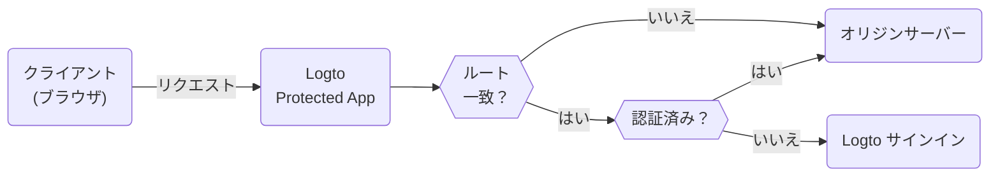

# Protected App — SDK を使わない認証 (Authentication) 統合

Protected App は、[SDK 統合](/quick-starts) の複雑さを排除し、[認証 (Authentication)](https://auth.wiki/authentication) レイヤーをアプリケーションから分離するために設計されています。認証 (Authentication) は当社が処理するため、コア機能に集中できます。ユーザーが認証 (Authentication) されると、Protected App がサーバーからコンテンツを配信します。

## Protected App の仕組み \{#how-protected-app-works}

Cloudflare により提供される Protected App は、グローバルなエッジネットワーク上で動作し、アプリケーションに低遅延かつ高可用性を実現します。

Protected App はセッション状態とユーザー情報を管理します。ユーザーが認証 (Authentication) されていない場合、Protected App はサインインページへリダイレクトします。認証 (Authentication) 後、Protected App はユーザーのリクエストに認証 (Authentication) とユーザー情報を付与し、オリジンサーバーへ転送します。

Protected App へアクセスできる認証 (Authentication) 済みユーザーを制限したい場合は、アプリケーションの **Rules** タブで [アプリレベルのアクセス制御](/authorization/app-level-access-control) を設定してください。

このプロセスは以下のフローチャートで視覚化されています：


```mermaid
graph LR
  A("クライアント<br/>(ブラウザ)") -->|リクエスト| B(Logto<br/>Protected App)
  B --> Condition{{ルート<br/>一致？}}
  Condition -->|はい| Matched{{認証済み？}}
  Matched -->|はい| C(オリジンサーバー)
  Matched -->|いいえ| D(Logto サインイン)
  Condition -->|いいえ| C
```

## オリジンサーバーの保護 \{#protect-your-origin-server}

オリジンサーバーは、物理または仮想デバイスであり、Logto の Protected App が所有しない場合もあります。アプリケーションのコンテンツはここに存在します。CDN サーバーと同様に、Protected App は認証 (Authentication) 処理を管理し、オリジンサーバーからコンテンツを取得します。そのため、ユーザーがオリジンサーバーへ直接アクセスできる場合、認証 (Authentication) をバイパスされ、アプリケーションは保護されなくなります。

したがって、オリジン接続のセキュリティを確保することが重要です。これにより、攻撃者が認証 (Authentication) なしでオリジンサーバーを発見・アクセスすることを防げます。主な方法は以下の通りです：

1. HTTP ヘッダー検証
2. JSON Web Token (JWT) 検証

### HTTP ヘッダー検証 \{#http-header-validation}

[HTTP Basic 認証 (Authentication)](https://developer.mozilla.org/en-US/docs/Web/HTTP/Authentication#basic_authentication_scheme) を利用して、オリジンサーバーを保護できます。

Protected App からの各リクエストには、以下のヘッダーが含まれます：

```
Authorization: Basic base64(appId:appSecret)
```

このヘッダーを検証することで、リクエストが Protected App からのものであることを確認し、このヘッダーが含まれないリクエストを拒否できます。

Nginx または Apache を利用している場合、オリジンサーバーで HTTP Basic 認証 (Authentication) を実装するには、以下のガイドを参照してください：

1. Nginx: [HTTP Basic 認証 (Authentication) の設定](https://docs.nginx.com/nginx/admin-guide/security-controls/configuring-http-basic-authentication/)
2. Apache: [認証 (Authentication) と認可 (Authorization)](https://httpd.apache.org/docs/2.4/howto/auth.html)

アプリケーション内でヘッダーを確認するには、Cloudflare が提供する [HTTP Basic 認証 (Authentication) の例](https://developers.cloudflare.com/workers/examples/basic-auth/) を参考に、HTTP Basic スキーマを使ったアクセス制限方法を学べます。

### JSON Web Token (JWT) 検証 \{#json-web-tokens-jwt-validation}

もう一つの方法は、JSON Web Token (JWT) を利用してオリジンサーバーを保護することです。

Protected App からの各認証 (Authentication) 済みリクエストには、以下のヘッダーが含まれます：

```
Logto-ID-Token: <JWT>
```

この JWT は [ID トークン (ID token)](https://auth.wiki/id-token) と呼ばれ、Logto により署名され、ユーザー情報が含まれています。この JWT を検証することで、リクエストが Protected App からのものであることを確認し、このヘッダーが含まれないリクエストを拒否できます。

トークンは [JWS](https://auth.wiki/jws) トークンとして暗号化・署名されています。

検証手順：

1. [JWT の検証](https://datatracker.ietf.org/doc/html/rfc7519#section-7.2)
2. [JWS 署名の検証](https://datatracker.ietf.org/doc/html/rfc7515#section-5.2)
3. トークンの発行者 (Issuer) は `https://<your-logto-domain>/oidc`（Logto 認証 (Authentication) サーバーによる発行）

```js
const express = require('express');
const jwksClient = require('jwks-rsa');
const jwt = require('jsonwebtoken');

const ISSUER = 'https://<your-logto-domain>/oidc';
const CERTS_URL = 'https://<your-logto-domain>/oidc/jwks';

const client = jwksClient({
  jwksUri: CERTS_URL,
});

const getKey = (header, callback) => {
  client.getSigningKey(header.kid, function (err, key) {
    callback(err, key?.getPublicKey());
  });
};

const verifyToken = (req, res, next) => {
  const token = req.headers['Logto-ID-Token'];

  // このリクエストにトークンヘッダーがあることを確認
  if (!token) {
    return res
      .status(403)
      .send({ status: false, message: 'missing required Logto-ID-Token header' });
  }

  jwt.verify(token, getKey, { issuer: ISSUER }, (err, decoded) => {
    if (err) {
      return res.status(403).send({ status: false, message: 'invalid id token' });
    }

    req.user = decoded;
    next();
  });
};

const app = express();

app.use(verifyToken);

app.get('/', (req, res) => {
  res.send('Hello World!');
});

app.listen(3000);
```

## 認証 (Authentication) 状態とユーザー情報の取得 \{#get-authentication-state-and-user-information}

アプリケーションで認証 (Authentication) 状態やユーザー情報を取得したい場合も、`Logto-ID-Token` ヘッダーを利用できます。

トークンをデコードするだけでよい場合、以下のコードを利用できます：

```js
const express = require('express');

const decodeIdToken = (req, res, next) => {
  const token = req.headers['Logto-ID-Token'];

  if (!token) {
    return res.status(403).send({
      status: false,
      message: 'missing required Logto-ID-Token header',
    });
  }

  const parts = token.split('.');
  if (parts.length !== 3) {
    throw new Error('Invalid ID token');
  }

  const payload = parts[1];
  const decodedPayload = atob(payload.replace(/-/g, '+').replace(/_/g, '/'));
  const claims = JSON.parse(decodedPayload);

  req.user = claims;
  next();
};

const app = express();

app.use(decodeIdToken);

app.get('/', (req, res) => {
  res.json(req.user);
});

app.listen(3000);
```

## ID トークン (ID token) のクレーム (Claims) をカスタマイズ \{#customize-id-token-claims}

デフォルトでは、`Logto-ID-Token` ヘッダーには標準 OIDC クレーム (Claims)（例：`sub`、`name`、`email`）が含まれます。[拡張クレーム (Claims)](/developers/custom-id-token#extended-claims)（ロールや組織データなど）を含めるには、以下の両方の設定が必要です：

1. **テナント切り替え**：<CloudLink to="/customize-jwt">Console > Custom JWT > ID token</CloudLink> でクレーム (Claims) を有効化。
2. **Protected App のスコープ**：Protected App の設定で、**ID token claims** > **Additional scopes** から該当スコープを選択。

拡張クレーム (Claims) は、Custom JWT で有効化され、かつ Protected App で該当スコープが選択されている場合のみ、転送される ID トークン (ID token) に含まれます。拡張スコープとクレーム (Claims) の全リストは [Custom ID token](/developers/custom-id-token) を参照してください。

| スコープ                             | クレーム (Claims)                    |
| ------------------------------------ | ------------------------------------ |
| `custom_data`                        | `custom_data`                        |
| `identities`                         | `identities`, `sso_identities`       |
| `roles`                              | `roles`                              |
| `urn:logto:scope:organizations`      | `organizations`, `organization_data` |
| `urn:logto:scope:organization_roles` | `organization_roles`                 |

## オリジナルホストの取得 \{#get-the-original-host}

クライアントがリクエストしたオリジナルホストを取得したい場合は、`Logto-Host` または `x-forwarded-host` ヘッダーを利用できます。

## 認証 (Authentication) ルールのカスタマイズ \{#customize-authentication-rules}

デフォルトでは、Protected App はすべてのルートを保護します。認証 (Authentication) ルールをカスタマイズしたい場合は、Console の「Custom authentication rules」フィールドを設定できます。

正規表現に対応しており、以下のようなケースがあります：

1. `/admin` および `/privacy` のみ認証 (Authentication) で保護したい場合：`^/(admin|privacy)/.*`
2. JPG 画像を認証 (Authentication) から除外したい場合：`^(?!.*\.jpg$).*$`

## ローカル開発 \{#local-development}

Protected App はオリジンサーバーと連携するよう設計されています。ただし、オリジンサーバーが公開されていない場合は、[ngrok](https://ngrok.com/) や [Cloudflare Tunnels](https://developers.cloudflare.com/pages/how-to/preview-with-cloudflare-tunnel/) などのツールを使ってローカルサーバーをインターネットに公開できます。

## SDK 統合への移行 \{#transition-to-sdk-integration}

Protected App は認証 (Authentication) プロセスを簡素化するために設計されていますが、より細かな制御やカスタマイズのために SDK 統合へ移行したい場合は、Logto で [新しいアプリケーションを作成](/integrate-logto/integrate-logto-into-your-application) し、[SDK 統合](/quick-starts) を設定できます。スムーズな移行のため、Protected App のアプリケーション設定を再利用できます。Protected App は実際には Logto の「Traditional Web App」であり、アプリケーション設定で「[AppId](/integrate-logto/application-data-structure#application-id)」や「[AppSecret](/integrate-logto/application-data-structure#application-secret)」を確認できます。移行が完了したら、アプリケーションから Protected App を削除できます。

## 関連リソース \{#related-resources}

<Url href="https://www.youtube.com/watch?v=ZBrXW3iZyKY">
  Protected App: 数クリックでアプリの認証 (Authentication) を構築。コード不要。
</Url>

<Url href="https://blog.logto.io/protected-app">Protected App の背景と動機</Url>

<Url href="https://blog.logto.io/fastest-way-to-build-auth-system">
  最速で認証 (Authentication) システムを構築する方法
</Url>
