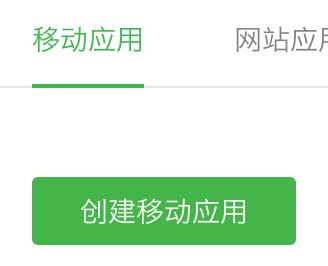

import GuideTip from '../../fragments/_guide-tip.mdx';

# WeChat を使用してソーシャルログインを設定する (ネイティブ)

ネイティブアプリ (iOS および Android) での WeChat ソーシャルサインイン用の公式 Logto コネクターです。

<GuideTip />

## はじめに

コネクターの概念がわからない場合や、このコネクターをサインイン体験に追加する方法がわからない場合は、[Logto チュートリアル](/connectors/social-connectors)を参照してください。

ネイティブアプリでは、WeChat のサインイン方法としてウェブを使用することはできません。WeChat アプリへのナビゲーションが必要であり、またその SDK を使用する必要があります。

怖そうに聞こえるかもしれませんが、心配しないでください。このチュートリアルで簡単に対処できます。

## WeChat オープンプラットフォームでモバイルアプリを作成する

> 💡 **ヒント**
>
> すでに完了している場合は、一部のセクションをスキップできます。

### アカウントを作成する

https://open.weixin.qq.com/ を開き、右上の「サインアップ」ボタンをクリックし、サインアッププロセスを完了します。

### モバイルアプリを作成する

作成したアカウントでサインインします。「モバイルアプリケーション」(移动应用) タブで、大きな緑色のボタン「モバイルアプリを作成」(创建移动应用) をクリックします。



アプリケーションフォームに必要な情報を入力しましょう。


#### 基本情報

ほとんどは非常に簡単で、いくつかのヒントがあります：

- WeChat サインインをテストしたいだけで、アプリが App Store にない場合、「アプリが利用可能」セクションで「いいえ」を選択して「アプリダウンロードリンク」をスキップします。
- 「アプリ操作フローチャート」は難しそうに見えます。私たちの経験から言えば、レビューを通過する可能性を高めるために、簡単なフローチャートといくつかのアプリのスクリーンショットを用意する必要があります。

「次のステップ」をクリックして進みます。

#### プラットフォーム情報

Logto を WeChat ネイティブサインインと統合するために、iOS および Android プラットフォームのいずれかまたは両方を設定できます。

**iOS アプリ**

「iOS アプリ」(iOS 应用) をチェックし、アプリの対象デバイスタイプを適宜チェックします。


App Store の可用性で「いいえ」を選択した場合は、ここで「AppStore ダウンロードアドレス」を入力する必要はありません。

_Bundle ID_、_テストバージョン Bundle ID_、および _ユニバーサルリンク_ を入力します（実際には、1 つのリンクだけが必要です 😂）。

> ℹ️ **注意**
>
> _Bundle ID_ と _テストバージョン Bundle ID_ は同じ値にすることができます。

> 💡 **ヒント**
>
> WeChat はネイティブサインインにユニバーサルリンクを要求します。設定していない場合やわからない場合は、[Apple 公式ドキュメント](https://developer.apple.com/ios/universal-links/)を参照してください。

**Android アプリ**

「Android アプリ」(Android 应用) をチェックします。


_アプリケーション署名_ (应用签名) と _アプリケーションパッケージ名_ (应用包名) を入力します。

> ℹ️ **注意**
>
> 署名を取得するためにアプリに署名する必要があります。詳細については、[アプリの署名](https://developer.android.com/studio/publish/app-signing)を参照してください。

署名が完了したら、`signingReport` タスクを実行して署名を取得できます。

```bash
./gradlew your-android-project:signingReport
```

対応するビルドバリアントのレポートの `MD5` 値が _アプリケーション署名_ (应用签名) になりますが、値からすべてのセミコロンを削除し、小文字にすることを忘れないでください。

例：`1A:2B:3C:4D` -> `1a2b3c4d`。

#### レビュー結果を待つ

プラットフォーム情報を入力した後、「レビューを送信」をクリックして続行します。通常、レビューは迅速に行われ、1〜2 日以内に終了します。

レビュー担当者は各提出時にランダムに割り当てられると推測されます。基準が変動するため、最初は拒否されるかもしれませんが、諦めないでください！現状を説明し、どのように修正するかをレビュー担当者に尋ねてください。

## アプリで WeChat ネイティブサインインを有効にする

### iOS

アプリに [Logto iOS SDK](/quick-starts/swift) を統合していると仮定します。この場合、非常に簡単で、WeChat SDK のドキュメントを読む必要さえありません：

**1. Xcode プロジェクトでユニバーサルリンクと URL スキームを設定する**

Xcode プロジェクト -> Signing & Capabilities タブで、「Associated Domains」機能と以前に設定したユニバーサルリンクを追加します。


次に「Info」タブに移動し、WeChat アプリ ID を使用して[カスタム URL スキーム](https://developer.apple.com/documentation/xcode/defining-a-custom-url-scheme-for-your-app)を追加します。


最後に `Info.plist` を開き、`LSApplicationQueriesSchemes` の下に `weixinULAPI` と `weixin` を追加します。


> 🤦 **注意**
>
> これらのアクションは非常に合理的ではないことはわかっていますが、これは私たちが見つけた最小限の実行可能なソリューションです。詳細については、[魔法の公式ガイド](https://developers.weixin.qq.com/doc/oplatform/en/Mobile_App/Access_Guide/iOS.html)を参照してください。

**2. `LogtoSocialPluginWechat` を Xcode プロジェクトに追加する**

フレームワークを追加します：


そして、Build Settings > Linking > Other Linker Flags に `-ObjC` を追加します：


> ℹ️ **注意**
>
> プラグインには WeChat Open SDK 1.9.2 が含まれています。プラグインをインポートした後、`import WechatOpenSDK` を直接使用できます。

**3. プラグインを `LogtoClient` の初期化オプションに追加する**

```swift
let logtoClient = LogtoClient(
  useConfig: config,
  socialPlugins: [LogtoSocialPluginWechat()]
)
```

**4. `onOpenURL` を適切に処理する**

> ℹ️ **注意**
>
> 関数 `LogtoClient.handle(url:)` は、あなたが有効にしたすべてのネイティブコネクターを処理します。これを一度だけ呼び出す必要があります。

```swift
// SwiftUI
YourRootView()
  .onOpenURL { url in
      LogtoClient.handle(url: url)
  }

// または AppDelegate
func application(_ app: UIApplication, open url: URL, options: /*...*/) -> Bool {
  LogtoClient.handle(url: url)
}
```

### Android

アプリに [Logto Android SDK](/quick-starts/android) を統合していると仮定します。この場合、非常に簡単で、WeChat SDK のドキュメントを読む必要さえありません：

**1. `Wechat Open SDK` をプロジェクトに追加する**

`mavenCentral()` リポジトリが Gradle プロジェクトのリポジトリに含まれていることを確認します：

```kotlin
repositories {
  // ...
  mavenCentral()
}
```

Wechat Open SDK を依存関係に追加します：

```kotlin
dependencies {
  // ...
  api("com.tencent.mm.opensdk:wechat-sdk-android:6.8.0")  // kotlin-script
  // または
  api 'com.tencent.mm.opensdk:wechat-sdk-android:6.8.0'   // groovy-script
}
```

**2. `WXEntryActivity` をプロジェクトに導入する**

パッケージルートの下に `wxapi` パッケージを作成し、`wxapi` パッケージに `WXEntryActivity` を追加します（例として `com.sample.app` を使用）：

```kotlin
// WXEntryActivity.kt
package com.sample.app.wxapi

import io.logto.sdk.android.auth.social.wechat.WechatSocialResultActivity

class WXEntryActivity: WechatSocialResultActivity()
```

```java
// WXEntryActivity.java
package com.sample.app.wxapi

import io.logto.sdk.android.auth.social.wechat.WechatSocialResultActivity

public class WXEntryActivity extends WechatSocialResultActivity {}
```

プロジェクト内の `WXEntryActivity` の最終位置は次のようになります（例として Kotlin を使用）：

```bash
src/main/kotlin/com/sample/app/wxapi/WXEntryActivity.kt
```

**3. `AndroidManifest.xml` を修正する**

`AndroidManifest.xml` に次の行を追加します：

```xml
\<?xml version="1.0" encoding="utf-8"?>
\<manifest xmlns:android="http://schemas.android.com/apk/res/android"
  package="com.sample.app">

  \<application>
    \<!-- 追加する行 -->
    \<activity android:name=".wxapi.WXEntryActivity" android:exported="true"/>
  \</application>

\</manifest>
```

## WeChat ネイティブコネクターをテストする

以上です。サインイン体験で [ソーシャルコネクターを有効にする](/connectors/social-connectors/#enable-social-sign-in)ことを忘れないでください。

WeChat ネイティブコネクターが有効になると、アプリをビルドして実行し、動作を確認できます。

> ⚠️ **注意**
>
> WeChat は WeChat アプリがインストールされていないデバイスに対する計画を持っていません。Logto はその場合、サインイン中にこのコネクターを非表示にします（これは [公式開発ガイド](https://developers.weixin.qq.com/doc/oplatform/en/Mobile_App/WeChat_Login/Development_Guide.html) からの推奨方法です）。
