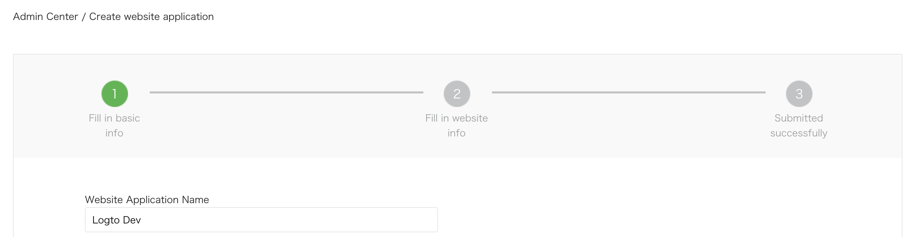

import GuideTip from '../../fragments/_guide-tip.mdx';

# WeChat を使用してソーシャルログインを設定する (Web)

Web アプリでの WeChat ソーシャルサインイン用の公式 Logto コネクター。

<GuideTip />

## はじめに

コネクターの概念がわからない場合や、このコネクターをサインイン体験に追加する方法がわからない場合は、[Logto チュートリアル](/connectors/social-connectors)を参照してください。

> **⚠️ 注意**
>
> このコネクターは Web アプリ専用です。ネイティブアプリで WeChat を使用してサインインする方法を探している場合は、[WeChat ネイティブコネクター](/integrations/wechat-native)を参照してください。

## WeChat オープンプラットフォームで Web アプリを作成する

> 💡 **ヒント**
>
> すでに完了しているセクションはスキップできます。

### アカウントを作成する

https://open.weixin.qq.com/ を開き、右上隅の「サインアップ」ボタンをクリックして、サインアッププロセスを完了します。

### Web アプリを作成する

作成したアカウントでサインインします。「Web アプリケーション」(网页应用) タブで、大きな緑色のボタン「Web アプリを作成」(创建网页应用) をクリックします。

アプリケーションフォームに必要な情報を入力しましょう。

#### 基本情報

ほとんどは非常に簡単です。フォームを完了したら、「次のステップ」をクリックして進みます。

#### ウェブサイト情報

「認可コールバックドメイン」(授权回调域) に Logto ドメインを入力します。例：`logto.io`。

#### レビュー結果を待つ

ウェブサイト情報を完了したら、「レビューを送信」をクリックして続行します。通常、レビューは迅速に行われ、1〜2日以内に終了します。

レビュー担当者は各提出ごとにランダムに割り当てられると考えられ、基準は変動します。最初に拒否されることもありますが、あきらめないでください！現状を説明し、どのように修正するかをレビュー担当者に尋ねてください。

### WeChat コネクターを設定する

OAuth アプリの詳細ページから取得した _Client ID_ と _Client Secret_ を `clientId` と `clientSecret` フィールドに入力します。

`scope` フィールドには 'snsapi_userinfo' または 'snsapi_base' を入力します。このフィールドはオプションであり、空白のままにしておくこともできます。デフォルト値は 'snsapi_userinfo' に設定されています。異なる値の [違い](https://developers.weixin.qq.com/doc/offiaccount/OA_Web_Apps/Wechat_webpage_authorization.html) を確認できます。

### WeChat Web コネクターをテストする

これで完了です。サインイン体験で [ソーシャルコネクターを有効にする](/connectors/social-connectors/#enable-social-sign-in) のを忘れないでください。

WeChat Web コネクターが有効になると、再度アプリにサインインして動作を確認できます。
