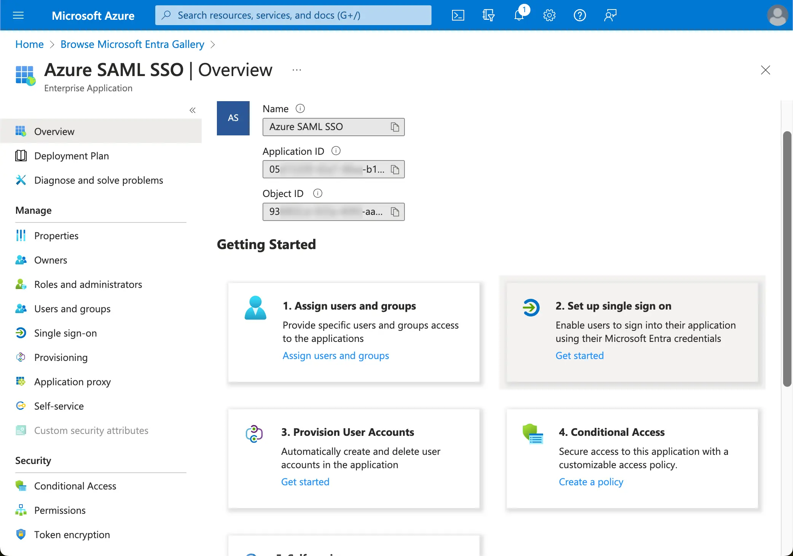

import GuideTip from '../../fragments/_sso_guide_tip.mdx';

# Microsoft Entra ID (SAML) を使用してシングルサインオンを設定する

最小限の設定作業で、このコネクターを使用して Microsoft Entra ID（以前の Azure AD）とエンタープライズシングルサインオン (SSO) を統合できます。

<GuideTip />

## ステップ 1: Azure AD SSO アプリケーションを作成する

Azure AD 側で SSO アプリケーションを作成することで、Azure AD SSO 統合を開始します。

1. [Azure ポータル](https://portal.azure.com/) にアクセスし、管理者としてサインインします。
2. `Microsoft Entra ID` サービスを選択します。
3. サイドメニューから `Enterprise applications` に移動します。`New application` をクリックし、`Create your own application` を選択します。

1. アプリケーション名を入力し、`Integrate any other application you don't find in the gallery (Non-gallery)` を選択します。
2. `Setup single sign-on` > `SAML` を選択します。

1. 指示に従って、最初のステップとして、Logto によって提供される次の情報を使用して基本的な SAML 設定を入力する必要があります。

- **Audience URI(SP Entity ID)**: Logto サービスのグローバルに一意の識別子として機能し、IdP への認証リクエスト中に SP の EntityId として機能します。この識別子は、IdP と Logto 間での SAML アサーションやその他の認証関連データの安全な交換において重要です。
- **ACS URL**: アサーションコンシューマーサービス (ACS) URL は、POST リクエストで SAML アサーションが送信される場所です。この URL は、IdP が SAML アサーションを Logto に送信するために使用されます。これは、Logto がユーザーのアイデンティティ情報を含む SAML 応答を受信し消費することを期待するコールバック URL として機能します。

`Save` をクリックして続行します。

## ステップ 2: Logto で SAML SSO を設定する

SAML SSO 統合を機能させるには、IdP メタデータを Logto に提供する必要があります。Logto 側に戻り、Azure AD SSO コネクターの `Connection` タブに移動します。

Logto は、IdP メタデータを設定するための 3 つの異なる方法を提供します。最も簡単な方法は、Azure AD SSO アプリケーションの `metadata URL` を提供することです。

Azure AD SSO アプリケーションの `SAML Certificates section` から `App Federation Metadata Url` をコピーし、Logto の `Metadata URL` フィールドに貼り付けます。

Logto は URL からメタデータを取得し、SAML SSO 統合を自動的に設定します。

## ステップ 3: ユーザー属性マッピングを設定する

Logto は、IdP から返されるユーザー属性を Logto のユーザー属性にマッピングする柔軟な方法を提供します。Logto はデフォルトで IdP から次のユーザー属性を同期します：

- id: ユーザーの一意の識別子。Logto は SAML 応答から `nameID` クレームを読み取り、ユーザー SSO アイデンティティ ID として使用します。
- email: ユーザーのメールアドレス。Logto はデフォルトで SAML 応答から `email` クレームを読み取り、ユーザーのプライマリメールとして使用します。
- name: ユーザーの名前。

ユーザー属性マッピングのロジックは、Azure AD 側または Logto 側のいずれかで管理できます。

1. AzureAD ユーザー属性を Logto ユーザー属性に Logto 側でマッピングします。

   Azure AD SSO アプリケーションの `Attributes & Claims` セクションにアクセスします。

   次の属性名（名前空間プレフィックス付き）をコピーし、Logto の対応するフィールドに貼り付けます。

   - `http://schemas.xmlsoap.org/ws/2005/05/identity/claims/emailaddress`
   - `http://schemas.xmlsoap.org/ws/2005/05/identity/claims/name` （推奨：この属性値マップを `user.displayname` に更新して、より良いユーザー体験を提供します）

1. AzureAD ユーザー属性を AzureAD 側で Logto ユーザー属性にマッピングします。

   Azure AD SSO アプリケーションの `Attributes & Claims` セクションにアクセスします。

   `Edit` をクリックし、Logto ユーザー属性設定に基づいて `Additional claims` フィールドを更新します：

   - Logto ユーザー属性設定に基づいてクレーム名の値を更新します。
   - 名前空間プレフィックスを削除します。
   - `Save` をクリックして続行します。

   次の設定で終了する必要があります：

Azure AD 側で追加のユーザー属性を指定することもできます。Logto は、ユーザーの `sso_identity` フィールドの下に IdP から返された元のユーザー属性の記録を保持します。

## ステップ 4: Azure AD SSO アプリケーションにユーザーを割り当てる

Azure AD SSO アプリケーションの `Users and groups` セクションにアクセスします。`Add user/group` をクリックして、Azure AD SSO アプリケーションにユーザーを割り当てます。Azure AD SSO アプリケーションに割り当てられたユーザーのみが、Azure AD SSO コネクターを通じて認証できます。

## ステップ 5: メールドメインを設定し、SSO コネクターを有効にする

Logto のコネクター `SSO experience` タブで組織の `email domains` を提供します。これにより、これらのユーザーに対する認証方法として SSO コネクターが有効になります。

指定されたドメインのメールアドレスを持つユーザーは、唯一の認証方法として SAML SSO コネクターを使用するようにリダイレクトされます。

Azure AD SSO 統合の詳細については、Azure AD の公式 [ドキュメント](https://learn.microsoft.com/en-us/entra/identity/enterprise-apps/add-application-portal-setup-sso) を確認してください。
