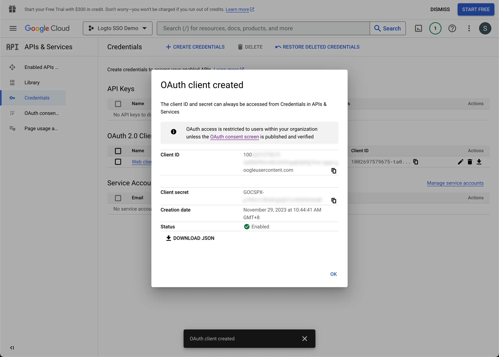

import GuideTip from '../../fragments/_sso_guide_tip.mdx';

# Google Workspace を使用してシングルサインオンを設定する

最小限の設定作業で、このコネクターは Microsoft Entra ID と統合してエンタープライズシングルサインオン (SSO) を実現します。

<GuideTip />

## ステップ 1: Google Cloud Platform で新しいプロジェクトを作成する

Google Workspace を認証 (Authentication) プロバイダーとして使用する前に、[Google API Console](https://console.developers.google.com/) でプロジェクトを設定して OAuth 2.0 資格情報を取得する必要があります。すでにプロジェクトがある場合は、このステップをスキップできます。それ以外の場合は、Google 組織の下で新しいプロジェクトを作成します。

## ステップ 2: アプリケーションの同意画面を設定する

新しい OIDC 資格情報を作成するには、アプリケーションの同意画面を設定する必要があります。

1. [OAuth 同意画面](https://console.cloud.google.com/apis/credentials/consent) ページに移動し、`Internal` ユーザータイプを選択します。これにより、OAuth アプリケーションは組織内のユーザーのみが利用可能になります。

2. ページの指示に従って `Consent Screen` 設定を入力します。次の最低限の情報を提供する必要があります：

- **アプリケーション名**: アプリケーションの名前。これは同意画面に表示されます。
- **サポートメール**: アプリケーションのサポートメール。これは同意画面に表示されます。

3. アプリケーションの `Scopes` を設定します。ユーザーのアイデンティティ情報とメールアドレスを IdP から適切に取得するために、Logto SSO コネクターは IdP から次のスコープを付与する必要があります：

- **openid**: このスコープは OIDC 認証 (Authentication) に必要です。ID トークンを取得し、IdP の userInfo エンドポイントにアクセスするために使用されます。
- **profile**: ユーザーの基本的なプロフィール情報にアクセスするために必要です。
- **email**: ユーザーのメールアドレスにアクセスするために必要です。

`Save` ボタンをクリックして同意画面の設定を保存します。

## ステップ 3: 新しい OAuth 資格情報を作成する

[Credentials](https://console.cloud.google.com/apis/credentials) ページに移動し、`Create Credentials` ボタンをクリックします。ドロップダウンメニューから `OAuth client ID` オプションを選択して、アプリケーション用の新しい OAuth 資格情報を作成します。

次の情報を入力して OAuth 資格情報の設定を続行します：

1. アプリケーションタイプとして `Web application` を選択します。
2. クライアントアプリケーションの `Name` を入力します。例として `Logto SSO Connector`。これにより、将来資格情報を識別するのに役立ちます。
3. `Authorized redirect URIs` に Logto のコールバック URI を入力します。これは、Google が認証 (Authentication) に成功した後にユーザーのブラウザをリダイレクトする URI です。ユーザーが IdP での認証 (Authentication) に成功すると、IdP はユーザーのブラウザをこの指定された URI に認可コードと共にリダイレクトします。Logto はこの URI から受け取った認可コードに基づいて認証 (Authentication) プロセスを完了します。
4. `Authorized JavaScript origins` に Logto コールバック URI のオリジンを入力します。これにより、Logto アプリケーションのみが Google OAuth サーバーにリクエストを送信できるようになります。
5. `Create` ボタンをクリックして OAuth 資格情報を作成します。

## ステップ 4: クライアント資格情報を使用して Logto コネクターを設定する

OAuth 資格情報を正常に作成した後、クライアント ID とクライアントシークレットを含むプロンプトモーダルが表示されます。

`Client ID` と `Client secret` をコピーし、Logto の SSO コネクターの `Connection` タブに対応するフィールドに入力します。

これで、Logto に Google Workspace SSO コネクターを正常に設定しました。

## ステップ 5: 追加のスコープ (オプション)

`Scope` フィールドを使用して、OAuth リクエストに追加のスコープを追加します。これにより、Google OAuth サーバーからより多くの情報を要求できます。詳細については、[Google OAuth Scopes](https://developers.google.com/identity/protocols/oauth2/scopes) ドキュメントを参照してください。

カスタムスコープ設定に関係なく、Logto は常に `openid`、`profile`、および `email` スコープを IdP に送信します。これは、Logto がユーザーのアイデンティティ情報とメールアドレスを適切に取得できるようにするためです。

## ステップ 6: メールドメインを設定し、SSO コネクターを有効にする

Logto のコネクター `SSO experience` タブに組織の `email domains` を提供します。これにより、SSO コネクターがこれらのユーザーの認証 (Authentication) 方法として有効になります。

指定されたドメインのメールアドレスを持つユーザーは、唯一の認証 (Authentication) 方法として SSO コネクターを使用するようにリダイレクトされます。

Google Workspace SSO コネクターの詳細については、[Google OpenID Connector](https://developers.google.com/identity/openid-connect/openid-connect) を確認してください。
