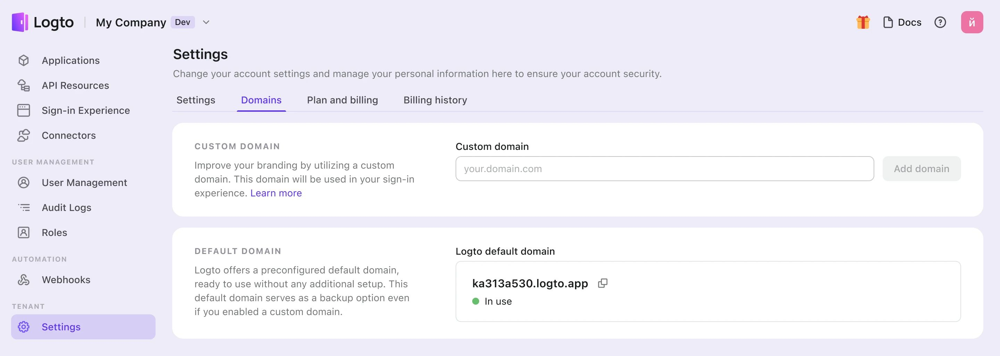

# カスタムドメイン

あなたの Logto テナントには、デフォルトの無料ドメイン `{{tenant-id}}.app.logto` が付属しています。しかし、`auth.example.com` のようなカスタムドメインを使用することで、ユーザー体験とブランド認知を向上させることができます。

カスタムドメインは、以下の機能に使用されます：

- [サインインおよび登録ページ](/end-user-flows/sign-up-and-sign-in) の URL
- [パスキー](/end-user-flows/mfa/webauthn) リンクの URL（ユーザーがパスキーをリンクした後にドメインを変更すると、認証がブロックされる可能性があります）。
- [ソーシャルコネクター](/connectors/social-connectors) または [エンタープライズ SSO コネクター](/connectors/enterprise-connectors) のコールバック URI。
- あなたのアプリケーションと Logto を統合するための [SDK エンドポイント](/integrate-logto/application-data-structure#openid-provider-configuration-endpoint)。

:::note
サービスを公開した後にドメインを変更すると、アプリケーションコードや統合が古いドメインを参照している可能性があるため、問題が発生することがあります。スムーズな移行を確保するために、**本番テナントの作成時にカスタムドメインを設定してください**。
:::

## コンソールでカスタムドメインを設定する

Logto コンソールで新しいカスタムドメインを追加するには、次の手順に従ってください：

1. <CloudLink to="/tenant-settings/domains">コンソール > 設定 > ドメイン</CloudLink> に移動します。
2. 「カスタムドメイン」セクションで、ドメイン名を入力し、「ドメインを追加」をクリックします。

   

3. テーブル内の CNAME 値をコピーし、ドメインの DNS プロバイダーに移動してレコードを追加します。

   

4. 検証と SSL プロセスを待ちます。
   1. カスタムドメインが追加されるまで、10 秒ごとに自動的にレコードを検証します。入力したドメイン名または DNS レコードが正確であることを確認してください。
   2. 検証は通常数分で完了しますが、DNS プロバイダーによっては最大 24 時間かかることがあります。プロセス中に他のページに移動しても問題ありません。

## トラブルシューティング

<details>
<summary>SSL 証明書の問題</summary>

カスタムドメインを設定する際に SSL 証明書の問題が発生した場合、それは DNS 設定の CAA レコードに関連している可能性があります。CAA レコードは、どの証明書機関 (CA) があなたのドメインの証明書を発行する権限を持っているかを指定します。

CAA レコードに関連する SSL 証明書の問題をトラブルシューティングして解決するには、[Cloudflare のドキュメント](https://developers.cloudflare.com/ssl/edge-certificates/caa-records/)を参照してください。

</details>

<details>
<summary>"The hostname is associated with a held zone" エラー</summary>

カスタムドメインを追加する際に "The hostname is associated with a held zone, please contact the owner to have the hold removed" というエラーメッセージが表示された場合、それはドメインがすでに Cloudflare ゾーンにあり、「ゾーンホールド」ステータスに設定されていることを意味します。この問題について詳しくは、[Cloudflare のドキュメント](https://developers.cloudflare.com/fundamentals/setup/account/account-security/zone-holds/)を参照してください。

この問題を解決するには、ゾーンホールドを解除する必要があります。Cloudflare でのゾーンホールドの解除方法については、上記のリンクを参照してください。

</details>

## カスタムドメインを使用する

設定を完了すると、カスタムドメイン名とデフォルトの Logto ドメイン名の両方がテナントで利用可能になります。ただし、カスタムドメイン名を有効にするためには、特定の設定が必要です。

:::note
この記事では、カスタムドメインが `auth.example.com` であると仮定しています。


:::

### アプリケーションの SDK エンドポイントを更新する

Logto SDK の初期化コードを変更し、エンドポイントのドメイン名を修正します。

```typescript
const client = new LogtoClient({
  ...,// 他のオプション
  endpoint: 'https://auth.example.com',
});
```

### 他のアプリケーションの認証エンドポイントを修正する

Logto SDK を使用していないアプリケーションがある場合、その認証エンドポイントを更新する必要があります。

認証エンドポイントは、次の well-known URL で確認できます：

```
https://auth.example.com/oidc/.well-known/openid-configuration
```

### ソーシャルコネクターのコールバック URI を更新する

ユーザーがカスタムドメインを使用している場合、ソーシャルコネクターのコールバック URI は自動的に更新されます。ソーシャルプロバイダーの開発者コンソールに移動して、コールバック URI を更新する必要があります。

ユーザーがカスタムドメインを使用している場合、ソーシャルコネクターのコールバック URI は新しいドメインを使用します。したがって、ソーシャルプロバイダーの開発者コンソールに移動して、コールバック URI を手動で更新する必要があります。
