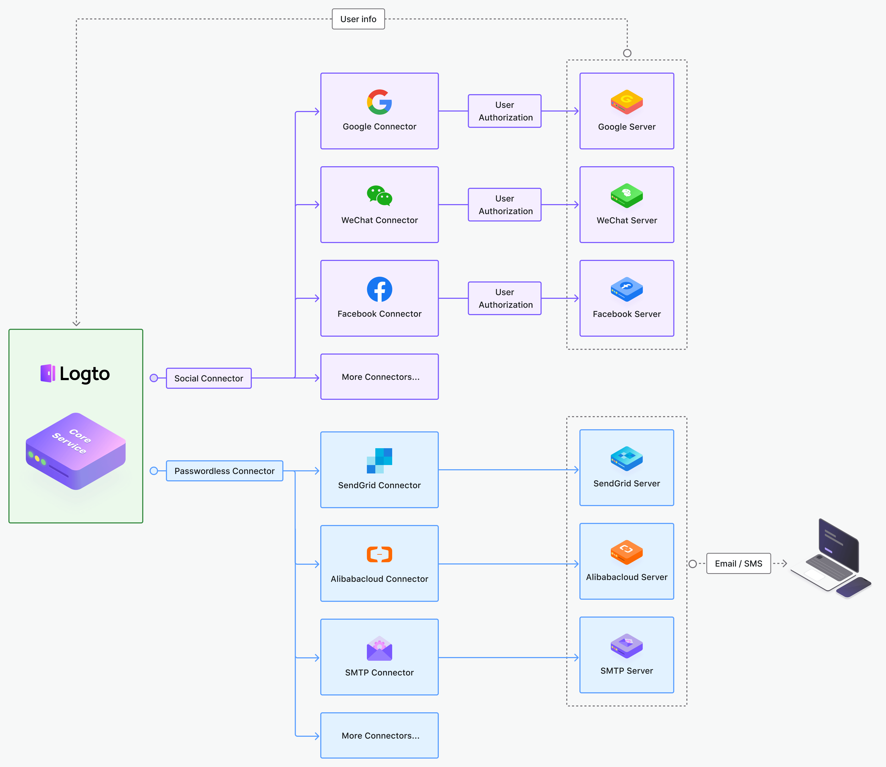

# コネクターを開発する

現在、Logto は WeChat、Alipay、Google、Facebook などの広く使用されているソーシャルサインインコネクターや、AliCloud、SendGrid、Twilio などの SMS / Email コネクターを提供しています。

以下は、コネクターが Logto コアサービスとどのように連携するかを示すアーキテクチャ図です。

これらは現時点でほとんどのユーザーのニーズを満たすことができるはずですが、私たちは進歩を続けます。

私たちがさらに多くのコネクターに取り組んでいる間に、あなた自身のコネクターを開発することもできます。あなたのコネクターをコミュニティ全体と共有することをお勧めします。

コネクターの構築から始めて、Logto プロジェクトに貢献する方法を見てみましょう。
