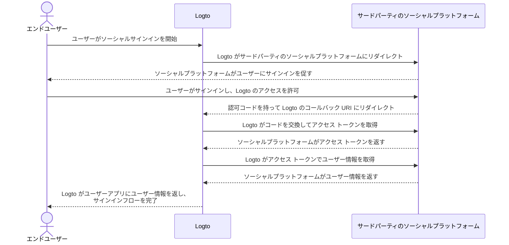

# コネクターの実装

コネクターのファイル構造を見た後、コネクターの開発の実装と主なアイデアについて説明します。

ソーシャルコネクターとパスワードレスコネクターの簡単な例を通じて、ほぼ同じアイデアでコネクターを構築できるようにします。

この部分では、特定のパラメーター（例えば `config`）の詳細には深入りしません。このガイドのポイントではないためです。新しいコネクターを実装する開発者は、サードパーティのサービスベンダーが提供するドキュメントを読み、パラメーターの詳細について詳しく説明する必要があります。

## ソーシャルコネクターを構築する

GitHub コネクターを例にとりましょう。

ほとんどのソーシャルコネクターの認可 (Authorization) フローは [OAuth Authorization Code Flow](https://openid.net/specs/openid-connect-basic-1_0.html) に従います。

:::note
ほとんどの _ソーシャルコネクター_ は、エンドユーザーの認証 (Authentication) によりユーザープロファイルを取得するために、2 ステップのスキームに従います（すべてのステップが成功すると仮定します）：

1. 認証リクエストを開始し、ユーザーの認証を取得します。
2. コネクターベンダーが付与した `authCode` を使用して `アクセス トークン` を取得します。
3. `アクセス トークン` を使用して、公開アクセス可能なユーザープロファイルをリクエストします。

:::



このフローを完了するために、次の 3 つのメソッドが必要です：

### getAuthorizationUri

`getAuthorizationUri` は、エンドユーザーを認証が必要なページにリダイレクトする URL を生成します。

インターフェースは [`@logto/connector-kit`](https://github.com/logto-io/logto/blob/master/packages/toolkit/connector-kit/src/types.ts) の `GetAuthorizationUri` として定義されています。

`getUserInfo` メソッドのために、サインインに関連する重要な情報を `setSession`（`GetAuthorizationUri` の第 2 引数）を使用して保存することが許可されています。

必要なパラメーターは次のとおりです：

- `authorizationEndpoint` は GitHub OAuth ドキュメントサイトで見つけることができ、エンドユーザーが認証のために行くべきページです
- `config` は GitHub シナリオで `clientId` と `clientSecret` を含みます
- `state` は CSRF を証明するランダムな文字列です
- エンドユーザーの認証が成功した後のランディングページの `redirectUri`

```typescript
const getAuthorizationUri = async ({ state, redirectUri }) => {
  const queryParameters = new URLSearchParams({
    client_id: config.clientId, // `config` には GitHub アプリケーションの資格情報が含まれています
    redirect_uri: redirectUri,
    state,
  });

  return `${authorizationEndpoint}?${queryParameters.toString()}`;
};
```

### getAccessToken

`getAccessToken` は、エンドユーザーの認証が成功した後に発行された認可コードでアクセス トークンを取得します。

前述の `getAuthorizationUri` メソッドで言及した `config` に加えて、次のものも取得したいです：

- リダイレクトランディングページに持ち込まれるパラメーターからの認可 `code`
- 認可コードでアクセス トークンを取得するための `accessTokenEndpoint`

```typescript
const getAccessToken = async (config: GithubConfig, code: string) => {
  const { clientId: client_id, clientSecret: client_secret } = config;

  const httpResponse = await got.post({
    url: accessTokenEndpoint,
    json: {
      client_id,
      client_secret,
      code,
    },
    timeout: defaultTimeout,
  });

  const result = accessTokenResponseGuard.safeParse(qs.parse(httpResponse.body));

  if (!result.success) {
    throw new ConnectorError(ConnectorErrorCodes.InvalidResponse, result.error);
  }

  const { access_token: accessToken } = result.data;

  assert(accessToken, new ConnectorError(ConnectorErrorCodes.SocialAuthCodeInvalid));

  return { accessToken };
};
```

### getUserInfo

`getUserInfo` は、前のステップで取得したアクセス トークンでユーザー情報を取得します。

インターフェースは [`@logto/connector-kit`](https://github.com/logto-io/logto/blob/master/packages/toolkit/connector-kit/src/types.ts) の `GetUserInfo` として定義されています。

サインインの目的で、`getSession` 関数を使用して必要な情報を取得できます。

`userInfoEndpoint` はユーザー情報を取得するために使用されるエンドポイントです。

公式ドキュメントを確認して、ユーザー情報エンドポイントでアクセス可能な特定のユーザー情報と対応するスコープを見つけることができます。

コネクターのアイデンティティプロバイダー（この場合は GitHub）によって割り当てられた `id` は必須です。他の情報はオプションです。ユーザープロファイルから `email` または `phone` を取得できる場合、それらが「確認済み」であることを確認してください。また、[Logto ユーザープロファイル](/user-management/user-data/#basic-data) のフィールド名と返されるキーを一致させる必要があります。

```typescript
const getUserInfo = async (
  data: { code: string; config: GithubConfig },
  getSession: GetSession,
  { set: SetStorageValue, get: GetStorageValue }
) => {
  const { code, config } = data;
  const { accessToken } = await getAccessToken(config, code);

  try {
    const httpResponse = await got.get(userInfoEndpoint, {
      headers: {
        authorization: `token ${accessToken}`,
      },
      timeout: defaultTimeout,
    });

    const result = userInfoResponseGuard.safeParse(parseJson(httpResponse.body));

    if (!result.success) {
      throw new ConnectorError(ConnectorErrorCodes.InvalidResponse, result.error);
    }

    const { id, avatar_url: avatar, email, name } = result.data;

    return {
      id: String(id),
      avatar: conditional(avatar),
      email: conditional(email),
      name: conditional(name),
    };
  } catch (error: unknown) {
    if (error instanceof HTTPError) {
      const { statusCode, body: rawBody } = error.response;

      if (statusCode === 401) {
        throw new ConnectorError(ConnectorErrorCodes.SocialAccessTokenInvalid);
      }

      throw new ConnectorError(ConnectorErrorCodes.General, JSON.stringify(rawBody));
    }

    throw error;
  }
};
```

完全な実装は [こちら](https://github.com/logto-io/connectors/blob/master/packages/connector-github/src/index.ts) で見つけることができます。

設定可能なパラメーターの詳細については、GitHub コネクターの README または GitHub の公式ドキュメントを参照してください。

:::note
ここで説明している例は、Logto の GitHub コネクターで使用される OAuth プロトコルの Authorization Code グラントタイプに基づいています。ただし、ユーザープロファイルを取得するために使用できる別のグラントタイプである Implicit グラントタイプもあり、実際には認証応答で直接 `アクセス トークン` を提供します。この便利さにもかかわらず、Authorization Code グラントタイプは、より強力なセキュリティのために、一般的に Implicit タイプよりも推奨されます。

また、OIDC や他のオープンプロトコルに基づいてコネクターを構築することもできます。これは、接続したいソーシャルベンダーの互換性と同様に、ユースケースに依存します。
:::

## パスワードレスコネクターを構築する

パスワードレスコネクターを構築するプロセスを理解するために、Aliyun ダイレクトメールコネクターの実装を見てみましょう。

パスワードレスコネクターは、ランダムコードをエンドユーザーのメールまたは電話に送信するために使用されます。その結果、`sendMessage` メソッドが必要です。

### sendMessage

メッセージを送信するためには、`config` と `endpoint` が正しく設定されている必要があります。

- `endpoint` は API コールが接続するエンドポイントです
- `config` には `templates`（異なるユーザーフローでパスコードを送信するためのコンテンツテンプレート）、`clientId` および `clientSecret`（API リクエストにアクセスするため）が含まれます

```typescript
const sendMessage = async (data, inputConfig) => {
  const { to, type, payload } = data;
  const config = inputConfig ?? (await getConfig(defaultMetadata.id));
  validateConfig<AliyunDmConfig>(config, aliyunDmConfigGuard);
  const { accessKeyId, accessKeySecret, accountName, fromAlias, templates } = config;
  const template = templates.find((template) => template.usageType === type);

  assert(
    template,
    new ConnectorError(
      ConnectorErrorCodes.TemplateNotFound,
      `Cannot find template for type: ${type}`
    )
  );

  const parameters = {
    AccessKeyId: accessKeyId,
    AccountName: accountName,
    ReplyToAddress: 'false',
    AddressType: '1',
    ToAddress: to,
    FromAlias: fromAlias,
    Subject: template.subject,
    HtmlBody:
      typeof payload.code === 'string'
        ? template.content.replace(/{{code}}/g, payload.code)
        : template.content,
  };

  try {
    const httpResponse = await request(
      endpoint,
      { Action: 'SingleSendMail', ...staticConfigs, ...parameters },
      accessKeySecret
    );

    const result = sendEmailResponseGuard.safeParse(parseJson(httpResponse.body));

    if (!result.success) {
      throw new ConnectorError(ConnectorErrorCodes.InvalidResponse, result.error);
    }

    return result.data;
  } catch (error: unknown) {
    if (error instanceof HTTPError) {
      const {
        response: { body: rawBody },
      } = error;

      assert(typeof rawBody === 'string', new ConnectorError(ConnectorErrorCodes.InvalidResponse));

      errorHandler(rawBody);
    }

    throw error;
  }
};

const request = async (
  url: string,
  parameters: PublicParameters & Record<string, string>,
  accessKeySecret: string
) => {
  const finalParameters: Record<string, string> = {
    ...parameters,
    SignatureNonce: String(Math.random()),
    Timestamp: new Date().toISOString(),
  };
  const signature = getSignature(finalParameters, accessKeySecret, 'POST');

  const payload = new URLSearchParams();

  for (const [key, value] of Object.entries(finalParameters)) {
    payload.append(key, value);
  }
  payload.append('Signature', signature);

  return got.post({
    url,
    headers: {
      'Content-Type': 'application/x-www-form-urlencoded',
    },
    form: payload,
  });
};
```

完全な実装は [こちら](https://github.com/logto-io/connectors/blob/master/packages/connector-aliyun-dm/src/index.ts) で見つけることができます。

設定可能なパラメーターの詳細については、Aliyun ダイレクトメールコネクターの README または Aliyun ダイレクトメールの公式ドキュメントを参照してください。

## さらに詳しく

コネクターメソッドの定義を確認し、コネクターインターフェースの設計を把握するには、[`@logto/connector-kit`](https://github.com/logto-io/logto/tree/master/packages/toolkit/connector-kit) を参照してください。また、「[コネクター - ConnectorMetadata](/connectors/connector-data-structure/#connectors-local-storage-connectormetadata)」および「[コネクターファイル構造](/logto-oss/develop-your-connector/connector-file-structure/)」を参照すると、実装の整理方法を理解するのに役立ちます。

- コネクターの設定 [_Zod_](https://github.com/colinhacks/zod) スキーマはすべてのコネクターに必須です。これは、`config` を DB に保存する前や `config` 情報を必要とする API を呼び出す前に型チェックを行うため、非常に重要です。
- すべての _SMS コネクター_ と _メールコネクター_ は、データベースからの設定を使用してサービスプロバイダーのメッセージ送信 API を呼び出すための `sendMessage` メソッドが必要です。開発者は、Admin Console でコネクターを設定する際に、保存されていない設定でテストメッセージを送信するためにこのメソッドを再利用することもできます。
- 認可 URL ジェネレーター `getAuthorizationUri` とユーザープロファイル取得 `getUserInfo` は、すべての _ソーシャルコネクター_ に必要です（`getAccessToken` は `getUserInfo` のオプションステップと見なされます）。
- すべてのコネクターメソッドは API コールを通じて動作するため、コネクター開発者はドキュメントを確認し、API コールが失敗する可能性のある応答を処理する必要があります。

## 独自のコネクターをインストールする

独自のコネクターの構築をすでに完了していると仮定します。次の手順を実行して手動でインストールします：

1. 実装したコネクターフォルダーを [`logto-io/logto`](https://github.com/logto-io/logto) の `/packages/connectors` ディレクトリにコピーします。
2. logto フォルダーのルートパスで `pnpm pnpm:devPreinstall && pnpm i` を入力して、コネクターレポジトリの依存関係をインストールします。
3. `pnpm connectors build` でコネクターをビルドします。
4. `pnpm cli connector link` を使用してローカルコネクターをリンクします。
5. `logto-io/logto` のルートディレクトリで `pnpm dev` を使用して Logto インスタンスを再起動し、コネクターが正常にインストールされたことを確認できます。

これで、コネクターが期待どおりに動作するかどうかをテストして試すことができます。

すでに NPM または Logto 公式コネクターに公開されているコネクターを追加したい場合は、[Logto CLI の使用 - コネクターの管理](/logto-oss/using-cli/manage-connectors/#add-connectors) を確認してください。
