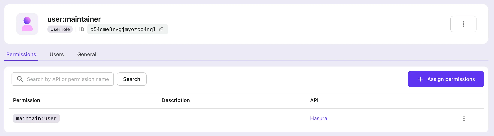
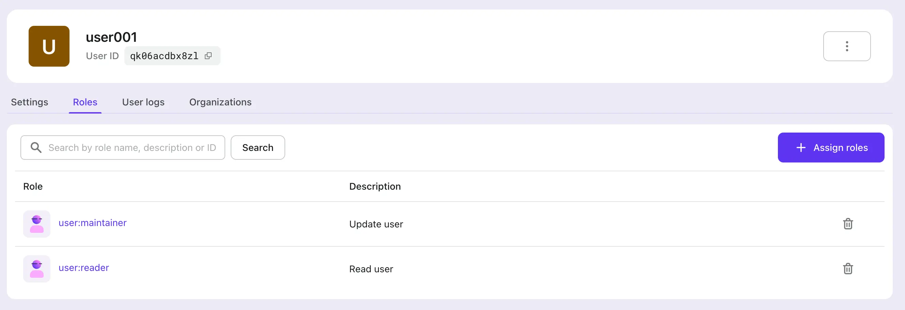

# あなたの Hasura アプリケーションに認証 (Authentication) を追加する

[Hasura](https://hasura.io/) は、データに適した GraphQL および REST API を迅速に提供できるツールです。データのセキュリティを考慮して、Hasura は各 API に対するアクセス制御を微調整する機能も提供しています。

通常、Hasura ユーザーは他のアイデンティティ管理および認証 (Authentication) サービスを利用しており、その中でも Logto は非常に人気があります。

このブログ記事では、すでに Hasura サービスを使用していることを前提とし、Hasura と Logto を統合してデータのセキュリティを最大化する方法を紹介します。Logto アカウントをお持ちでない場合は、今すぐサインアップして使用を開始してください！

## 背景

Hasura は [ロールベースのアクセス管理](https://hasura.io/docs/latest/auth/overview/) を採用しており、Logto は標準の [ロールベースのアクセス制御 (RBAC)](/authorization/role-based-access-control) を使用しています。

Logto のモデルと RBAC のベストプラクティスでは、ユーザーに `scope` を使用して最も細かい権限の粒度を対応させ、`role` を一連の `scope` として便利なバッチ操作のために使用し、最終的に `scope` をチェックして（通常はリソースプロバイダー側で）ユーザーが特定の操作を実行できるかどうかを確認することを推奨しています。

Hasura では、`role` が最も細かい権限の粒度に対応し、権限チェックは `role` に対して行われます。したがって、Logto の設定時には、1 つの `role` を正確に 1 つの `scope` にマッピングすることをお勧めします。このアプローチにより、Logto と Hasura の権限をリンクさせ、混乱や誤用を避けることができます。

Hasura は Webhook または JWT を使用したアクセス制御をサポートしています。以前の [ブログ記事](https://blog.logto.io/logto-x-hasura) では Webhook の使用方法を紹介しましたが、以下のセクションでは Hasura の JWT モードアクセス制御を利用する方法を説明します。

## 始めましょう

簡単な例から始めましょう。ユーザーがすでに Hasura に 2 つの API、`GET /user` と `PATCH /user` を持っており、それぞれ `user:reader` と `user:maintainer` という 2 つのロールに対応しているとします。

### 1. Logto に Hasura API リソースを作成する

Logto に Hasura API リソースを作成します。


### 2. Logto で Hasura の設定に従ってロールを作成する

ステップ 1 で言及した Hasura API リソースのために 2 つの `scope`、すなわち `read:user` と `maintain:user` を作成し、次に 2 つのロール、`user:reader`（`read:user` scope を含む）と `user:maintainer`（`maintain:user` scope を含む）を作成して、Hasura のロールと 1 対 1 で対応させます。そして、必要に応じてこれらのロールを Logto ユーザーに割り当てます。




### 3. Hasura 環境変数 `HASURA_GRAPHQL_JWT_SECRET` を設定して JWT モードを有効にする

[Hasura JWT 設定オプション](https://hasura.io/docs/latest/auth/authentication/jwt/#hasura-jwt-configuration-options) を調べると、JWT を使用してアクセス制御を行う前に、環境変数 `HASURA_GRAPHQL_JWT_SECRET` を追加して設定する必要があります。

設定できるオプションは多数ありますが、ここでは最も簡単なケースを紹介します：`jwk_url` のみを設定する必要があります。この値は、Logto の OpenID 設定エンドポイント (https://your.logto.domain/oidc/.well-known/openid-configuration) から取得できます。


### 4. ユーザーアクセス トークンの追加クレームをカスタマイズする

Logto のカスタムトークンクレーム機能を使用して、ユーザーアクセス トークンに追加のクレームを追加するロジックをカスタマイズします。


`getCustomJwtClaims` メソッドをカスタマイズして、Hasura がアクセス制御を実装するために依存する JWT にデータを追加します。これには、そのインスタンス中に認可されたユーザーに関連するデータが含まれる場合があります。`context` を通じてアクセスできる `role` などです。

また、環境変数 `USER_DEFAULT_ROLE_NAMES` を定義して、ハードコーディングを避けています。

### 5. Logto SDK を統合する

Logto と Hasura を設定した後、アプリを Logto SDK と統合します。ここでは、ユーザーサインイン後に Logto が発行するユーザーアクセス トークンをプレビューするために React の例を使用します。



最初に、以前に作成した `user:reader` と `user:maintainer` ロールをユーザーに割り当て、その後そのユーザーとしてログインします。

```tsx
const config: LogtoConfig = {
  endpoint: 'http://localhost:3001',
  appId: '<your-application-id>',
  appSecret: '<your-application-secret>',
  scopes: [
    ...// 既存のスコープ
    'read:user',
    'maintain:user',
  ],
  resources: [
    ...// 既存のリソース
    'https://*.hasura.app/api',
  ],
};
```

ユーザーアクセス トークンを取得し、Hasura API をリクエストします：

```tsx
const accessToken = await logto.getAccessToken('https://*.hasura.app/api');

// Hasura へのリクエストを送信する前に
request.headers.set('Authorization', `Bearer ${accessToken}`);
request.headers.set('x-Hasura-Role', '<required-role-for-the-endpoint>');
```

## 結論

この記事では、Hasura がサポートする Webhook 以外の JWT ベースのアクセス制御の別の方法を提供します。

Hasura の [Webhook](https://hasura.io/docs/latest/auth/authentication/webhook/) と [JWT](https://hasura.io/docs/latest/auth/authentication/jwt/) アクセス制御のプロセスを比較すると、Webhook アプローチは Hasura のリクエストごとに Logto に Webhook を送信し、応答を待ちます。一方、JWT ベースのアプローチは JWT が期限切れになるまで継続的に使用できます。

JWT アプローチはネットワーク負荷を軽減し、Webhook によるネットワーク遅延を排除できます。一方、Webhook アプローチはユーザー権限の変更をリアルタイムで同期できます。

これらの結論に基づいて、実際のビジネスニーズと組み合わせて適切なアプローチを選択できます。
