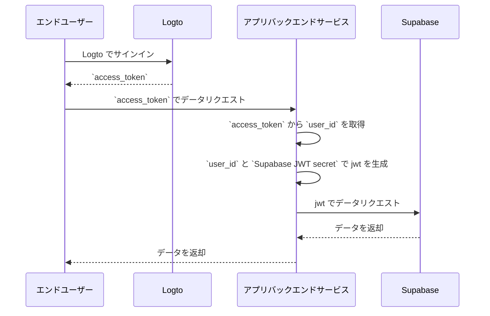

# Supabase アプリケーションへ認証機能の追加

## Supabase の基本 \{#supabase-basics}

Supabase は [Postgres の Row-Level Security](https://www.postgresql.org/docs/current/ddl-rowsecurity.html) を利用してデータアクセス権限を制御します。簡単に言えば、データベース内のテーブルに対して Row Level Security ポリシーを作成することで、誰がテーブル内のデータを読み書き・更新できるかを制限・管理できます。

ここでは、データベースに「posts」という名前のテーブルがあり、次のような内容があると仮定します：


テーブル内の `user_id` フィールドは、それぞれの投稿データがどのユーザーに属しているかを表します。`user_id` フィールドに基づいて、各ユーザーが自分自身の投稿データのみアクセスできるように制限できます。

ただし、これを実現する前に、Supabase がデータベースへアクセスしている現在のユーザーを識別できる必要があります。

### Supabase リクエストにユーザーデータを追加する \{#add-user-data-to-the-supabase-requests}

Supabase は JWT をサポートしているため、アプリケーションが Supabase とやり取りする際、Supabase から提供された JWT シークレットを使ってユーザーデータを含む JWT を生成できます。この JWT をリクエスト時の認証 (Authentication) ヘッダーとして使用します。リクエストを受け取ると、Supabase は自動的に JWT の有効性を検証し、その後の処理全体で JWT 内のデータへアクセスできるようにします。

まず、Supabase ダッシュボードの「Project Settings」から Supabase が提供する JWT シークレットを取得します：


次に、Supabase SDK を使って Supabase へリクエストを送る際、このシークレットを使って JWT を生成し、リクエストの認証 (Authentication) ヘッダーとして付与します。（この処理はアプリケーションのバックエンドサービス内で行い、JWT シークレットは第三者に絶対に公開しないでください）

```jsx
import { createClient } from '@supabase/supabase-js';
import { sign } from 'jsonwebtoken';

/
 * 注意:
 * SUPABASE_URL, SUPABASE_ANON_KEY は JWT シークレットと同じ場所で確認できます。
 */
const SUPABASE_URL = process.env.SUPABASE_URL;
const SUPABASE_ANON_KEY = process.env.SUPABASE_ANON_KEY;

const SUPABASE_JWT_SECRET = process.env.SUPABASE_JWT_SECRET;

export const getSupabaseClient = (userId) => {
  const jwtPayload = {
    userId,
  };

  const jwt = sign(jwtPayload, SUPABASE_JWT_SECRET, {
    expiresIn: '1h', // デモ用
  });

  const client = createClient(SUPABASE_URL, SUPABASE_ANON_KEY, {
    global: {
      headers: {
        Authorization: `Bearer ${jwt}`,
      },
    },
  });

  return client;
};
```

次に、Supabase ダッシュボードの SQL Editor で、リクエストに含まれる userId を取得する関数を作成します：


画像で使用されているコードは次の通りです：

```sql
create or replace function auth.user_id() returns text as $$
  select nullif(current_setting('request.jwt.claims', true)::json->>'userId', '')::text;
$$ language sql stable;
```

このコードが示すように、Supabase では `request.jwt.claims` を呼び出すことで生成した JWT のペイロードを取得できます。ペイロード内の `userId` フィールドが設定した値です。

この関数により、Supabase は現在データベースへアクセスしているユーザーを特定できます。

### Row-Level Security ポリシーの作成 \{#create-row-level-security-policy}

次に、posts テーブルの `user_id` フィールドに基づいて、各ユーザーが自分自身の投稿データのみアクセスできるように Row-Level Security ポリシーを作成します。

1. Supabase ダッシュボードの Table Editor ページで posts テーブルを選択します。
2. テーブル上部の「Add RLS Policy」をクリックします。
3. 表示されたウィンドウで「Create policy」をクリックします。
4. Policy Name を入力し、SELECT Policy コマンドを選択します。
5. 下記コードの `using` ブロックに次を入力します：

```sql
auth.user_id() = user_id
```


このようなポリシーを活用することで、Supabase 内でのデータアクセス制御が実現できます。

実際のアプリケーションでは、データの挿入や更新などユーザーの操作を制限するためにさまざまなポリシーを作成しますが、この記事では割愛します。Row-Level Security (RLS) についてさらに詳しくは [Secure your data using Postgres Row Level Security](https://supabase.com/docs/guides/database/postgres/row-level-security) を参照してください。

### Logto との基本的な統合プロセス \{#basic-integration-process-with-logto}

前述の通り、Supabase はアクセス制御に RLS を利用しているため、Logto（または他の認証サービス）との統合の鍵は、認可されたユーザーのユーザー ID を取得し、それを Supabase へ送信することです。全体の流れは下図の通りです：



次に、このプロセス図に基づいて Logto と Supabase の統合方法を説明します。

## Logto 統合 \{#logto-integration}

Logto はさまざまなフレームワークやプログラミング言語向けの統合ガイドを提供しています。

これらのフレームワークや言語で構築されたアプリは、一般的にネイティブアプリ、SPA（シングルページアプリ）、従来型 Web アプリ、M2M（マシン間通信）アプリなどのカテゴリに分類されます。利用している技術スタックに応じて [Logto クイックスタート](/quick-starts) ページから Logto をアプリケーションに統合できます。その後、アプリケーションの種類に応じて下記の手順に従って Logto をプロジェクトに統合してください。

### ネイティブアプリまたは SPA \{#native-app-or-spa}

ネイティブアプリと SPA はどちらも端末上で動作し、ログイン後に取得した認証情報（アクセス トークン）は端末内に保存されます。

そのため、アプリを Supabase と統合する際は、各ユーザーの端末で機密情報（Supabase JWT シークレットなど）を公開できないため、バックエンドサービスを介して Supabase とやり取りする必要があります。

ここでは、React と Express で SPA を構築していると仮定します。[Logto React SDK ガイド](/quick-starts/react) に従ってアプリケーションへ Logto を統合済み（[react サンプル](https://github.com/logto-io/js/tree/master/packages/react-sample) のコードも参照可能）であり、さらに [アクセス トークンの検証](/authorization/validate-access-tokens) ガイドに従ってバックエンドサーバーに Logto アクセス トークンの検証も追加済みとします。

次に、Logto から取得したアクセス トークンを使ってバックエンドサーバーへユーザーデータをリクエストします：

```jsx
import { useLogto } from '@logto/react';
import { useState, useEffect } from 'react';
import PostList from './PostList';

const endpoint = '<https://www.mysite.com/api/posts>';
const resource = '<https://www.mysite.com/api>';

function PostPage() {
  const { isAuthenticated, getAccessToken } = useLogto();
  const [posts, setPosts] = useState();

  useEffect(() => {
    const fetchPosts = async () => {
      const response = await fetch(endpoint, {
        headers: {
          Authorization: `Bearer ${await getAccessToken(resource)}`,
        },
      });
      setPosts(response.json());
    };

    if (isAuthenticated) {
      void fetchPosts();
    }
  }, [isAuthenticated, getAccessToken]);

  return <PostList posts={posts} />;
}

export default PostPage;
```

バックエンドサーバーでは、ミドルウェアを使ってアクセス トークンからログイン中ユーザーの ID を抽出しています：

```jsx
// auth-middleware.ts
import { createRemoteJWKSet, jwtVerify } from 'jose';

//...

export const verifyAuthFromRequest = async (ctx, next) => {
  // トークンを抽出
  const token = extractBearerTokenFromHeaders(ctx.request.headers);

  const { payload } = await jwtVerify(
    token, // リクエストヘッダーから抽出した生の Bearer Token
    createRemoteJWKSet(new URL('https://<your-logto-domain>/oidc/jwks')), // Logto サーバーから取得した jwks_uri で jwks を生成
    {
      // トークンの発行者（Logto サーバーで発行されたもの）
      issuer: 'https://<your-logto-domain>/oidc',
      // トークンのオーディエンス（現在の API のリソースインジケーター）
      audience: '<your request listener resource indicator>',
    }
  );

  // RBAC を利用している場合
  assert(payload.scope.includes('some_scope'));

  // カスタムペイロードロジック
  ctx.auth = {
    userId: payload.sub,
  };

  return next();
};
```

ここで、上記で説明した `getSupabaseClient` を使い、Supabase へのリクエストで使用する JWT に `userId` を付与できます。あるいは、Supabase とやり取りするリクエスト用に Supabase クライアントを作成するミドルウェアを作成しても構いません：

```jsx
export const withSupabaseClient = async (ctx, next) => {
  ctx.supabase = getSupabaseClient(ctx.auth.userId);

  return next();
};
```

その後の処理フローでは、`ctx.supabase` を直接呼び出して Supabase とやり取りできます：

```jsx
const fetchPosts = async (ctx) => {
  const { data } = await ctx.supabase.from('posts').select('*');

  return data;
};
```

このコードでは、Supabase は事前に設定したポリシーに基づき、現在のユーザーに属する投稿データのみ返します。

### 従来型 Web アプリ \{#traditional-web-app}

従来型 Web アプリとネイティブアプリや SPA との主な違いは、従来型 Web アプリはページのレンダリングや更新をすべて Web サーバー上で行う点です。そのため、ユーザーの認証情報は Web サーバーで直接管理されます（ネイティブアプリや SPA では端末側に保存）。

Supabase で従来型 Web アプリと Logto を統合する場合、バックエンドから直接ログイン中ユーザーの ID を取得できます。

Next.js プロジェクトを例にすると、[Next.js SDK ガイド](/quick-starts/next-app-router) に従って Logto を統合した後、Logto SDK を使ってユーザー情報を取得し、Supabase とのやり取り用 JWT を構築できます。

```jsx
import { getLogtoContext } from '@logto/next-server-actions';
import { logtoConfig } from '@/logto';
import { getSupabaseClient } from '@/utils';
import PostList from './PostList';

export default async function PostPage() {
  const { cliams } = await getLogtoContext(logtoConfig);

  // `cliams` の `sub` 値がユーザー ID
  const supabase = getSupabaseClient(cliams.sub);

  const { data: posts } = await supabase.from('posts').select('*');

  return <PostList posts={posts} />;
}
```

### マシン間通信アプリ \{#machine-to-machine-app}

マシン間通信 (M2M) は、アプリがリソースサーバーと直接通信する必要がある場合（例：静的サービスが毎日投稿を取得するなど）によく利用されます。

マシン間通信アプリの認証には [Machine-to-machine: Logto で認証](/quick-starts/m2m) ガイドを利用できます。Supabase とマシン間通信アプリの統合は、ネイティブアプリや SPA（「[ネイティブアプリまたは SPA](#native-app-or-spa)」セクション参照）と同様です。Logto からアクセス トークンを取得し、保護されたバックエンド API で検証します。

ただし注意点として、ネイティブアプリや SPA は通常エンドユーザー向けであるため、取得したユーザー ID はユーザー自身を表します。一方、マシン間通信アプリのアクセス トークンはアプリケーション自体を表し、トークンペイロードの `sub` フィールドは M2M アプリのクライアント ID であり、特定のユーザーではありません。したがって、開発時にはどのデータが M2M アプリ向けかを区別することが重要です。

さらに、特定の M2M アプリが Supabase へサービス全体を代表して RLS 制限を回避してアクセスしたい場合は、Supabase の `service_role` シークレットを使って Supabase クライアントを作成できます。これは、個々のユーザー向けに設定された Row-Level Security ポリシーに制限されず、すべてのデータへアクセスする必要がある管理や自動化タスクを実行したい場合に便利です。

`service_role` シークレットは JWT シークレットと同じページで確認できます：


Supabase クライアントを作成する際に `service_role` シークレットを使用すると、このクライアントはデータベース内のすべてのデータへアクセスできます：

```jsx
import { createClient } from '@supabase/supabase-js';

// ...
const SUPABASE_SERVICE_ROLE_SCRET = process.env.SUPABASE_SERVICE_ROLE_SCRET;

const client = createClient(SUPABASE_URL, SUPABASE_SERVICE_ROLE_SCRET, {
  // ...options
});
```
