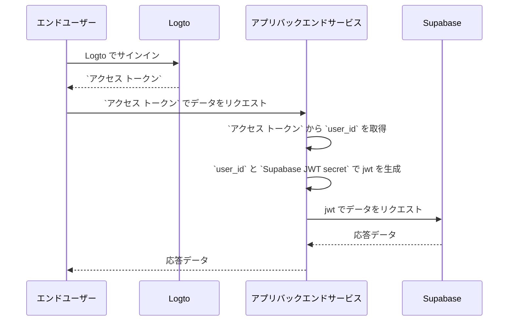

import createGetUserIdFunctionImage from '@site/docs/quick-starts/database/supabase/create-get-user-id-function.webp';
import createRlsPolicyImage from '@site/docs/quick-starts/database/supabase/create-rls-policy.webp';
import postsTableImage from '@site/docs/quick-starts/database/supabase/posts-table.webp';
import serviceRoleSecretImage from '@site/docs/quick-starts/database/supabase/service-role-secret.webp';
import supabaseApiSettingsImage from '@site/docs/quick-starts/database/supabase/supabase-api-settings.webp';

# あなたの Supabase アプリケーションに認証 (Authentication) を追加する

## Supabase の基本 \{#supabase-basics}

Supabase は、データアクセス権限を制御するために [Postgres の Row-Level Security](https://www.postgresql.org/docs/current/ddl-rowsecurity.html) を利用しています。簡単に言えば、データベース内のテーブルに対して Row Level Security ポリシーを作成することで、誰がテーブル内のデータを読み取り、書き込み、更新できるかを制限および管理できます。

データベースに「posts」という名前のテーブルがあり、次のような内容が含まれていると仮定します：


テーブル内の `user_id` フィールドは、各投稿データが属するユーザーを表しています。`user_id` フィールドに基づいて、各ユーザーが自分の投稿データにのみアクセスできるように制限できます。

ただし、これを実装する前に、Supabase はデータベースにアクセスしている現在のユーザーを識別できる必要があります。

### Supabase リクエストにユーザーデータを追加する \{#add-user-data-to-the-supabase-requests}

Supabase の JWT サポートのおかげで、アプリケーションが Supabase とやり取りする際に、Supabase が提供する JWT シークレットを使用してユーザーデータを含む JWT を生成できます。この JWT をリクエスト時の認証 (Authentication) ヘッダーとして使用します。リクエストを受け取ると、Supabase は自動的に JWT の有効性を検証し、その後のプロセス全体で含まれるデータへのアクセスを許可します。

まず、Supabase ダッシュボードの「プロジェクト設定」から Supabase が提供する JWT シークレットを取得できます：


次に、Supabase SDK を使用して Supabase にリクエストを行う際に、このシークレットを使用して JWT を生成し、リクエストの認証 (Authentication) ヘッダーとして添付します。（このプロセスはアプリケーションのバックエンドサービス内で行われ、JWT シークレットは第三者に公開されるべきではありません）。

```jsx
import { createClient } from '@supabase/supabase-js';
import { sign } from 'jsonwebtoken';

/*
 * 注意:
 * SUPABASE_URL、SUPABASE_ANON_KEY は JWT シークレットを見つけた場所と同じ場所で見つけることができます。
 */
const SUPABASE_URL = process.env.SUPABASE_URL;
const SUPABASE_ANON_KEY = process.env.SUPABASE_ANON_KEY;

const SUPABASE_JWT_SECRET = process.env.SUPABASE_JWT_SECRET;

export const getSupabaseClient = (userId) => {
  const jwtPayload = {
    userId,
  };

  const jwt = sign(jwtPayload, SUPABASE_JWT_SECRET, {
    expiresIn: '1h', // デモ用
  });

  const client = createClient(SUPABASE_URL, SUPABASE_ANON_KEY, {
    global: {
      headers: {
        Authorization: `Bearer ${jwt}`,
      },
    },
  });

  return client;
};
```

次に、Supabase ダッシュボードの SQL エディタに移動し、リクエストに含まれる userId を取得する関数を作成します：


画像で使用されているコードは次のとおりです：

```sql
create or replace function auth.user_id() returns text as $$
  select nullif(current_setting('request.jwt.claims', true)::json->>'userId', '')::text;
$$ language sql stable;
```

コードが示すように、Supabase では `request.jwt.claims` を呼び出すことで生成した JWT のペイロードを取得できます。ペイロード内の `userId` フィールドは、私たちが設定した値です。

この関数を使用すると、Supabase は現在データベースにアクセスしているユーザーを特定できます。

### Row-Level Security ポリシーを作成する \{#create-row-level-security-policy}

次に、posts テーブルの `user_id` フィールドに基づいて、各ユーザーが自分の投稿データにのみアクセスできるように制限する Row-Level Security ポリシーを作成できます。

1. Supabase ダッシュボードのテーブルエディタページに移動し、posts テーブルを選択します。
2. テーブルの上部にある「Add RLS Policy」をクリックします。
3. 表示されたウィンドウで「Create policy」をクリックします。
4. ポリシー名を入力し、SELECT ポリシーコマンドを選択します。
5. 以下のコードの `using` ブロックに次を入力します：

```sql
auth.user_id() = user_id
```


このようなポリシーを活用することで、Supabase 内でのデータアクセス制御が実現されます。

実際のアプリケーションでは、データの挿入や変更などのユーザーアクションを制限するためにさまざまなポリシーを作成しますが、これはこの記事の範囲を超えています。Row-Level Security (RLS) についての詳細は、[Postgres Row Level Security を使用してデータを保護する](https://supabase.com/docs/guides/database/postgres/row-level-security) を参照してください。

### Logto との基本的な統合プロセス \{#basic-integration-process-with-logto}

前述のように、Supabase はアクセス制御に RLS を利用しているため、Logto（または他の認証 (Authentication) サービス）と統合する鍵は、認可されたユーザーのユーザー ID を取得し、それを Supabase に送信することです。プロセス全体は以下の図に示されています：



次に、このプロセス図に基づいて Logto を Supabase と統合する方法を説明します。

## Logto 統合 \{#logto-integration}

Logto は、さまざまなフレームワークやプログラミング言語の統合ガイドを提供しています。

これらのフレームワークや言語で構築されたアプリは、一般的にネイティブアプリ、SPA（シングルページアプリ）、従来のウェブアプリ、M2M（マシン間通信）アプリなどのカテゴリに分類されます。使用している技術スタックに基づいて、[Logto クイックスタート](/quick-starts) ページを訪れて、アプリケーションに Logto を統合できます。その後、アプリケーションの種類に基づいて、以下の手順に従ってプロジェクトに Logto を統合します。

### ネイティブアプリまたは SPA \{#native-app-or-spa}

ネイティブアプリと SPA はどちらもデバイス上で実行され、ログイン後に取得した資格情報（アクセス トークン）はデバイス上にローカルに保存されます。

したがって、アプリを Supabase と統合する際には、各ユーザーのデバイス上で機密情報（例えば Supabase JWT シークレット）を公開できないため、バックエンドサービスを通じて Supabase とやり取りする必要があります。

React と Express を使用して SPA を構築していると仮定します。[Logto React SDK ガイド](/quick-starts/react) に従ってアプリケーションに Logto を統合し成功した後、バックエンドサーバーに Logto アクセス トークンの検証を追加しました（[Node (Express) で API を保護する](/authorization/api-resources/node-express) ドキュメントを参照できます）。

次に、Logto から取得したアクセス トークンを使用して、バックエンドサーバーからユーザーデータをリクエストします：

```jsx
import { useLogto } from '@logto/react';
import { useState, useEffect } from 'react';
import PostList from './PostList';

const endpoint = '<https://www.mysite.com/api/posts>';
const resource = '<https://www.mysite.com/api>';

function PostPage() {
  const { isAuthenticated, getAccessToken } = useLogto();
  const [posts, setPosts] = useState();

  useEffect(() => {
    const fetchPosts = async () => {
      const response = await fetch(endpoint, {
        headers: {
          Authorization: `Bearer ${await getAccessToken(resource)}`,
        },
      });
      setPosts(response.json());
    };

    if (isAuthenticated) {
      void fetchPosts();
    }
  }, [isAuthenticated, getAccessToken]);

  return <PostList posts={posts} />;
}

export default PostPage;
```

バックエンドサーバーでは、ミドルウェアを使用してアクセス トークンからログインしたユーザーの ID を抽出しました：

```jsx
// auth-middleware.ts
import { createRemoteJWKSet, jwtVerify } from 'jose';

//...

export const verifyAuthFromRequest = async (ctx, next) => {
  // トークンを抽出
  const token = extractBearerTokenFromHeaders(ctx.request.headers);

  const { payload } = await jwtVerify(
    token, // リクエストヘッダーから抽出された生の Bearer トークン
    createRemoteJWKSet(new URL('https://<your-logto-domain>/oidc/jwks')), // Logto サーバーから取得した jwks_uri を使用して jwks を生成
    {
      // トークンの発行者、Logto サーバーによって発行されるべき
      issuer: 'https://<your-logto-domain>/oidc',
      // トークンのオーディエンス、現在の API のリソースインジケーターであるべき
      audience: '<your request listener resource indicator>',
    }
  );

  // RBAC を使用している場合
  assert(payload.scope.includes('some_scope'));

  // カスタムペイロードロジック
  ctx.auth = {
    userId: payload.sub,
  };

  return next();
};
```

これで、上記で説明した `getSupabaseClient` を使用して、Supabase への後続のリクエストで使用する JWT に `userId` を添付できます。または、Supabase とやり取りする必要があるリクエストのために Supabase クライアントを作成するミドルウェアを作成できます：

```jsx
export const withSupabaseClient = async (ctx, next) => {
  ctx.supabase = getSupabaseClient(ctx.auth.userId);

  return next();
};
```

その後の処理フローでは、`ctx.supabase` を直接呼び出して Supabase とやり取りできます：

```jsx
const fetchPosts = async (ctx) => {
  const { data } = await ctx.supabase.from('posts').select('*');

  return data;
};
```

このコードでは、Supabase は以前に設定したポリシーに基づいて、現在のユーザーに属する投稿データのみを返します。

### 従来のウェブアプリ \{#traditional-web-app}

従来のウェブアプリとネイティブアプリまたは SPA の主な違いは、従来のウェブアプリはウェブサーバー上でのみページをレンダリングおよび更新することです。したがって、ユーザーの資格情報はウェブサーバーによって直接管理され、ネイティブアプリや SPA ではユーザーのデバイス上に存在します。

Supabase で従来のウェブアプリを Logto と統合する際には、バックエンドから直接ログインしたユーザーの ID を取得できます。

Next.js プロジェクトを例にとると、[Next.js SDK ガイド](/quick-starts/next-app-router) に従ってプロジェクトに Logto を統合した後、Logto SDK を使用してユーザー情報を取得し、Supabase とやり取りするための対応する JWT を構築できます。

```jsx
import { getLogtoContext } from '@logto/next-server-actions';
import { logtoConfig } from '@/logto';
import { getSupabaseClient } from '@/utils';
import PostList from './PostList';

export default async function PostPage() {
  const { claims } = await getLogtoContext(logtoConfig);

  // `claims` の `sub` 値はユーザー ID です。
  const supabase = getSupabaseClient(claims.sub);

  const { data: posts } = await supabase.from('posts').select('*');

  return <PostList posts={posts} />;
}
```

### マシン間通信アプリ \{#machine-to-machine-app}

マシン間通信 (M2M) は、アプリがリソースサーバーと直接通信する必要がある場合によく使用されます。例えば、毎日の投稿を取得する静的サービスなどです。

マシン間通信アプリの認証 (Authentication) には、[Machine-to-machine: Auth with Logto](/quick-starts/m2m) ガイドを使用できます。Supabase とマシン間通信アプリの統合は、ネイティブアプリや SPA と同様です（「[ネイティブアプリまたは SPA](#native-app-or-spa)」セクションで説明されています）。Logto からアクセス トークンを取得し、それを保護されたバックエンド API を通じて検証します。

ただし、ネイティブアプリや SPA は通常エンドユーザー向けに設計されているため、取得したユーザー ID はユーザー自身を表します。しかし、マシン間通信アプリのアクセス トークンはアプリケーション自体を表し、アクセス トークンペイロードの `sub` フィールドは特定のユーザーではなく M2M アプリのクライアント ID です。したがって、開発中にどのデータが M2M アプリ向けであるかを区別することが重要です。

さらに、特定の M2M アプリが RLS 制限をバイパスして Supabase にアクセスする必要がある場合、Supabase の `service_role` シークレットを使用して Supabase クライアントを作成できます。これは、個々のユーザーのために設定された Row-Level Security ポリシーに制限されずにすべてのデータにアクセスする必要がある管理タスクや自動化タスクを実行したい場合に便利です。

`service_role` シークレットは、JWT シークレットと同じページで見つけることができます：


Supabase クライアントを作成する際に `service_role` シークレットを使用すると、このクライアントはデータベース内のすべてのデータにアクセスできます：

```jsx
import { createClient } from '@supabase/supabase-js';

// ...
const SUPABASE_SERVICE_ROLE_SECRET = process.env.SUPABASE_SERVICE_ROLE_SECRET;

const client = createClient(SUPABASE_URL, SUPABASE_SERVICE_ROLE_SECRET, {
  // ...options
});
```
