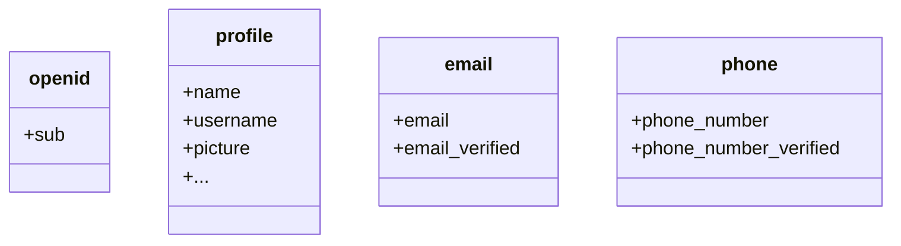

デフォルトでは、限られたクレーム (Claim) が返されます。より多くの情報が必要な場合は、追加のスコープ (Scope) をリクエストして、より多くのクレーム (Claim) にアクセスできます。

:::info
「クレーム (Claim)」はサブジェクトについての主張であり、「スコープ (Scope)」はクレーム (Claim) のグループです。現在のケースでは、クレーム (Claim) はユーザーに関する情報の一部です。
:::

スコープ - クレーム (Claim) 関係の非規範的な例を示します：

:::tip
「sub」クレーム (Claim) は「サブジェクト (Subject)」を意味し、ユーザーの一意の識別子（つまり、ユーザー ID）です。
:::

Logto SDK は常に 3 つのスコープ (Scope) をリクエストします：`openid`、`profile`、および `offline_access`。
