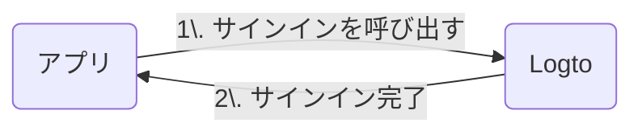

import RegardingRedirectBasedSignIn from './_regarding-redirect-based-sign-in.mdx';

詳細に入る前に、エンドユーザー体験の概要を簡単にご紹介します。サインインプロセスは次のようにシンプルにまとめられます：

1. アプリがサインインメソッドを呼び出します。
2. ユーザーは Logto のサインインページにリダイレクトされます。ネイティブアプリの場合は、システムブラウザが開かれます。
3. ユーザーがサインインし、アプリ（リダイレクト URI として設定）に戻されます。

<RegardingRedirectBasedSignIn />

---
