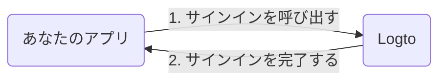

import RegardingRedirectBasedSignIn from './_regarding-redirect-based-sign-in.mdx';

詳細に入る前に、エンドユーザーの体験について簡単に説明します。サインインプロセスは次のように簡略化できます：

1. あなたのアプリがサインインメソッドを呼び出します。
2. ユーザーは Logto のサインインページにリダイレクトされます。ネイティブアプリの場合、システムブラウザが開かれます。
3. ユーザーがサインインし、あなたのアプリにリダイレクトされます（リダイレクト URI として設定されています）。

<RegardingRedirectBasedSignIn />

---
