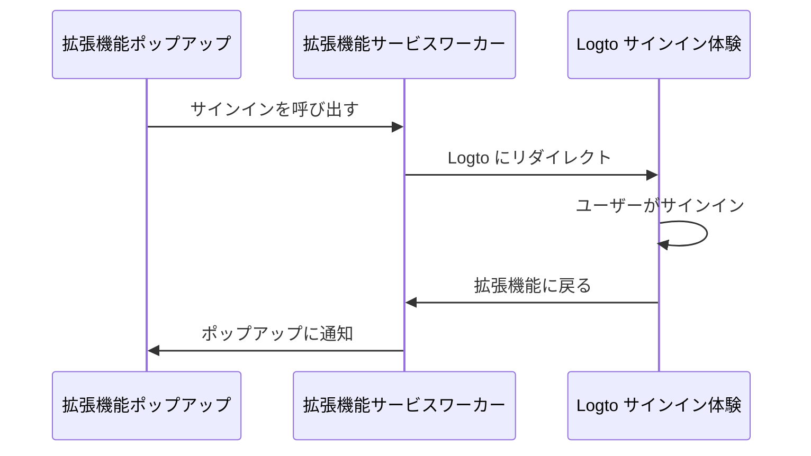
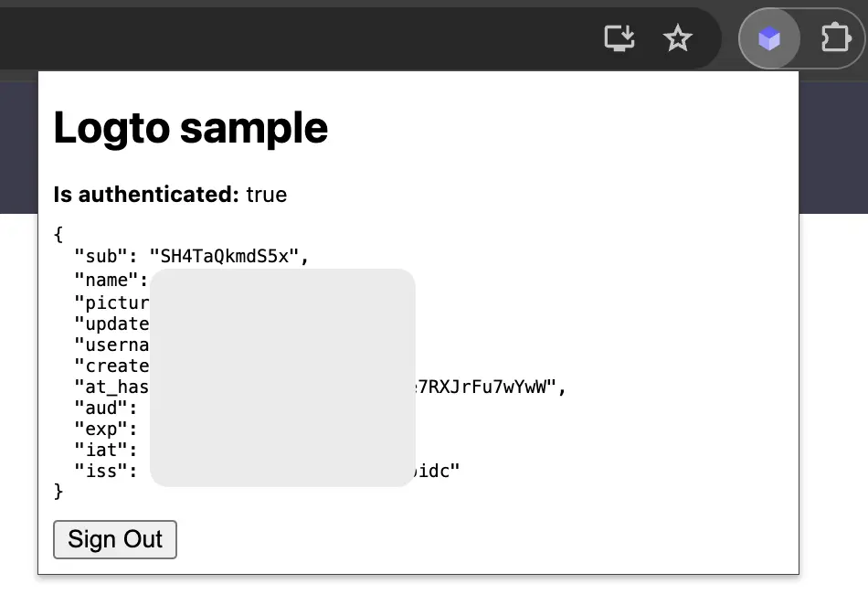

import RegardingRedirectBasedSignIn from '../../fragments/_regarding-redirect-based-sign-in.mdx';

### 認証 (Authentication) フロー \{#the-authentication-flow}

Chrome 拡張機能のポップアップに「サインイン」ボタンを配置したと仮定すると、認証 (Authentication) フローは次のようになります：



拡張機能内の他のインタラクティブなページについては、`拡張機能ポップアップ` の参加者をページ名に置き換えるだけです。このチュートリアルでは、ポップアップページに焦点を当てます。

<RegardingRedirectBasedSignIn />

### `manifest.json` を更新する \{#update-the-manifestjson}

Logto SDK は `manifest.json` に次の権限を必要とします：

```json title="manifest.json"
{
  "permissions": ["identity", "storage"],
  "host_permissions": ["https://*.logto.app/*"]
}
```

- `permissions.identity`: Chrome Identity API に必要で、サインインとサインアウトに使用されます。
- `permissions.storage`: ユーザーのセッションを保存するために必要です。
- `host_permissions`: Logto SDK が Logto API と通信するために必要です。

:::note
Logto Cloud でカスタムドメインを使用している場合は、`host_permissions` をドメインに合わせて更新する必要があります。
:::

### バックグラウンドスクリプト（サービスワーカー）を設定する \{#set-up-a-background-script-service-worker}

Chrome 拡張機能のバックグラウンドスクリプトで、Logto SDK を初期化します：

```js title="service-worker.js"
import LogtoClient from '@logto/chrome-extension';

export const logtoClient = new LogtoClient({
  endpoint: '<your-logto-endpoint>'
  appId: '<your-logto-app-id>',
});
```

`<your-logto-endpoint>` と `<your-logto-app-id>` を実際の値に置き換えてください。これらの値は、Logto コンソールで作成したアプリケーションページで見つけることができます。

バックグラウンドスクリプトがない場合は、[公式ガイド](https://developer.chrome.com/docs/extensions/develop/concepts/service-workers/basics) に従って作成できます。

:::info
**なぜバックグラウンドスクリプトが必要なのか？**

ポップアップやオプションページのような通常の拡張機能ページはバックグラウンドで実行できず、認証 (Authentication) プロセス中に閉じられる可能性があります。バックグラウンドスクリプトは、認証 (Authentication) プロセスが適切に処理されることを保証します。
:::

次に、他の拡張機能ページからのメッセージをリッスンし、認証 (Authentication) プロセスを処理する必要があります：

```js title="service-worker.js"
chrome.runtime.onMessage.addListener((message, sender, sendResponse) => {
  // 以下のコードでは、各アクションに対して `true` を返すため、`sendResponse` を呼び出して
  // 送信者に通知する必要があります。ここでエラーを処理したり、他の方法で送信者に通知することもできます。

  if (message.action === 'signIn') {
    const redirectUri = chrome.identity.getRedirectURL('/callback');
    logtoClient.signIn(redirectUri).finally(sendResponse);
    return true;
  }

  if (message.action === 'signOut') {
    const redirectUri = chrome.identity.getRedirectURL();
    logtoClient.signOut(redirectUri).finally(sendResponse);
    return true;
  }

  return false;
});
```

上記のコードでは、2 つのリダイレクト URI が使用されていることに気付くかもしれません。これらはどちらも `chrome.identity.getRedirectURL` によって作成され、認証 (Authentication) フローのためのリダイレクト URL を生成するための [Chrome の組み込み API](https://developer.chrome.com/docs/extensions/reference/api/identity#method-getRedirectURL) です。2 つの URI は次のようになります：

- サインイン用：`https://<extension-id>.chromiumapp.org/callback`
- サインアウト用：`https://<extension-id>.chromiumapp.org/`

これらの URI はアクセス可能ではなく、Chrome が認証 (Authentication) プロセスの特定のアクションをトリガーするためにのみ使用されます。

### Logto アプリケーション設定を更新する \{#update-logto-application-settings}

次に、作成したリダイレクト URI を許可するように Logto アプリケーション設定を更新する必要があります。

1. Logto コンソールのアプリケーションページに移動します。
2. 「リダイレクト URI」セクションで、URI を追加します：`https://<extension-id>.chromiumapp.org/callback`。
3. 「サインアウト後のリダイレクト URI」セクションで、URI を追加します：`https://<extension-id>.chromiumapp.org/`。
4. 「CORS 許可されたオリジン」セクションで、URI を追加します：`chrome-extension://<extension-id>`。Chrome 拡張機能の SDK は、このオリジンを使用して Logto API と通信します。
5. **変更を保存** をクリックします。

`<extension-id>` を実際の拡張機能 ID に置き換えることを忘れないでください。拡張機能 ID は `chrome://extensions` ページで見つけることができます。

### ポップアップにサインインとサインアウトボタンを追加する \{#add-sign-in-and-sign-out-buttons-to-the-popup}

もう少しで完了です！ポップアップページにサインインとサインアウトボタン、およびその他の必要なロジックを追加しましょう。

`popup.html` ファイルで：

```html title="popup.html"
<button id="sign-in">Sign in</button> <button id="sign-out">Sign out</button>
```

`popup.js` ファイルで（`popup.js` が `popup.html` に含まれていると仮定）：

```js title="popup.js"
document.getElementById('sign-in').addEventListener('click', async () => {
  await chrome.runtime.sendMessage({ action: 'signIn' });
  // サインインが完了（または失敗）したら、ここで UI を更新できます。
});

document.getElementById('sign-out').addEventListener('click', async () => {
  await chrome.runtime.sendMessage({ action: 'signOut' });
  // サインアウトが完了（または失敗）したら、ここで UI を更新できます。
});
```

### チェックポイント：認証 (Authentication) フローをテストする \{#checkpoint-test-the-authentication-flow}

これで Chrome 拡張機能で認証 (Authentication) フローをテストできます：

1. 拡張機能のポップアップを開きます。
2. 「サインイン」ボタンをクリックします。
3. Logto サインインページにリダイレクトされます。
4. Logto アカウントでサインインします。
5. Chrome に戻ります。

### 認証 (Authentication) 状態を確認する \{#check-authentication-state}

Chrome は統一されたストレージ API を提供しているため、サインインおよびサインアウトフロー以外のすべての Logto SDK メソッドはポップアップページで直接使用できます。

`popup.js` で、バックグラウンドスクリプトで作成した `LogtoClient` インスタンスを再利用するか、同じ構成で新しいインスタンスを作成できます：

```js title="popup.js"
import LogtoClient from '@logto/chrome-extension';

const logtoClient = new LogtoClient({
  endpoint: '<your-logto-endpoint>'
  appId: '<your-logto-app-id>',
});

// または、バックグラウンドスクリプトで作成した logtoClient インスタンスを再利用
import { logtoClient } from './service-worker.js';
```

次に、認証 (Authentication) 状態とユーザーのプロファイルを読み込む関数を作成できます：

```js title="popup.js"
const loadAuthenticationState = async () => {
  const isAuthenticated = await logtoClient.isAuthenticated();
  // 認証 (Authentication) 状態に基づいて UI を更新

  if (isAuthenticated) {
    const user = await logtoClient.getIdTokenClaims(); // { sub: '...', email: '...', ... }
    // ユーザーのプロファイルで UI を更新
  }
};
```

`loadAuthenticationState` 関数をサインインおよびサインアウトロジックと組み合わせることもできます：

```js title="popup.js"
document.getElementById('sign-in').addEventListener('click', async () => {
  await chrome.runtime.sendMessage({ action: 'signIn' });
  await loadAuthenticationState();
});

document.getElementById('sign-out').addEventListener('click', async () => {
  await chrome.runtime.sendMessage({ action: 'signOut' });
  await loadAuthenticationState();
});
```

認証 (Authentication) 状態を持つポップアップページの例はこちらです：



### その他の考慮事項 \{#other-considerations}

- **サービスワーカーバンドリング**：Webpack や Rollup などのバンドラーを使用する場合、Node.js モジュールの不要なバンドリングを避けるために、ターゲットを `browser` または類似のものに明示的に設定する必要があります。
- **モジュール解決**：Logto Chrome 拡張機能 SDK は ESM のみのモジュールです。

TypeScript、Rollup、およびその他の設定を含む完全な例については、[サンプルプロジェクト](https://github.com/logto-io/js/tree/HEAD/packages/chrome-extension-sample) を参照してください。
