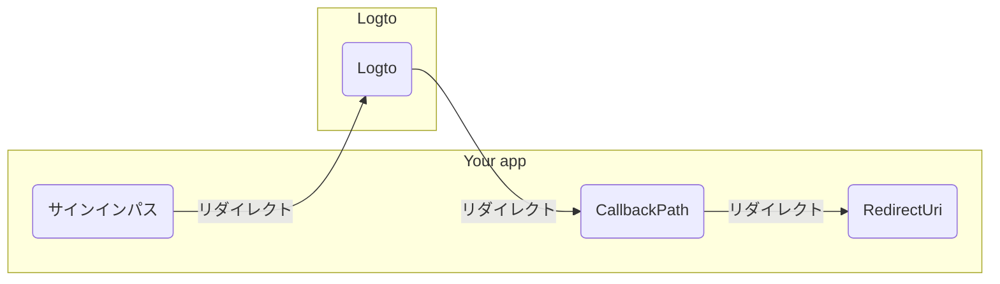

import RegardingRedirectBasedSignIn from '../../fragments/_regarding-redirect-based-sign-in.mdx';

進む前に、.NET Core 認証 (Authentication) ミドルウェアにおける混乱しやすい用語を 2 つ明確にする必要があります：

1. **CallbackPath**: ユーザーがサインインした後に Logto がユーザーをリダイレクトする URI（Logto における「リダイレクト URI」）
2. **RedirectUri**: Logto 認証 (Authentication) ミドルウェアで必要なアクションが実行された後にリダイレクトされる URI。

サインインプロセスは次のように示されます：

 

同様に、.NET Core にはサインアウトフローのための **SignedOutCallbackPath** と **RedirectUri** もあります。

明確にするために、これらを次のように呼びます：

| 使用する用語                         | .NET Core 用語        |
| ------------------------------------ | --------------------- |
| Logto リダイレクト URI               | CallbackPath          |
| Logto サインアウト後リダイレクト URI | SignedOutCallbackPath |
| アプリケーションリダイレクト URI     | RedirectUri           |

<RegardingRedirectBasedSignIn />
