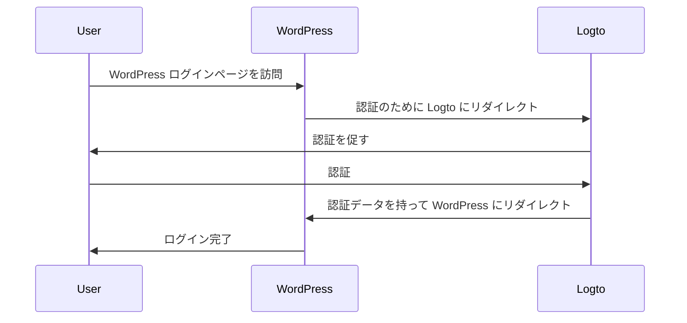
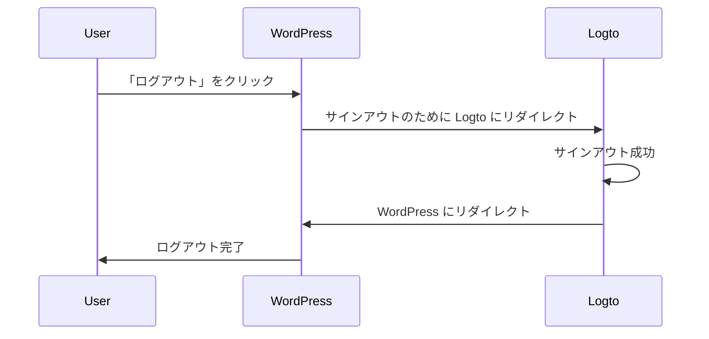

import TabItem from '@theme/TabItem';
import Tabs from '@theme/Tabs';

import FurtherReadings from '../../fragments/_further-readings.md';

# Logto プラグインで WordPress ウェブサイトへ認証機能の追加

このチュートリアルでは、公式の WordPress プラグインを使用して [WordPress](https://wordpress.org) ウェブサイトに Logto を統合する方法を紹介します。

## 前提条件 \{#prerequisites}

- [Logto Cloud](https://cloud.logto.io) アカウントまたは [セルフホスト Logto](/introduction/set-up-logto-oss)。
- 作成された Logto の従来型アプリケーション。
- WordPress プロジェクト：公式の [WordPress インストールガイド](https://wordpress.org/support/article/how-to-install-wordpress/) に従って、WordPress ウェブサイトをセットアップしてください。

## 統合 \{#integration}

### プラグインのインストール \{#authentication-settings}

:::info
現在、プラグインは審査中であり、WordPress プラグインディレクトリにはまだありません。利用可能になり次第、このページを更新します。
:::

<Tabs>

{/* WordPress プラグインディレクトリでプラグインが利用可能になったら、以下のブロックをコメント解除してください */}
{/* <TabItem value="admin-panel" label="WordPress 管理パネルから"> */}

{/* 1. **プラグイン** > **新規追加** に移動します。 */}
{/* 2. 「Logto」を検索します。 */}
{/* 3. **今すぐインストール** をクリックします。 */}
{/* 4. **有効化** をクリックします。 */}

{/* </TabItem> */}

<TabItem value="upload" label="アップロードから">

1. 次のリンクのいずれかから Logto WordPress プラグインをダウンロードします：
   - [最新リリース](https://github.com/logto-io/wordpress/releases)：`logto-plugin-<version>.zip` 形式のファイルをダウンロードします。
     {/* WordPress プラグインディレクトリでプラグインが利用可能になったら、以下の行をコメント解除してください */}
     {/* - [WordPress プラグインディレクトリ](https://wordpress.org/plugins) で「Logto」を検索します。 */}
2. プラグイン ZIP ファイルをダウンロードします。
3. WordPress 管理パネルで **プラグイン** > **新規追加** に移動します。
4. **プラグインのアップロード** をクリックします。
5. ダウンロードした ZIP ファイルを選択し、**今すぐインストール** をクリックします。
6. **有効化** をクリックします。

</TabItem>

</Tabs>

### プラグインの設定 \{#scopes}

WordPress 管理パネルのサイドバーに Logto メニューが表示されるはずです。**Logto** > **設定** をクリックしてプラグインを設定します。

:::note
プラグインを設定する前に、Logto コンソールで **従来型ウェブ** アプリケーションを作成しておく必要があります。まだ作成していない場合は、[アプリケーションへの Logto の統合](/integrate-logto/integrate-logto-into-your-application) を参照してください。
:::

プラグインを開始するための最小限の設定は次のとおりです：

- Logto エンドポイント：Logto テナントのエンドポイント。
- アプリ ID：Logto アプリケーションのアプリ ID。
- アプリシークレット：Logto アプリケーションの有効なアプリシークレットのいずれか。

すべての値は Logto コンソールのアプリケーション詳細ページで確認できます。

値を入力したら、**変更を保存** をクリックします（ボタンが見つからない場合はページの下までスクロールしてください）。

### リダイレクト URI の設定 \{#extra-params}

リダイレクト URI は、ユーザーが認証された後に Logto がリダイレクトする URL です。サインアウト後のリダイレクト URI は、ユーザーがログアウトした後に Logto がリダイレクトする URL です。

サインインフローを説明する非規範的なシーケンス図はこちらです：

サインアウトフローの非規範的なシーケンス図はこちらです：

リダイレクトが必要な理由について詳しくは、[サインイン体験の説明](/concepts/sign-in-experience) を参照してください。

この場合、Logto コンソールで両方のリダイレクト URI を設定する必要があります。WordPress 管理パネルの **Logto** > **設定** ページに移動して、**リダイレクト URI** と **サインアウト後のリダイレクト URI** フィールドを確認します。

1. **リダイレクト URI** と **サインアウト後のリダイレクト URI** の値をコピーし、Logto コンソールの **リダイレクト URI** と **サインアウト後のリダイレクト URI** フィールドに貼り付けます。
2. Logto コンソールで **変更を保存** をクリックします。

### チェックポイント: WordPress ウェブサイトのテスト \{#require-verified-email}

これで、WordPress ウェブサイトで Logto 統合をテストできます：

1. 必要に応じてシークレットブラウザウィンドウを開きます。
2. WordPress ウェブサイトを訪問し、該当する場合は **ログイン** リンクをクリックします。または、直接ログインページ（例：`https://example.com/wp-login.php`）にアクセスします。
3. ページは Logto サインインページにリダイレクトされるはずです。
4. サインインまたはサインアッププロセスを完了します。
5. 認証が成功すると、WordPress ウェブサイトに自動的にリダイレクトされ、ログインされるはずです。
6. **ログアウト** リンクをクリックして WordPress ウェブサイトからログアウトします。
7. Logto サインアウトページにリダイレクトされ、その後 WordPress ウェブサイトに戻るはずです。
8. WordPress ウェブサイトからログアウトされるはずです。

## 認証 (Authentication) 設定 \{#require-organization-id}

プラグインはそのままでも動作しますが、Logto プラグイン設定ページで認証 (Authentication) 設定をカスタマイズして、ニーズにより適合させることができます。

### スコープ \{#authorization-settings}

Logto はスコープを使用して、アプリケーションと共有する情報を制御します。Logto WordPress プラグインは、認証 (Authentication) プロセスを処理するために [Logto PHP SDK](https://github.com/logto-io/php) を使用しており、デフォルトで次のスコープを含みます：

- `openid`: OpenID Connect に必要な基本スコープ。
- `profile`: ユーザーの基本的なプロフィール情報を取得するため。
- `offline_access`: オフラインアクセスのためのリフレッシュ トークンを取得するため。

スコープについての詳細は、[スコープとクレーム](/quick-starts/php#scopes-and-claims) を参照してください。

プラグインはデフォルトで次の 2 つの追加スコープも追加します：

- `email`: ユーザーのメールアドレスを取得するため。
- `roles`: Logto 内のユーザーのロールを取得するため。

これらの 2 つのスコープは、Logto のメールとロールを WordPress のメールとロールにマッピングするために使用されます。プラグイン設定の **スコープ** フィールドを編集してスコープをカスタマイズできます。

:::warning
`email` または `roles` スコープを削除すると、プラグインの一部の機能が正しく動作しなくなります。
:::

### 追加パラメータ \{#role-mapping}

認証 (Authentication) リクエストに追加のパラメータを追加して、認証 (Authentication) プロセスをカスタマイズすることができます。たとえば、`first_screen` パラメータを追加して、認証 (Authentication) プロセスで最初に表示する画面を決定できます。

追加パラメータについての詳細は、[認証 (Authentication) パラメータ](/end-user-flows/authentication-parameters) を参照してください。

### 確認済みメールの要求 \{#advanced-settings}

デフォルトでは、プラグインは Logto で確認済みのメールアドレスを持つユーザーのみが WordPress ウェブサイトにログインできるように要求します。確認済みのメールアドレスを持たないユーザーがログインしようとすると、プラグインはエラーをスローします。

この機能を無効にするには、プラグイン設定で **確認済みメールの要求** オプションのチェックを外します。

### 組織 ID の要求 \{#remember-session}

Logto で特定の組織メンバーシップを持つユーザーのみが WordPress ウェブサイトにログインできるように要求することができます。組織 ID が指定されている場合、プラグインはユーザーの ID トークンに指定された組織 ID が含まれているかどうかを確認します。含まれていない場合、エラーがスローされます。

組織について詳しくは、[組織](/organizations) を参照してください。

## 認可 (Authorization) 設定 \{#sync-profile}

認証 (Authentication) に加えて、Logto は [ロールベースのアクセス制御 (RBAC)](/authorization/role-based-access-control) などの認可 (Authorization) 機能も提供します。独自のアプリケーションを開発する場合、RBAC を実装するにはカスタムコードが必要ですが、Logto WordPress プラグインは Logto ロールを [WordPress ロール](https://wordpress.org/documentation/article/roles-and-capabilities/) にマッピングするための組み込みの方法を提供します。

### ロールマッピング \{#wordpress-form-login}

Logto WordPress プラグインを使用すると、Logto ロールを WordPress ロールにマッピングできます。これにより、Logto でユーザーに異なるロールを割り当てることができ、プラグインはログイン時に対応する WordPress ロールを自動的にそのユーザーに割り当てます。

ロールをマッピングするには、**ロールマッピング** セクションで **追加** をクリックして新しいロールマッピングを追加します。たとえば、Logto の `group:editors` ロールを WordPress の `Editor` ロールにマッピングしたい場合、次の値で新しいロールマッピングを追加できます：

- Logto ロール: `group:editors`
- WordPress ロール: `editor` (WordPress の `Editor` ロールのロールスラッグ)

すべての WordPress ロールのロールスラッグは、[Roles and Capabilities](https://wordpress.org/documentation/article/roles-and-capabilities/) ドキュメントで確認できます。

:::note
ロールスラッグは大文字と小文字を区別します。`Editor` のようにロール名を入力すると、ロールマッピングは機能しません。
:::

Logto コンソールに移動し、左サイドバーで **ロール** をクリックします。`group:editors` という名前の新しいロールを作成し、それをユーザーに割り当てます。その後、そのユーザーで WordPress ウェブサイトにログインします。ユーザーが WordPress で `Editor` ロールに割り当てられていることが確認できるはずです。

:::note
ユーザーが WordPress ウェブサイトにログインしている場合、ユーザーがログアウトして再度ログインするまでロールマッピングは有効になりません。
:::

複数の Logto ロールを WordPress ロールにマッピングするために、複数のロールマッピングを追加することもできます。現在、プラグインは優先順位の順序でロールをマッピングしようとします。たとえば、次のロールマッピングがある場合：

- Logto ロール: `group:editors`, WordPress ロール: `editor`
- Logto ロール: `group:authors`, WordPress ロール: `author`
- Logto ロール: `group:subscribers`, WordPress ロール: `subscriber`

そして、ユーザーが Logto で `group:editors` と `group:authors` の両方のロールを持っている場合、ユーザーは WordPress で `Editor` ロールに割り当てられます。

## 高度な設定 \{#username-strategy}

### セッションの記憶 \{#troubleshooting}

デフォルトでは、プラグインはユーザーのセッションを 2 週間記憶します。これは、ユーザーが WordPress ウェブサイトにログインすると、2 週間ログインを求められないことを意味します。この時間を 2 日に短縮するには、プラグイン設定で **セッションの記憶** オプションのチェックを外します。

### プロフィールの同期 \{#callback-url-shows-404}

デフォルトでは、プラグインは毎回のログイン時にユーザーのプロフィールを同期します。これは、ユーザーが WordPress ウェブサイトにログインすると、Logto から最新の情報でプロフィールが更新されることを意味します。この機能を無効にするには、プラグイン設定で **プロフィールの同期** オプションのチェックを外します。

:::warning
この機能を無効にすると、ユーザーが初めてログインしたときにのみロールマッピングが有効になります。
:::

### WordPress フォームログイン \{#frequently-asked-questions}

デフォルトでは、WordPress ログイン URL に `?form=1` を追加して WordPress フォームログインを使用できます。これはテスト目的で便利ですが、WordPress フォームでのログインを許可したくない場合は、この機能を無効にすることができます。

### ユーザー名戦略 \{#how-can-i-trigger-the-forgot-password-flow}

WordPress でユーザーのユーザー名を生成する方法は複数あります。ユーザーの一意の識別子としてメールを使用する場合、デフォルトの戦略を使用するのが安全です。

## トラブルシューティング \{#how-can-i-use-the-wordpress-form-login}

### コールバック URL が 404 を表示する \{#further-readings}

コールバック URL が 404 エラーを表示する場合、WordPress のリライトルールが古くなっており、手動で更新する必要がある可能性があります。これを行うには、WordPress 管理パネルの **設定** > **パーマリンク** に移動し（または `/wp-admin/options-permalink.php` に直接アクセス）、**変更を保存** をクリックします。

## よくある質問 \{#frequently-asked-questions}

### パスワードを忘れた場合のフローをトリガーするにはどうすればよいですか？ \{#how-can-i-trigger-the-forgot-password-flow}

パスワードを忘れた場合のフローをトリガーする方法は 2 つあります：

1. Logto サインインページのパスワードを忘れたリンクをクリックします。
2. WordPress ログイン URL に `?action=lostpassword` を追加します。たとえば、`https://example.com/wp-login.php?action=lostpassword`。
   これにより、Logto のパスワードを忘れたページにリダイレクトされます。

### WordPress フォームログインを使用するにはどうすればよいですか？ \{#how-can-i-use-the-wordpress-form-login}

デフォルトでは、WordPress ログイン URL に `?form=1` を追加して WordPress フォームログインを使用できます。たとえば、`https://example.com/wp-login.php?form=1`。

この機能を無効にしたい場合は、プラグイン設定で **WordPress フォームログイン** オプションのチェックを外します。

## さらなる読み物 \{#further-readings}

<FurtherReadings />
